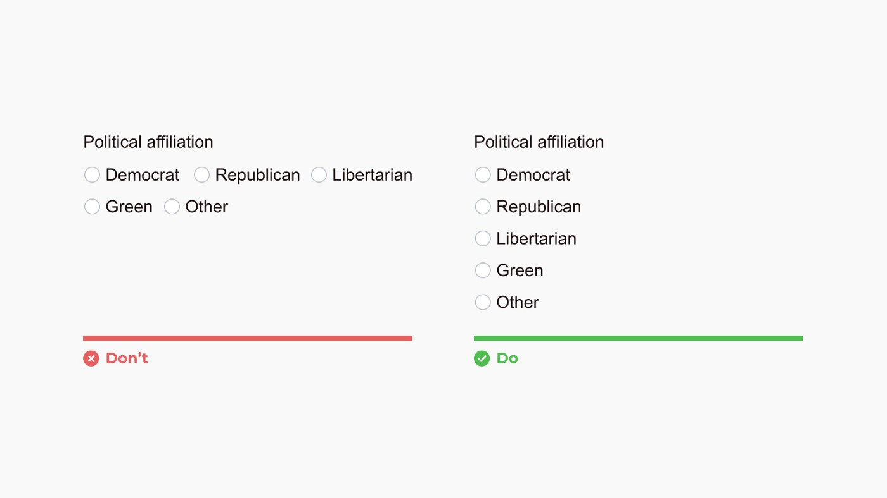
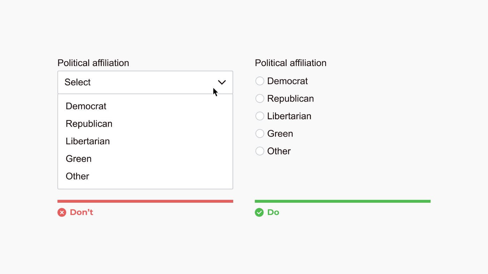
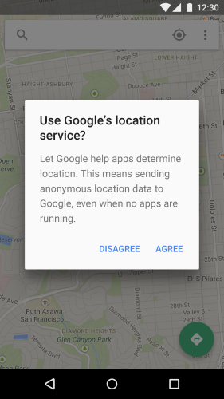
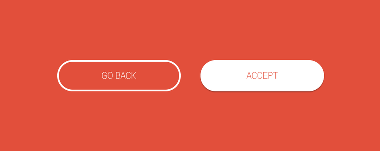
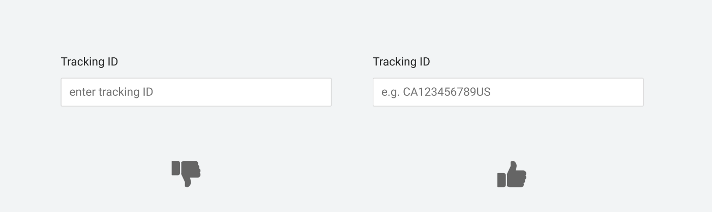
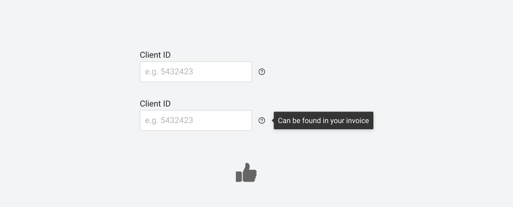
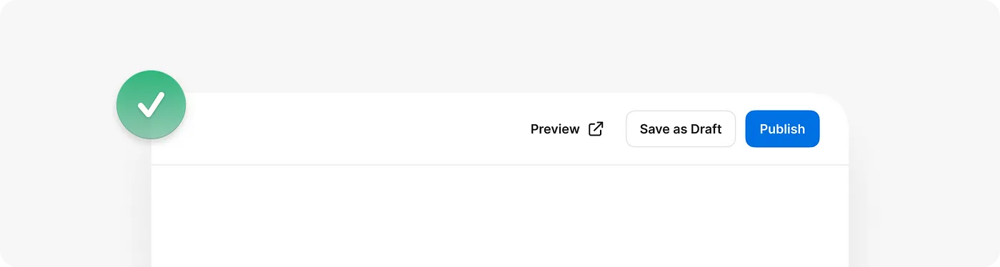
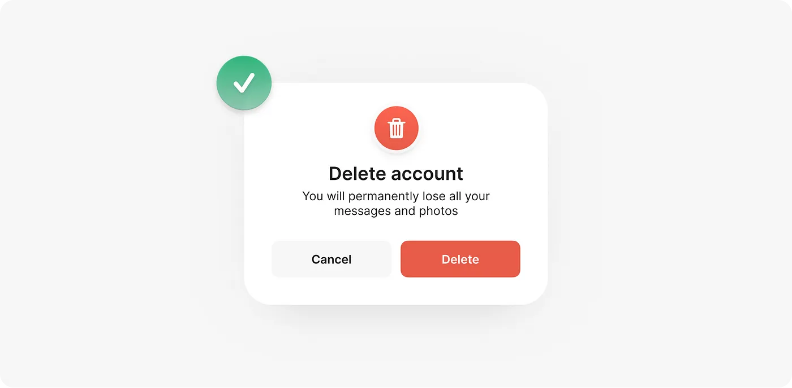
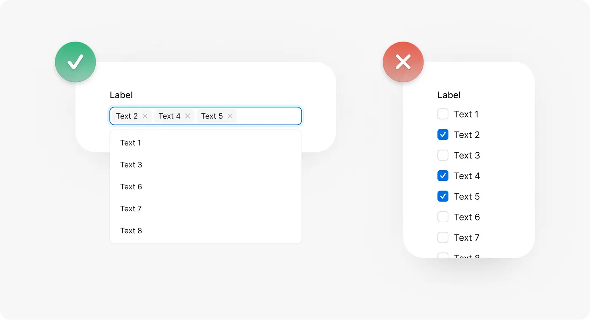
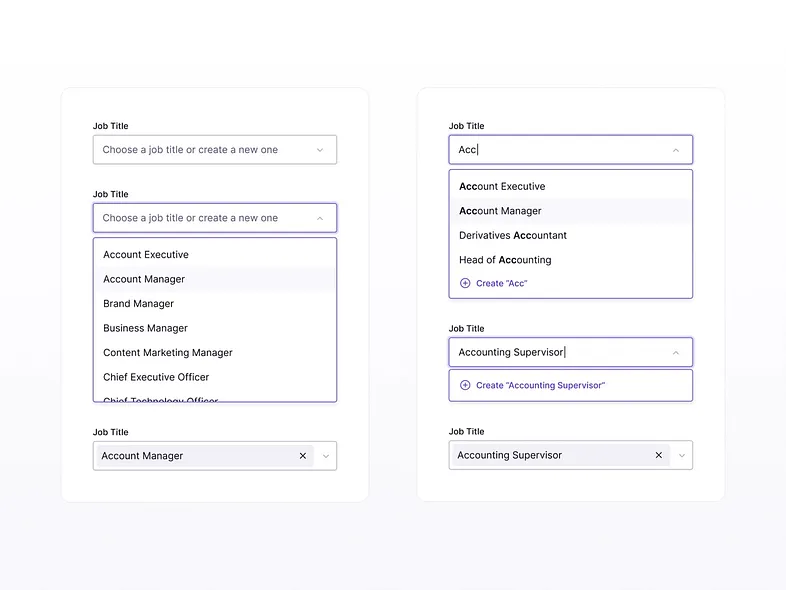

# Best Practices

These best practices more of a knowledge sharing which have been acquired collectively while working in different projects, or reading articles, books, and other resources. The main objective of this document is to produce readable, reusable, consistent, and refactorable software.

Not every practices herein has to be strictly followed, and even fewer will be universally agreed upon. These are guidelines and nothing more.

## Table of Contents

1. [Angular](#angular)
1. [Typescript](#typescript)
1. [Node.js](#nodejs)
1. [Generative AI](#generative-ai)

## Angular

---

### 1. Avoid `placeholder` if it matches the `label`

Do not use a `placeholder` if it is identical to the `label`. Use `placeholder` only for providing additional hints or tips.

**Why:** Repetition of information creates unnecessary duplication.

---

### 2. Enclose `plain text` within elements

Plain text in HTML should always be wrapped in an appropriate element like a `<div>` or `<span>`.

---

### 3. Use `links` for non-form actions

Use `links` instead of `buttons` for actions outside a form.

---

### 4. Avoid `inline styles`

Inline styles should be avoided. Use external stylesheets for consistency and reusability.

**Why:**

- Inline styles cannot be reused.
- They make the HTML markup cluttered and hard to maintain.

---

### 5. Prefer `class` selectors over `id` selectors

Always use `class` selectors instead of `id` selectors because `class` selectors are reusable.

**Example (Do):**

```html
<header>
  <h4 class="sidebar-heading">Sub Heading</h4>
</header>
```

**Example (Avoid):**

```html
<header>
  <h4 id="sidebar-heading">Sub Heading</h4>
</header>
```

---

### 6. Use the `hidden` attribute for visibility control

Use the `hidden` attribute to hide elements instead of relying on JavaScript or CSS.

**Example:**

```html
<p hidden>This paragraph is hidden from view.</p>
```

---

### 7. Follow Angular `file naming` conventions

Use Angular's recommended suffixes for different file types:

- **Components:** `.component.ts`
- **Directives:** `.directive.ts`
- **Pipes:** `.pipe.ts`
- **Guards:** `.guard.ts`
- **Interceptors:** `.interceptor.ts`
- **Modules:** `.module.ts`
- **Routing Modules:** `-routing.module.ts`
- Other files: Use descriptive names, e.g., `filtering.ts` for utility filters.

---

### 8. Avoid `nested subscriptions`

Flatten or join inner observables using higher-order observables like `switchMap`.

**Why:**
Nested subscriptions lead to callback hell and unreadable code.

**Example (Do):**

```typescript
todo$ = this.route.params.pipe(
  map((params) => +params['id']),
  switchMap((id) => this.todoStore.getTodoById(id))
);
```

**Example (Avoid):**

```typescript
this.route.params.subscribe((params) => {
  const id = +params['id'];
  this.todoStore.todos.subscribe((todos) => {
    this.todo = todos.find((todo) => todo.id === id);
  });
});
```

---

### 9. Use proper naming for `subject` and `observable`

- Postfix `subject` variables with `Subject`.
- Postfix `observable` variables with `$`.

**Example:**

```typescript
private categorySelectionSubject = new Subject<number>();
categorySelectedAction$ = this.categorySelectionSubject.asObservable();
```

---

### 10. Avoid functions in `templates`

Do not call functions directly within templates. Instead, use `pipes` or pre-calculated values for better performance.

**Example (Do):**

```html
<span>{{ travelDetailsJson | travelDetails: 'source' }}</span>
```

**Example (Avoid):**

```html
<span>{{ getSourceDetails(travelDetailsJson) }}</span>
```

---

### 11. Use `asapScheduler` instead of `setTimeout`

Prefer `asapScheduler` from RxJS for delays to avoid blocking the event loop.

---

### 12. Use `takeUntil` or `take(1)` for unsubscribing

Use operators like `takeUntil` or `take(1)` for unsubscribing from observables to prevent memory leaks.

**Example:**

```typescript
private _destroyed$ = new Subject();

ngOnInit(): void {
  iAmAnObservable.pipe(
    takeUntil(this._destroyed$)
  ).subscribe(value => this.textToDisplay = value);
}

ngOnDestroy(): void {
  this._destroyed$.next();
  this._destroyed$.complete();
}
```

---

### 13. Avoid logic inside `subscribe`

Move logic out of `subscribe` functions to keep code functional and cleaner.

**Example (Do):**

```typescript
pokemon$
  .pipe(
    filter(({ type }) => type !== 'Water'),
    map(getStats),
    tap(logStats)
  )
  .subscribe(saveToPokedex);
```

**Example (Avoid):**

```typescript
pokemon$.subscribe((pokemon) => {
  if (pokemon.type === 'Water') return;
  const stats = getStats(pokemon);
  logStats(stats);
  saveToPokedex(stats);
});
```

---

### 14. Use the `json` pipe for debugging

Use the `json` pipe to display object data for debugging purposes.

**Example:**

```html
<div><pre>{{ profileForm | json }}</pre></div>
```

---

### 15. Use child components with `ngFor`

When using `ngFor`, consider breaking repeating logic into child components.

**Example (Do):**

```html
<user-detail *ngFor="let user of users" [user]="user"></user-detail>
```

**Example (Avoid):**

```html
<div *ngFor="let user of users">
  <h3>{{ user.name }}</h3>
  <span>{{ user.age }}</span>
</div>
```

---

### 16. Delegate complex logic to component methods

Avoid embedding non-trivial logic in templates. Use component methods for such logic.

---

### 17. Use `trackBy` with `ngFor`

Use `trackBy` to improve performance by uniquely identifying elements in `ngFor`.

---

### 18. Avoid using `enums`

Enums cannot be tree-shaken. Consider alternatives like constants.

---

### 19. Optimize images with `ngSrc` and set dimensions

Use `ngSrc` for lazy loading images and set dimensions (`width` and `height`) to prevent layout shifts.

---

### 20. Follow `Declarative Data Access` patterns

Use the `async` pipe to manage data streams directly in templates, reducing the need for explicit subscription management.

**Example:**

```html
<div *ngIf="products$ | async as products">
  <button *ngFor="let product of products">{{ product.name }}</button>
</div>
```

---

### 21. Apply the `Adapter Pattern`

Use the `Adapter Pattern` when integrating third-party libraries. This allows seamless replacement of the library later without major code changes.

---

### 22. Implement `Typeahead` or `Combobox` for Large Lookups

For lookups with numerous values, utilize a `Typeahead` or `Combobox` component. These provide both `select` and `textbox` functionality, improving the user experience.

**Otherwise:** Users may struggle to navigate through extensive lists, leading to frustration.

---

### 23. Design `Forms` as Single Columns

Single-column forms are easier to scan and align well with mobile displays.

**Otherwise:** Multi-column forms can overwhelm users, causing them to overlook or skip fields.

---

### 24. Present `Checkboxes` and `Radios` Vertically

Vertical alignment makes checkboxes and radio buttons easier to scan. Including visuals alongside options can further enhance usability.



---

### 25. Display All Options Directly if Fewer Than Six

Show options directly when fewer than six exist. For more than five options, use a dropdown with search functionality for sets exceeding 25 items. Use a radio button group otherwise.

**Otherwise:** Dropdowns hide choices and require additional clicks to select.



---

### 26. Appropriately Size `Modal` Windows

Ensure modals are appropriately sized. They should not occupy the entire screen and should ideally use no more than 25% of it. If content cannot fit without scrolling, consider using a separate page instead.

---

### 27. Avoid `Nested Modals`

Do not create modal windows that trigger additional modals.

**Otherwise:** This increases visual complexity and user confusion.

---

### 28. Use `Flat Buttons` on Modals

Utilize flat buttons in modals to harmonize the button actions with dialog content.



---

### 29. Employ `Raised` and `Ghost` Buttons

Use raised buttons for primary actions and ghost buttons for secondary or tertiary actions.



---

### 30. Provide Meaningful `Placeholder` Text

Include placeholders to guide users on the expected input. For example, use a placeholder such as "Enter tracking number (e.g., 12345ABC)."



---

### 31. Add Help Icons Next to Fields

Include a help icon ('?' or 'i') to display tooltips with guidance when hovered over. This is particularly helpful for complex or sensitive fields.



---

### 32. Use Toggles for Binary Choices

For binary options (e.g., Yes/No), prefer toggles over radio buttons or dropdowns.

---

### 33. Prioritize One Primary Button

Avoid placing multiple primary buttons together. Differentiate actions by using distinct button styles such as filled, outlined, or plain.



---

### 34. Use Appropriate Colors for Actions

Apply consistent colors for actions: red for destructive actions (e.g., "Delete") and green for positive ones (e.g., "Save"). Add icons for clarity when needed.



---

### 35. Use Action-Oriented Button Labels

Avoid vague labels like "Yes" or "No." Use clear, action-oriented text such as "Save" or "Cancel" to indicate the button's purpose.

---

### 37. Use Multi-Select Fields for Over Seven Options

For lists with more than seven values, consider using a multi-select field to simplify the selection process.



---

### 38. Avoid Long Dropdowns

Long dropdowns can be challenging, especially for mobile users. Limit the number of items to prevent scrolling frustration.



---

### 39. Eliminate Unnecessary Messages

Avoid showing irrelevant or unclear messages that might confuse users or lead to misunderstandings.


---

### 41. Secure the `Environment`

Ensure all software and components are up-to-date, and remove unused features or dependencies to maintain a secure environment.

### 42. Use Prefixes for Commit Messages

Follow a standardized convention for commit messages. Examples:

```shell
docs: message
feat: message
fix: message
perf: message
refactor: message
revert: message
style: message
test: message
build: message
ci: message
chore: message
```

---

### 43. Examples of Well-Written Commit Messages

Use concise, descriptive messages. Examples:

```shell
chore: update npm dependency to the latest version
refactor(core): add and move tests for `Dispatcher`.
fix(zone.js): store remove abort listener on the scheduled task.
fix(docs-infra): remove config release from test scripts
build: update io_bazel_rules_sass digest to 61dde52
docs: resolve extra padding on tutorial editor (#54828)
```

---

### 44. Code Review Guidelines

When performing code reviews, ensure the following criteria are met:

- **Readability:** Code should be clean and easy to understand.
- **Performance:** Optimize for efficient execution.
- **Reusability:** Design for modularity and future use.
- **Test Coverage:** Include tests for edge cases and functionality.
- **Maintainability:** Ensure code can be updated or refactored easily.

---

### 45. Guidelines for Writing Issue Titles

Use the format `[Component] ([Project/Module]) - [Action] [Description]`.

Examples:

- routes (example-app) - add examples for all supported functionality
- ui (dashboard) - update styling for the new theme
- backend (auth-service) - fix token expiration issue
- API (user-profile) - remove deprecated endpoints
- docs (setup-guide) - update installation instructions
- database (orders) - optimize query performance
- middleware (security) - implement additional logging

---

### 46. Use Numeric Lists in Documentation

Use numeric lists for long content sections to improve readability and organization. Numeric lists are easier to scan than alphabetic ones.

---

### 47. Use `inject()` for Dependency Injection

Prefer `inject()` for cleaner dependency management over a `constructor`.

```typescript
import { inject } from '@angular/core';
import { HttpClient } from '@angular/common/http';

export const fetchData = () => {
  const http = inject(HttpClient);
  return http.get('https://api.example.com/data');
};
```

---

### 48. Use Standalone Components

Standalone components reduce module dependencies and improve modularity.

Example:

```typescript
import { Component } from '@angular/core';

@Component({
  selector: 'app-input-demo',
  standalone: true,
  template: `
    <input [(ngModel)]="name" placeholder="Enter your name" />
    <p>Hello, {{ name }}!</p>
  `,
  imports: [FormsModule],
})
export class InputDemoComponent {
  name: string = '';
}
```

---

### 49. Use `ngTemplateOutlet` for Template Reuse

Leverage `ngTemplateOutlet` to dynamically reuse templates.

Example:

```html
<ng-template #template let-name="name">
  <h1>Hello {{ name }}</h1>
</ng-template>

<div *ngTemplateOutlet="template; context: { name: 'Angular' }"></div>
```

## Typescript

Here's the rewritten version with improved logical structure:

### 1. Avoid Mental Mapping

When coding quickly, we often make assumptions that are clear to us in the moment but may not be easily understood by others or our future selves. Always aim to make your code as readable as possible for anyone who may encounter it.

**Code Example** - `Do`

```typescript
names.forEach((name) => {
  this.notifyUsers(name);
});
```

**Code Example** - `Avoid`

```typescript
names.forEach((u) => {
  this.notifyUsers(u);
});
```

---

### 2. Functions Should Do One Thing

A function should focus on a single responsibility. It should have a clear, descriptive name that conveys its purpose and what the arguments represent. A function that does only one thing is easier to maintain and reuse.

**Code Example** - `Do`

```typescript
function notifyUser() {}

function getUsers() {}

function createFile(name) {
  fs.create(name);
}

function createPublicFile(name) {
  fs.create(`./public/${name}`);
}
```

**Code Example** - `Avoid`

```typescript
function notify() {}

function getUsers() {}

function createFile(name, isPublic) {
  if (isPublic) {
    fs.create(`./public/${name}`);
  } else {
    fs.create(name);
  }
}
```

---

### 3. Use `includes()` Instead of Multiple Conditions

Instead of using multiple `||` conditions to check for several values, use an array and the `includes()` method. This approach is cleaner and more efficient.

**Code Example** - `Do`

```typescript
if (['orange', 'red', 'gray'].includes(x)) {
  // do something
}
```

**Code Example** - `Avoid`

```typescript
if (x === 'orange' || x === 'red' || x === 'gray') {
  // do something
}
```

---

### 4. Use Template Literals for String Concatenation

Template literals allow you to concatenate strings and variables in a cleaner and more readable manner than using the `+` operator.

**Code Example** - `Do`

```typescript
const winnerMsg = `Congrats to the winner: ${winnerName}, you got a ${gift}`;

const msg = `Working in conjunction with humanitarian aid agencies,
  we have supported programmes to help alleviate human suffering.`;
```

**Code Example** - `Avoid`

```typescript
const winnerMsg =
  'Congrats to the winner: ' + winnerName + ', you got a ' + gift;

const msg =
  'Working in conjunction with humanitarian aid agencies,\n\t' +
  'we have supported programmes to help alleviate human suffering. \n\t';
```

---

### 5. Avoid Magic Numbers

Magic numbers are hard-coded values without clear meaning. Always assign such numbers to a well-named variable to clarify their purpose.

**Code Example** - `Do`

```typescript
let NUMBER_OF_STUDENTS = 50;
for (let i = 0; i < NUMBER_OF_STUDENTS; i++) {
  // do something
}
```

**Code Example** - `Avoid`

```typescript
for (let i = 0; i < 50; i++) {
  // do something
}
```

---

### 6. Avoid Deep Nesting

Deeply nested loops can be difficult to understand. Instead of nesting too many levels, extract them into separate functions for clarity and reuse.

**Code Example** - `Do`

```typescript
const array = [[['John Snow']]];
const getValuesOfNestedArray = (element) => {
  if (Array.isArray(element)) {
    return getValuesOfNestedArray(element[0]);
  }
  return element;
};
getValuesOfNestedArray(array);
```

**Code Example** - `Avoid`

```typescript
const array = [[['John Snow']]];
array.forEach((firstArr) => {
  firstArr.forEach((secondArr) => {
    secondArr.forEach((element) => {
      console.log(element);
    });
  });
});
```

---

### 7. Avoid Large Functions

Large functions can be overwhelming and hard to maintain. Break them down into smaller, focused functions to enhance readability, reusability, and testability.

**Code Example** - `Do`

```typescript
// add
const add = (a, b) => {
  return a + b;
};
// sub
const sub = (a, b) => {
  return a - b;
};
```

**Code Example** - `Avoid`

```typescript
const addSub = (a, b) => {
  // add
  const addition = a + b;
  // sub
  const sub = a - b;
  // returning as a string
  return `${addition}${sub}`;
};
```

---

### 8. Favor Descriptive Over Concise Naming

Always use descriptive names for functions, variables, and constants. This avoids ambiguity and improves code readability, especially when there are multiple similar functions.

**Code Example** - `Do`

```typescript
const searchUserByPhoneNo = (phone) => {
  // do something
};
```

**Code Example** - `Avoid`

```typescript
const searchUser = (phone) => {
  // do something
};
```

---

### 9. Capitalize Constant Values (SNAKE CASE)

Constant values should be in uppercase with words separated by underscores. This is a widely accepted convention to differentiate constants from regular variables.

**Code Example** - `Do`

```typescript
const DAYS_IN_A_YEAR = 365;
```

---

### 10. Avoid Inlining Function Types

Instead of inlining function types directly within the function signature, define them separately for clarity and better maintainability.

**Code Example** - `Do`

```typescript
type SearchParams = {
  title?: string;
  publishYear?: string;
  author?: string;
};

type Book = {
  isbn: string;
  title: string;
  publishYear: string;
  author: string[];
};

type GetBooks = (s: SearchParams) => Promise<Book[]>;

const getBooks: GetBooks = (searchParams) =>
  fetch(api + createQuery(searchParams)).then((res) =>
    res.ok ? res.json() : Promise.reject(res)
  );
```

**Code Example** - `Avoid`

```typescript
const getBooks = (searchParams: {
  title?: string;
  publishYear?: string;
  author?: string;
}): Promise<{
  isbn: string;
  title: string;
  publishYear: string;
  author: string[];
}>[] => {
  return fetch(api + createQuery(searchParams)).then((res) =>
    res.ok ? res.json() : Promise.reject(res)
  );
};
```

---

### 11. Use `strong type checks`

Always use `===` (strict equality) instead of `==` (loose equality) to avoid unexpected type coercion.

**Code Example** - `Do`

```typescript
if (val === '123') {
  console.log(val);
}
```

**Code Example** - `Avoid`

```typescript
if (val == 123) {
  console.log(val);
}
```

---

### 12. Use proper `variable naming`

Variables should be named clearly to convey their purpose. Avoid unnecessary words or context in variable names.

**Code Example** - `Do`

```typescript
const MAX_AGE = 30;
let daysSinceLastVisit = 10;

let currentYear = new Date().getFullYear();
const isUserOlderThanAllowed = user.age > MAX_AGE;
```

**Code Example** - `Avoid`

```typescript
let daysSLV = 10;
let y = new Date().getFullYear();

let ok;
if (user.age > 30) {
  ok = true;
}
```

**Code Example** - `Do`

```typescript
let name;
let product;
```

**Code Example** - `Avoid`

```typescript
let nameValue;
let theProduct;
```

**Code Example** - `Do`

```typescript
const product = {
  id: 1,
  name: 'T-Shirt',
  price: 8.99,
  units: 12,
};
product.name;
```

**Code Example** - `Avoid`

```typescript
const product = {
  productId: 1,
  productName: 'T-Shirt',
  productPrice: 8.99,
  productUnits: 12,
};
product.productName;
```

---

### 13. Use proper `function naming`

Function names should be long and descriptive, reflecting their behavior and the intent of the arguments. Avoid excessive arguments (ideally no more than two) to keep the function simple and testable. Default arguments should be used instead of conditionals where possible.

**Code Example** - `Do`

```typescript
function sendEmailUser(emailAddress) {
  // implementation
}
```

**Code Example** - `Avoid`

```typescript
function email(user) {
  // implementation
}
```

**Code Example** - `Do`

```typescript
function getProducts({ fields, fromDate, toDate }) {
  // implementation
}

getProducts({
  fields: ['id', 'name', 'price', 'units'],
  fromDate: '2020-07-01',
  toDate: '2020-07-22',
});
```

**Code Example** - `Avoid`

```typescript
function getProducts(fields, fromDate, toDate) {
  // implementation
}
```

**Code Example** - `Do`

```typescript
function createShape(type = 'circle') {
  // ...
}
```

**Code Example** - `Avoid`

```typescript
function createShape(type) {
  const shapeType = type || 'circle';
  // ...
}
```

---

### 14. Use `scan` instead of `reduce` operator

Use `scan` instead of `reduce` for streams, as it emits an intermediate result at each step, making it more useful for real-time processing.

**Code Example** - `Do`

```typescript
const source$ = range(0, 10);

source$
  .pipe(
    filter((x) => x % 2 === 0),
    map((x) => x + x),
    scan((acc, x) => acc + x, 0)
  )
  .subscribe((x) => console.log(x));
```

---

### 15. Place most of the code outside the `conditional branch`

Avoid placing too much logic inside conditional branches. This can make the code difficult to follow. Instead, execute the main logic outside the condition and return early if necessary.

**Code Example** - `Do`

```typescript
function drawRectangle(e) {
  const mouseOutOfBounds = this.getMousePos(e);
  if (mouseOutOfBounds) {
    return;
  }

  const ctx = this.canvas.getContext('2d');
  ctx.beginPath();
  ctx.lineWidth = '4';
  ctx.strokeStyle = 'green';
  ctx.rect(30, 30, 50, 50);
  ctx.stroke();
}
```

**Code Example** - `Avoid`

```typescript
function drawRectangle(e) {
  const mouseOutOfBounds = this.getMousePos(e);
  if (!mouseOutOfBounds) {
    const ctx = this.canvas.getContext('2d');
    ctx.beginPath();
    ctx.lineWidth = '4';
    ctx.strokeStyle = 'green';
    ctx.rect(30, 30, 50, 50);
    ctx.stroke();
  }
}
```

---

### 16. Use `Optional Chaining`

Optional chaining (`?.`) helps prevent runtime errors when accessing deeply nested properties in objects that may not exist.

**Code Example** - `Do`

```typescript
const value = data?.test?.value;
console.log(value);

const person = {
  name: 'John',
  age: 19,
  fullName() {
    return 'John Snow';
  },
};

person.lastName?.(); // undefined (no error)
person.fullName?.(); // John Snow
```

**Code Example** - `Avoid`

```typescript
const data = { test: { value: 1 } };
if (data && data.test) {
  console.log(data.test.value);
}
```

---

### 17. Use `Nullish Coalescing`

Use the nullish coalescing operator (`??`) to handle cases where a value is `null` or `undefined`. It ensures that only those values are replaced by the right-hand side, unlike `||` which also replaces falsy values like `0` or `''`.

**Code Example** - `Do`

```typescript
let maybeValue = '';
let safeValue = maybeValue ?? 'value';
console.log(safeValue); // ""

maybeValue = null;
let safeValue = maybeValue ?? 'value';
console.log(safeValue); // "value"

const authorName = book?.author?.firstName ?? 'Unknown';
```

**Code Example** - `Avoid`

```typescript
let maybeValue = 'I exist';
let safeValue = maybeValue || 'value';
console.log(safeValue); // "I exist"
```

---

### 18. Passing `arguments` as `objects`

Passing arguments as objects improves code readability, as it eliminates the need for the arguments to be in a specific order and helps with autocompletion in IDEs.

**Code Example** - `Do`

```typescript
const createProduct = ({ name, description, price }) => {
  // Create the product
};

createProduct({
  name: 'Pepperoni Pizza',
  description: 'Hot, crispy and tasty!',
  price: 15.99,
});
```

---

### 19. Use `Object.entries()` to check empty object

To check if an object is empty, use `Object.entries()` which returns an array of the object's enumerable properties. If the length is 0, the object is empty.

**Code Example** - `Do`

```typescript
let sampleObj = {
  name: 'Mark',
  occupation: 'Developer',
};
let emptyObj = {};
console.log(Object.entries(sampleObj).length === 0); // false
console.log(Object.entries(emptyObj).length === 0); // true
```

---

### 20. Use `early return` pattern

Using the early return pattern makes code more readable and efficient by eliminating unnecessary `else` statements.

**Code Example** - `Do`

```typescript
function FizzBuzz(i) {
  if (i % 15 === 0) {
    return 'FizzBuzz';
  }
  if (i % 3 === 0) {
    return 'Fizz';
  }
  return i % 5 === 0 ? 'Buzz' : i;
}
```

**Code Example** - `Avoid`

```typescript
function FizzBuzz(i) {
  let result = undefined;
  if (i % 15 === 0) {
    result = 'FizzBuzz';
  } else if (i % 3 === 0) {
    result = 'Fizz';
  } else if (i % 5 === 0) {
    result = 'Buzz';
  } else {
    result = i;
  }
  return result;
}
```

---

### 21. Use `dot` Syntax Over `bracket` Syntax

We should prefer `dot` syntax when the properties are known in advance, as it makes the code more succinct and easier to read. Use `bracket` syntax only when the property is a variable or might change dynamically.

**Correct Example**:

```typescript
book.preface.intro = 'Section 1';
```

**Avoid**:

```typescript
book['preface']['intro'] = 'Section 1';
```

---

### 22. Use `spread` Operator to Conditionally Add Properties to Objects or Arrays

The `spread` operator (`...`) allows for quick and conditional additions of properties to objects or arrays.

**Example**:

```typescript
const condition = true;
const person = {
  id: 1,
  name: 'John Doe',
  ...(condition && { age: 16 }),
};
```

```javascript
const fruits = ['a', 'b', ...(isSummer ? ['w'] : [])];
```

---

### 23. Use `in` Keyword to Check if Property Exists in an Object

The `in` keyword is the preferred way to check if a property exists in an object.

**Example**:

```typescript
const person = { name: 'John Doe', salary: 1000 };
console.log('salary' in person); // returns true
console.log('age' in person); // returns false
```

---

### 24. Use `multiline` Comments Over `single-line` Comments for Long Text

For long comments, use multiline comments for better readability.

**Correct Example**:

```typescript
/*
  This is another long comment
  written as a multiline comment
*/
```

**Avoid**:

```typescript
// This is a long comment
// Which is written as multiple single-line comments.
```

---

### 25. Use `Union Types` Instead of `Enum`

Union types are preferred over `enum` because they offer more flexibility, don't get compiled, and are more linear. If you must use `enum`, declare it as `const` to prevent it from being included in the build output.

**Correct Example with Union Types**:

```typescript
export type GamePadInput = 'UP' | 'DOWN' | 'LEFT' | 'RIGHT';
```

**Correct Example with Const Enum**:

```typescript
const enum ProductType {
  Sports,
  HomeGoods,
  Groceries,
}
```

**Avoid Enum**:

```typescript
enum GamePadInput {
  Up = 'UP',
  Down = 'DOWN',
  Left = 'LEFT',
  Right = 'RIGHT',
}
```

Instead of:

```typescript
export enum HttpStatusCode {
  OK = 200,
  BAD_REQUEST = 400,
  UNAUTHORIZED = 401,
  FORBIDDEN = 403,
  NOT_FOUND = 404,
  INTERNAL_SERVER_ERROR = 500,
}
```

Use:

```typescript
export const HttpStatusCode_OK = 200;
export const HttpStatusCode_BAD_REQUEST = 400;
export const HttpStatusCode_UNAUTHORIZED = 401;
export const HttpStatusCode_FORBIDDEN = 403;
export const HttpStatusCode_NOT_FOUND = 404;
export const HttpStatusCode_INTERNAL_SERVER_ERROR = 500;

export const ALL_HTTP_STATUS_CODES = [
  HttpStatusCode_OK,
  HttpStatusCode_BAD_REQUEST,
  HttpStatusCode_UNAUTHORIZED,
  HttpStatusCode_FORBIDDEN,
  HttpStatusCode_NOT_FOUND,
  HttpStatusCode_INTERNAL_SERVER_ERROR,
] as const;

export type HttpStatusCodes = (typeof ALL_HTTP_STATUS_CODES)[number];
```

---

### 26. Avoid Code Duplication

Duplicate code increases maintenance complexity. Instead, abstract common logic into reusable functions.

**Correct Example**:

```typescript
function showEmployeeList(employees) {
  employees.forEach((employee) => {
    const expectedSalary = employee.calculateExpectedSalary();
    const experience = employee.getExperience();

    const data = {
      expectedSalary,
      experience,
    };

    switch (employee.type) {
      case 'manager':
        data.portfolio = employee.getMBAProjects();
        break;
      case 'developer':
        data.githubLink = employee.getGithubLink();
        break;
    }

    render(data);
  });
}
```

**Avoid**:

```typescript
function showDeveloperList(developers) {
  developers.forEach((developer) => {
    const expectedSalary = developer.calculateExpectedSalary();
    const experience = developer.getExperience();
    const githubLink = developer.getGithubLink();
    const data = {
      expectedSalary,
      experience,
      githubLink,
    };

    render(data);
  });
}

function showManagerList(managers) {
  managers.forEach((manager) => {
    const expectedSalary = manager.calculateExpectedSalary();
    const experience = manager.getExperience();
    const portfolio = manager.getMBAProjects();
    const data = {
      expectedSalary,
      experience,
      portfolio,
    };

    render(data);
  });
}
```

---

### 27. Avoid Using Flags as Function Parameters

Functions should focus on one thing. Avoid using flags to make a function do multiple tasks. Instead, split the function into multiple functions.

**Correct Example**:

```typescript
function createFile(name) {
  fs.create(name);
}

function createTempFile(name) {
  createFile(`./temp/${name}`);
}
```

**Avoid**:

```typescript
function createFile(name, temp) {
  if (temp) {
    fs.create(`./temp/${name}`);
  } else {
    fs.create(name);
  }
}
```

---

### 28. Avoid Positional Markers

Positional markers add noise to the code. Let functions and variable names, along with proper indentation, convey the structure of your code.

**Correct Example**:

```typescript
$scope.model = {
  menu: 'foo',
  nav: 'bar',
};

const actions = function () {
  // ...
};
```

**Avoid**:

```typescript
////////////////////////////////////////////////////////////////////////////////
// Scope Model Instantiation
////////////////////////////////////////////////////////////////////////////////
$scope.model = {
  menu: 'foo',
  nav: 'bar',
};

////////////////////////////////////////////////////////////////////////////////
// Action setup
////////////////////////////////////////////////////////////////////////////////
const actions = function () {
  // ...
};
```

---

### 29. Avoid Contractions

Avoid using contractions in variable and function names as they reduce readability.

**Correct Example**:

```typescript
const onItemClick = () => {};
```

**Avoid**:

```typescript
const onItmClk = () => {};
```

---

### 30. Use Named Parameters Instead of Options Objects

Named parameters improve the clarity of function calls by explicitly showing which options are being passed.

**Correct Example**:

```typescript
function setPageThread(name, { popular, expires, activeClass } = {}) {
  console.log(popular);
  console.log(expires);
  console.log(activeClass);
}
```

**Avoid**:

```typescript
function setPageThread(name, options = {}) {
  let popular = options.popular;
  let expires = options.expires;
  let activeClass = options.activeClass;
}
```

---

### 31. Avoid Direct Use of `Object.prototype` Methods

Avoid directly calling `Object.prototype` methods like `hasOwnProperty`, `propertyIsEnumerable`, and `isPrototypeOf`. These methods can be shadowed by properties in the object or fail with objects created without a prototype (e.g., `Object.create(null)`). Use the `call` method to ensure functionality.

**Example**:

```typescript
const obj = { a: 1 };
const hasA = Object.prototype.hasOwnProperty.call(obj, 'a');
```

---

### 32. Avoid Nested Subscriptions

Use higher-order observables like `switchMap()` to flatten or join inner observables. This avoids pyramid-shaped callback hell and improves readability.

**Prefer**:

```typescript
todo$ = this.route.params.pipe(
  map((params) => +params['id']),
  switchMap((id) => this.todoStore.getTodoById(id))
);
```

**Avoid**:

```typescript
this.route.params.subscribe((params) => {
  const id = +params['id'];
  this.todoStore.todos.subscribe((todos) => {
    this.todo = todos.find((todo) => todo.id === id);
  });
});
```

---

### 33. Prefer `Type Annotations` Over `Type Assertions`

Using type annotations ensures type safety and compile-time checks.

**Prefer**:

```typescript
const william: Person = {
  name: 'William',
  age: 25,
  occupation: 'artist',
};
```

**Avoid**:

```typescript
const william = {
  name: 'William',
  age: 25,
} as Person;
```

---

### 34. Avoid `++` Operator; Use Compound Operators

Instead of incrementing with `++`, use compound operators like `+=`.

---

### 35. Avoid Assigning `undefined`

Do not manually assign `undefined` to variables. Use `null` instead when needed.

---

### 36. Encapsulate Conditionals

Encapsulate complex conditional logic into functions with descriptive names to enhance readability.

**Prefer**:

```typescript
function shouldShowSpinner(fsm, listNode) {
  return fsm.state === 'fetching' && isEmpty(listNode);
}

if (shouldShowSpinner(fsmInstance, listNodeInstance)) {
  // ...
}
```

**Avoid**:

```typescript
if (fsm.state === 'fetching' && isEmpty(listNode)) {
  // ...
}
```

---

### 37. Handle Caught Errors

Always handle caught errors meaningfully. Logging to the console is insufficient.

**Prefer**:

```typescript
try {
  functionThatMightThrow();
} catch (error) {
  console.error(error);
  notifyUserOfError(error);
  reportErrorToService(error);
}
```

**Avoid**:

```typescript
try {
  functionThatMightThrow();
} catch (error) {
  console.log(error);
}
```

---

### 38. Handle Rejected Promises or Observables

Similar to caught errors, rejected promises should be handled properly.

**Prefer**:

```typescript
getData()
  .then((data) => functionThatMightThrow(data))
  .catch((error) => {
    console.error(error);
    notifyUserOfError(error);
    reportErrorToService(error);
  });
```

**Avoid**:

```typescript
getData()
  .then((data) => functionThatMightThrow(data))
  .catch((error) => console.log(error));
```

---

### 39. Use Logical Nullish Assignment (`??=`)

The `??=` operator assigns a value only if the variable is nullish (null or undefined).

**Prefer**:

```typescript
let user = { name: 'John Snow' };
user.twitterName ??= '@john_snow';
```

**Avoid**:

```typescript
if (!user.twitterName) {
  user.twitterName = '@john_snow';
}
```

---

### 40. Avoid Implicit Else

Explicitly handle all cases to enhance readability and adhere to the fail-fast principle.

**Prefer**:

```typescript
function carBrand(model) {
  if (model === 'A4') {
    return 'Audi';
  }
  if (model === 'AMG') {
    return 'Mercedes-Benz';
  }
  throw new Error('Model not found');
}
```

**Avoid**:

```typescript
function carBrand(model) {
  if (model === 'A4') {
    return 'Audi';
  }
  return 'Mercedes-Benz';
}
```

---

### 41. Prefer ECMAScript `#field` for Private Members

Use `#field` instead of `private` for private class members, as it is natively supported in JavaScript.

**Prefer**:

```typescript
class Test {
  #age: number;
}
```

**Avoid**:

```typescript
class Test {
  private age: number;
}
```

---

### 42. Use `at()` Method for Array/String Access

The `at()` method simplifies accessing elements from the end of an array or string.

**Example**:

```typescript
const A = [2, 4, 6, 8, 10];
A.at(-1); // 10

const S = 'Hello World';
S.at(-1); // 'd'
```

---

### 43. Use `findLast()` to Locate Items from the End

The `findLast()` method helps locate array items starting from the end.

**Example**:

```typescript
const A = [1, 20, 3, 40, 5];
A.findLast((v) => v % 10 === 0); // 40
```

---

### 44. Use `hasOwn()` Instead of `hasOwnProperty()`

The `Object.hasOwn()` method is more concise and avoids issues with shadowing.

**Prefer**:

```typescript
if (Object.hasOwn(object, 'foo')) {
  console.log('has property foo');
}
```

**Avoid**:

```typescript
let hasOwnProperty = Object.prototype.hasOwnProperty;
if (hasOwnProperty.call(object, 'foo')) {
  console.log('has property foo');
}
```

---

### 45. Use the `cause` Property in Errors

Preserve the original error when wrapping errors using the `cause` property.

**Example**:

```typescript
await fetch('https://example.com/data.csv')
  .catch((err) => {
    throw new Error('Failed to fetch', { cause: err });
  })
  .catch((err) => {
    console.log('Cause:', err.cause);
  });
```

---

### 46. Prefer Separate Types Over Optional Properties

Divide types to model distinct states clearly, avoiding excessive use of optional properties.

**Prefer**:

```typescript
interface Product {
  id: string;
  type: 'digital' | 'physical';
}

interface DigitalProduct extends Product {
  type: 'digital';
  sizeInMb: number;
}

interface PhysicalProduct extends Product {
  type: 'physical';
  weightInKg: number;
}
```

**Avoid**:

```typescript
interface Product {
  id: string;
  type: 'digital' | 'physical';
  sizeInMb?: number;
  weightInKg?: number;
}
```

---

### 47. Use Descriptive Names for Generics

Use descriptive names for generics to improve clarity.

**Prefer**:

```typescript
function head<Element>(arr: Element[]): Element | undefined {
  return arr[0];
}
```

**Avoid**:

```typescript
function head<T>(arr: T[]): T | undefined {
  return arr[0];
}
```

---

### 51. Class Names

Use **noun** or **noun phrase** names for classes, such as `Customer`, `WikiPage`, `Account`, or `AddressParser`. Avoid using terms like `Manager`, `Processor`, `Data`, or `Info`. A class name should not be a verb.

---

### 52. Method Names

Methods should have **verb** or **verb phrase** names, such as `postPayment`, `deletePage`, or `save`.

---

### 53. Pick One Word Per Concept

Maintain consistency by using one word for a single concept throughout the codebase. For example:

- Avoid mixing terms like `fetch`, `retrieve`, and `get` for similar actions.
- Do not use varied terms like `controller`, `manager`, or `driver` interchangeably.
  A consistent lexicon simplifies understanding and usage.

---

### 54. Blocks and Indenting

- Code blocks (e.g., `if`, `else`, `while`) should typically contain one line of code, ideally a function call.
- Keep function indentation shallow (one or two levels) for better readability and maintainability.
- Smaller, focused functions are easier to name descriptively and understand.

---

### 55. Avoid Flag Arguments

Passing a boolean (flag) to a function is a poor practice. It indicates the function is doing more than one thing, reducing clarity.

---

### 56. Command-Query Separation

A function should either, It should not do both:

1. Perform an action (change the state of an object).
1. Return information about an object.

---

### 57. Prefer Exceptions Over Error Codes

- Returning error codes forces the caller to handle errors immediately.
- Using exceptions allows error handling to be separate from the primary logic, simplifying the code.

---

### 58. Avoid Javadocs in Non-Public Code

Javadocs are useful for public APIs but unnecessary for internal or non-public code.

---

### 59. Vertical Density

Place lines of code that are closely related together to improve readability.

---

### 60. Vertical Openness Between Concepts

Use blank lines to separate distinct concepts, making the code easier to navigate.

---

### 61. Horizontal Openness and Density

- Avoid spaces between function names and opening parentheses, as the function and its arguments are closely related.

---

### 62. Provide Context with Exceptions

- Include detailed context in error messages to identify the source and nature of the problem.
- Always pass meaningful messages with exceptions.

---

### 63. Don't Return Null

- Returning `null` can lead to unexpected errors.
- Instead, throw an exception or return a special-case object.
- For third-party APIs that return `null`, wrap such methods to handle this explicitly.

---

### 64. Don't Pass Null

- Passing `null` to methods is worse than returning `null`.
- Avoid it unless explicitly required by an external API.

---

### 65. FIRST Rule for Clean Tests

- **Fast**: Tests should execute quickly.
- **Independent**: Tests should not depend on each other.
- **Repeatable**: Tests should work in any environment.
- **Self-validating**: Tests should yield a boolean result (pass/fail).
- **Timely**: Write tests early during development.

---

### 66. Keep Design Simple

A "simple" design:

1. Passes all tests.
1. Avoids duplication.
1. Clearly expresses intent.
1. Minimizes the number of classes and methods.

---

### 67. Avoid Overloading Interfaces

- Tight, small interfaces reduce coupling.
- Avoid defining interfaces with too many functions to depend on.

---

### 68. Favor Many Small Functions Over Complex Behavior Flags

It’s better to have multiple specialized functions than a single function with behavior dictated by flags or code passed as arguments.

---

### 69. Prefer Polymorphism Over Conditional Statements

Where applicable, use polymorphism instead of `if/else` or `switch/case`.

---

### 70. Use Long Names for Long Scopes

- Short variable names are fine for small scopes.
- Use descriptive, longer names for variables in larger scopes.

---

### 71. Names Should Describe Side Effects

- Function, variable, and class names should clearly indicate their purpose and behavior.
- Example: A function named `createOrReturns` explicitly describes its dual behavior.

---

### 72. Use `GUIDs` for IDs

Adopt `GUIDs` as random ID generators instead of sequential IDs to prevent Broken Object Level Authorization (BOLA) vulnerabilities.

---

## Node.js

### 1. Validate Content-Type

Always validate the `Content-Type` header. Use `application/json` as the default format.

**Why**:
Invalid `Content-Type` can open security risks like unwanted POST requests.

---

### 2. Avoid Returning Plain Text

Don't return plain text as an API response. While not mandatory, it’s a common practice to use JSON as the data format.

---

### 3. Use `camelCase` for JSON Properties

Always use `camelCase` for JSON keys.

**Do**:

```json
{
  "userId": "1",
  "userName": "John Snow"
}
```

**Avoid**:

```json
{
  "user_id": "1",
  "user_name": "John Snow"
}
```

---

### 4. Include Error Details in Responses

Always include error details in the response body. Mention the affected fields if possible.

**Example**:

```json
{
  "error": "Invalid payload.",
  "detail": {
    "name": "This field is required."
  }
}
```

---

### 5. Include Totals in Responses

When returning a list, include the total number of items.

**Do**:

```json
{
  "users": [{}, {}],
  "total": 2
}
```

**Avoid**:

```json
{
  "users": [{}, {}]
}
```

---

### 6. Use Correct HTTP Methods

Stick to standard HTTP methods for clarity:

- **GET**: Fetch data.
- **POST**: Create data.
- **PUT**: Replace data.
- **PATCH**: Update part of the data.
- **DELETE**: Remove data.

---

### 7. Return Correct Status Codes

Match HTTP methods with appropriate status codes:

- **200 OK**: GET, PUT, PATCH.
- **201 Created**: POST.
- **204 No Content**: DELETE.

---

### 8. Avoid Verbs in Resource URLs

Use HTTP methods to describe actions, not verbs in the URL.

**Do**:
`PUT /users/{userId}`

**Avoid**:
`POST /updateUser/{userId}` or `GET /getUsers`

---

### 9. Use Plural Names for Collections

Point to collections using plural names.

**Do**:
`GET /users`

**Avoid**:
`GET /user`

---

### 10. URLs Should Point to Properties

Structure URLs to start with a collection and end with an identifier.

**Do**:
`GET /shops/:shopId`

**Avoid**:
`GET /shops/:shopId/category/:categoryId/price`

---

### 11. Use `kebab-case` for URLs

Write URLs in `kebab-case` for readability.

**Do**:
`/system-orders`

**Avoid**:
`/systemOrders` or `/system_orders`

---

### 12. Use `camelCase` for Parameters

Use `camelCase` for route parameters.

**Do**:
`/system-orders/{orderId}`

**Avoid**:
`/system-orders/{order_id}` or `/system-orders/{OrderId}`

---

### 13. Use Verbs for Non-Resource URLs

For non-CRUD operations, verbs in URLs are acceptable.

**Example**:
`POST /alerts/245743/resend`

---

### 14. Debug with `util.inspect()`

To debug objects, use `util.inspect()` for detailed information.

**Example**:

```javascript
const util = require('util');
console.log(
  util.inspect(object, { showHidden: false, depth: 2, colors: true })
);
```

---

### 15. Use `__dirname` and `path()`

For file paths, use `__dirname` and `path()` to avoid OS inconsistencies.

**Example**:

```javascript
res.sendFile(path.join(__dirname, 'views/index.html'));
```

## Generative AI

### 1. Better prompts

```javascript
/* draw a brown wooden boat with a white sail on top of a blue ocean
- the sky is light blue with on white cloud
- the cloud has three different sized circles that overlap each other
- the sun is a yellow circle inside a yellow-orange circle inside an orange circle in
- the sail is a large white triangle connected to the top of the dark brown mast down
- the boat is curved at the bottom and has a dark brown rectangle for the body
*/
```

```html
<!-- add a button for a power (or exponential) function -->
```

```shell
# Please give me the code in YAML to deploy a WordPress container to a Kubernetes cluster`

# Please document this code

# Please explain this code to me

# Please provide a query in steps like recipe instruction instead of a single paragraph, keep the relevant tab opened for a better context, and provide one or two examples for a better context.
```
