# Extracted Notes

## Angular

- Binding expression {{}}

- Modules provide some sort of container for the code that we write so that it will not leak-out to some other code.

- Modules provide some sort of container for the code that we write so that it will not leak-out to some other code.

- The ngCloak directive allows us to hide portions or all of our page and tell angular a chance to run to go though and parse the HTML and replace the directives or bindings with the actual values which it wants to display to avoid the flashes of unbound HTML on slower computer.

- HTML doesn’t allow forms to be nested but using ngForm directive we can have nested forms to allow creating the smaller sections of the form.

- $compile service – is used heavily internally by angular whenever a page is loaded it uses to look through the directive and process them. We can also generally used them inside directives. $compile return a ‘link’ function in which we passed the scope.

- Using $parse service – it is also similar with the $compile service and used by angular internally. It is used to evaluate and expression and turn that expression into function that can be evaluated against a given context.

- $rootScope – one $rootScope per application. When we create a new scope it is created from $rootScope getting prototypal inheritance. We can inject global data on it. Avoid using it as a best practice.

- Keyboard shortcut: hold down mouse click on history button on browser to see history. Angular will take care of managing history in the browser as we are not actually loading pages but just loading the angular templates.

- If we use ‘&’ means that we will execute this function into the parent scope instead in the isolate scope. ‘=’ means we are expecting an object. The ‘@’ sign indicates that we are going expect a string to be passed in, so we pass a string or an expression using evaluation {{}} operator.

- Understanding Transclusion – it typically refers to taking a portion of a document and embedding it inside a document. In angular we take an HTML and embedded it inside a directive.

- Transclusion - It is like a picture frame. Like frame is completely separate from the picture inside of it. Just set the transclude property to true, and use the ng-transclude attribute inside the template html.

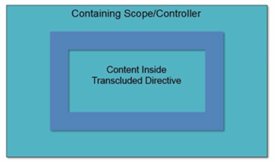

- If we have some HTML content side a directive like below angular will not show it because it is replacing the `<collapsible>` tag with the HTML inside the template, so we need to use transude to true and in template need to specify where it needs to be shown

- We can return from the compile function a link function then that link function will be executed for each element. So compile function runs once and affects all the instances of the directive the same way then the link function runs individually for each directive. Most often when we create a directive we will not create a compile function, typically we can take care of kinds of things that we need to do using the linking function and the template to manipulate the HTML. The angular ng-repeat directive uses the compile function in order to do its work.

- We can achieve the same functionality using link and inside it using compile but it will be expensive because compile will run many times as per ‘for’ loop value.

- Previously Karma called testacular and it is independent of angular, it can used to test other javascript code as well.

- Angular is an opinionated software. It extends HTML vocabulary using the concept of directive.

- It is helpful in creating single page application. Gmail website is an example of single page application. Routing is a key part in writing single page application.

- Angular was originally written by Misko Hevery. Why angular – it is a complete solution and easy to learn. Abstract away complexity and open source backed by google. Highly testable. Benefits – code reduction. Makes forms more interactive using 2 way bindings. Poor API hiding like using directly ng-click. It supports accessibility using ngAria for screen readers and internationalization. Publicly released as version 0.9.0 in October 2010.

- Angular auto do the change detection unlike in other technologies like in asp.net using component.render() where user has to do it which cause many problems.

- Angular use dirty checking as in javascript comparing two objects is very fast operation. Angular watch all events which can change the data like ng-click or service call then run digest cycle, do dirty check and re-render the page.

- Because angular utilize the client side rendering technique, means most of our HTML isn’t sent directly with the page but instead it comes later on. Due to this most search engines almost see nothing of our site because without the javascript rendering the HTML our site has almost nothing to display. If SEO is important to you then need to use some technique like rely on google only, render portions of site of server, or use a pre-renderer.

- React suffer from Frankenstein framework syndrome, means React by itself is really only a rendering engine, it doesn’t do other things like routing or server communication so we need to look around and piece together the different libraries and parts that we ne need to make a complete solution. So need a good architect person to decide which piece will work best. But angular is a complete solution.

- In angular 2 the angular team has completely revamped the framework to move it forward in a way that really wouldn’t be possible without major changes, due to this angular 2 doesn’t have backwards compatibility with angular 1 framework.

- Angular 2 is created keeping performance in mind so it is much faster than angular 1 which is like 5 to 10 times faster. It has simplified the conceptual model and removed the idea of controllers and modules and simplified how services works and removed much of the configuration overhead. Angular 2 is designed to be more mobile friendly and web standards in mind.

- Angular uses dependency injection to make it easy to get a hold of components, or services that can hold encapsulated functionality and data that we can use to build complex application out of small and simple pieces.

- JQuery – Angular included jQuery in its core library for basic selection and manipulation functions. If we give reference of jQuery then it will use its full version. When a directive does need to manipulate the DOM directly, jQuery is a tool used to do it.

- 5 types of services - provider(), factory(), service(), value(), constant()

- The $q service makes it easy to implement async patterns in our app. It is an object which represent the pending result of an async operation. It provides and API to work with promises and deferred objects that return promises to the calling code. when first client make request to server, the server will first create the deferred object using $q, which is used to communicate the status of the async work back to the client. This deferred object will immediately return a promise back to the client. Then client can use promise API to configure a callback function to execute when the work and the service is complete.

- Client side routing doesn’t replace the server side routing. But while using client side routing the call to server is for getting the little bit of information rather than complete webpages and all of it related resources. SPA need client side routing as a means of referring to different locations with the SPA. There still be interaction with server but for partial data.

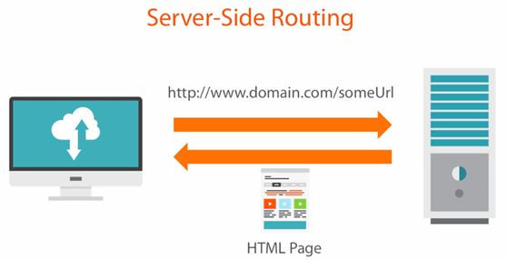
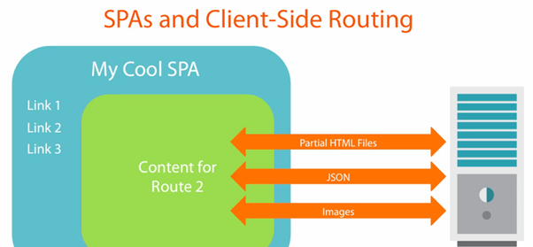

- Hashbang versus HTML5 Mode – this is the default mode. There will be “#” character after the domain name in the URL. All the text on URL after this character will be for client side routing and angular will handle it. The alternate to this mode is HTML mode

- When angular is configured to run in HTML5 mode it attempts to use the browser’s HTML5 history API.

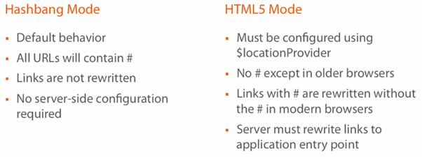

- Jasmine is a behaviour driven development framework, it gives us mechanism to write and then execute the unit tests in javascript. The describe function provides the logical grouping of the multiple test cases, and the ‘it’ function state the name of the test cases.

- The main ability karma gives us to execute our unit tests via the command line, so instead of every time do switching between browser and text editor we can easily run it in the command line. Phantom JS will allow us to use the headless browser for even faster test feedback.

- Whenever we construct a new date its base value will always be in UTC, it is a time standard by which the world regulates clocks and time. If we specify a date without an offset, UTC is assumed. A date instance has two states the UTC time and a local time based on the system settings. These two states cause problems in unit tests.

- TzDate is a wrapper for the native javascript date type to construct date with time zone information. We can setup a time zone that will not change according to the local machine. It is not a complete implementation of date type object. Its main purposeis to create Date-like instances with timezone fixed to the specified timezone offset, so that we can test code that depends on local timezone settings without dependency on the time zone settings of the machine where the code is running.

- Creating directive by using attribute or element are only recommended because other two are easy to overlook while reading HTML. By using attribute it means we are modifying an existing element while if we use it like element then it means we are adding a new object on the page.

- Because HTML is case insensitive so we need to use dasherization or snake casing while using directive name in HTML. We can also use colon or underscore.

- Structural Directive - These types of directives are complex and rarely created. These are also template directives. It modifies the overall HTML structure. Like ng-if it removes the entire element from the DOM unlike ng-hide which only use simple css display rule to none and ng-repeat, ng-switch. They all use transclusion and control where and when the transclusion will be available in the node.

- Types of directives:

  - Component type – it represents some data and its associated HTML and related functionality, and always implemented as a custom element or also called widget. Like buttons
  - Decorator type – most commonly used. It adds additional functionality to an existing tag or modifies that tag’s display. Like ng-click. These are always implemented as an attribute never have template.
  - Structural/Templating type – like ng-repeat. These type of directive manipulates the DOM structurally to produce a display.

- Best Practice: do not use the replace attribute. And always prefix your directive name with some custom project specific text.

- There are three ways by which we can set the relationship among the directive’s scope and containing controller scope, the default is or the directive to share the scope with the containing controller.

  - Shared type

  - Inherited directive scope – if we create new item on the directive then it will be internal to that directive only. To implement this just create a scope property on directive and set it as true. Its parent and proto property will be containing controller scope. False value will be shared scope.

  - Isolated scope – isolated scope can’t see everything on the parent scope, but it can see specific items that we make visible to the isolated scope. Its parent scope will still have the containing container but the proto property would not have the containing controller scope. By using this we will be able to create a directive that is truly reusable.

- We should break a component/directive into multiple small directives. It is just like not to putting all your code in main class but break into multiple classes as per object orientation.

- If we use the '^' then it will look the directive on the parent node, for '?' sign means that directive may not be present then in that case it will give is as null. If we use the '^^' then we only looking on the parent node not on the current node.

- Key factors in building a line of business application – data is an asset, amount of data is significant, number of input/output data fields is significant, data integrity is critical, data visualization

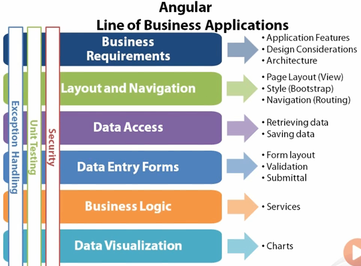

- Bootstrap is a framework for prettifying the web pages, help you build responsive web applications means responsive to changes in layout, it scales to multiple form factors – phones, tablets, laptops and desktops and handle browser differences. It is developed by twitter.

- For routing angular use fragment identifier because it gets processed on client side and doesn’t get submitted on server, so we assign a unique fragment identifier to each view. The ngRoute is based on fragment identifies while uiRouter is based on application states URL fragment identifier is optional in it. Nester routing can provide the navigation for a tab-based set of edit pages.

- Controller should not have more than 5 collaborators means dependency. We can also use the facade class to arrogate the interaction with several collaborator sin to a single collaborator. Value provider can be used to create global data. Controller should be testable by following the guidelines like too many used collaborators will make it difficult, like manipulating the DOM or too many business logic, too much work it will be tough to test.

- Avoid FOUC (flash of un-styled or un-compiled content) – we can avoid that by using ngCloak, ngBind or waiting image. The ng-bind gives us ability to do the same thing as {{}}.

- For bootstrap logic which is required to start the app, should be in app.run().

- We can organize our app using by feature or type. For large project ‘by feature’ would be better or mix with both types. The LIFT principle (locating our code is easy, identify code at a glance, flat structure as long as we can, try to stay DRY). Have below format while writing controller to have ‘above the fold’ concept, and should not have more than 3 level for folder, it should be flat.

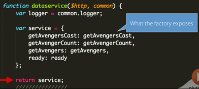

- 3 categories of modules – angular js modules, 3rd party modules, custom modules (which we create our self).

- Exceptions cannot be avoided entirely but they can be handled gracefully.

- Why to use Angular? Expressive HTML, modularity, Rule based navigation, powerful data binding, testable, popular so better support and help.

- Bower is a NPM for the web components, to get the dependency files.

- Lifecycle - When the page loads it loads our static DOM. Angular JS is then loaded then we have our ‘on content ready’ event that’s fired. Which kicks off, that’s what Angular is listening for. That is the entry point. Then angular looks for the application within the HTML, so that is our ng-app. From there it goes through and compile all of our services, and controller and everything that we have declared on our model basically gets compiled. It then goes through the DOM and says what directives do I have, what are the angular js pieces within the HTML and generate the template. This is the compilation phase. Then it goes back through and it links it together says this template gets this scope, binds it together and we have our view.

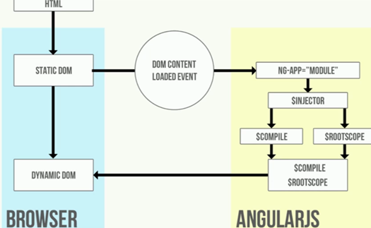

- $digest() processes all of the watchers of the current scope, $apply() is used to notify that something has happened outside of the Angular JS domain, $apply forces a $digest cycle.

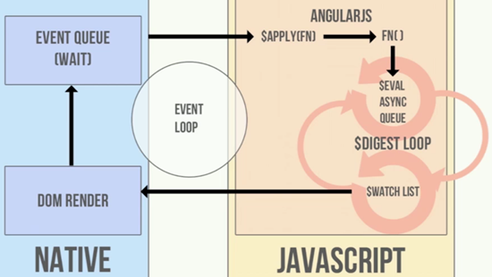

- If we use factory then it works on revealing module pattern, and service is worked with ‘.’ dot syntax pattern, in this we are attaching methods and properties to a ‘this’ object. Prefer to use factory.

- Treating HTML as a DSL (domain specific language) – by using directive we can create HTML like DSL which will specify our page functionality.

- DSL – directives allows HTML to be extended into DSL. By creating custom tags in HTML, we can start to show what we are doing and convey it in a way that makes sense for domain experts. HTML becomes very expressive and self-documented. People find DSLs valuable because a well-designed DSL can be much easier to program with than a traditional library. This improves programmer productivity, which is always valuable. In particular it may also improve communication with domain experts which is an important tool for tackling one of the hardest problem in software development.

- Using compile function – it is used to manipulate the DOM prior the link function executing. Angular team choose to break out the compile and link function due to performance reason because in compile angular need to traverse the whole DOM to find the directive that need to be processed. When we use the compile function scope will not be available to us as it is mainly used for DOM manipulation not finding the scope or adding watches.

- Use the compiler function for template manipulation before the directive was actually attached to the DOM. The compile function takes our HTML and scope and put them together. The compile function gets broke into two functions pre and post. What we get from post link, in the compile function, is what we look in the linker which is our scope and HTML together.

- Use Green Sock for javascript HTML5 animations.

- Cookies present problems today, because the browser sends a cookie on every request, even on requests that do not need a cookie to authenticate the user, and sometimes on requests that have been put together as part of a malicious cross-site request forgery, a CSRF. Cookies do not work well with web API that works on a different domain as they are limited to a specific domain. We have more control over token.

- When we use an ng-repeat and you repeat over something like ‘star in stars’ collection from the scope, angular really wants to see distinct values inside of there, so distinct object references, or distinct number values, or distinct strings. So in case like we have an array with empty elements, in order to work with ng-repeat, we need to tell angular to track these elements by index, instead of the values that are inside of the elements.

- Creating stars ratings functionality:

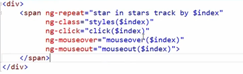

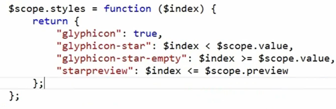

- Forms are always start off simple, but then the business wants to add rounded corners and cute icons to make the form look friendly and inviting, and the real complexity starts when the business starts adding validation rules to a form.

- Function binding to isolate scope: whenever we use the ‘&’ binding, we are essentially creating a proxy function on our isolated scope, when we invoke this proxy function, angular goes out and looks at the expression here and it figures out how to invoke that expression to get it to work. We have to understand that angular actually understands expressions like this at a very deep level. If we look thorough the angular source code, we will see lots of regular expression to parse things out, and angular even knows the name of this parameter that of this parameter that we want to pass to the method on objects. Angular understands that it needs a value to pass into this function. So when want to invoke these proxy function, we do not want to just pass parameters along, we to want to pass essentially, a hash that tells angular in the expression being used, if there is something with this name value, then pass along what is inside of this variable for that function argument. So we need to use an object literal syntax like below to get a parameter into an expression that is bound to a proxy function on our isolated scope.

- The first version of angular known as Angular JS. Angular 2.0 or above known as just Angular.

- Angular is a tool to help you build interactive websites, you can call it a framework. It provides tools to communicate with the server and to improve the performance, package application, maintain state, organize code/logic, ease display of data, synchronize state as it changes.

- Angular 2 is more standard based (modern web standards), modern (state management, change detection, etc.), more performant.

- Angular releases major version every 6 months, 6 months of active support and 12 months of LTS support (only security and bug fixes, no new features unlike active support).

- Universal benefits – reduction of cost, standards compliance, extremely performance, open source, use typescript, backed by Google, very uniformity (make onboarding new developers cheaper and simpler), amazing documentation.

- It indirectly provides environment for router, HTTP, forms, RxJS, etc. Already configured with Typescript no need extra to configure, opinionated means fewer decisions to take. Provides support for progressive web apps, lazy-loading, fully reactive forms library support, fully featured router, animations library, supports strictly typed forms.

- Angular also supports server-side rendering, mobile friendly, angular language service (Intellisense and better debugging in templates).

- Components – building blocks of modularity. It breaks up display of application in manageable chunks. It has display and logic.

- Services are a place to put logic which is not related with the display like checking more than article reading limit has been crossed or not.

- Directives are a way to give existing tag a new functionality like making elements or appear on hove, control the visibility, etc.

- Pipes is used, to format the data to display like uppercase.

- Modules are not optional in angular 14. It is a grouping of other features like services, components, pipe and directives, it can also include other modules.

- Application state gets changes on user interaction, http service response or by timer execution.

- Efficient change detection – first the state gets change then cascading changes occurs and finally re-render of page.

- Inefficient change detection – the system is not smart enough to identify the cascading changes and re-render the UI multiple times.

- Zone.js is a wrapper on the things which can change the state change like user interactions, http and timers, it knows when these things gets completed. Angular then subscribed to notification from zone.js so that it can run the change detection and re-render the display.


- Rendering targets provided by angular – browser/DOM, server-side, native mobile apps, native desktop apps.

- Angular CLI solves JS fatigue problem which setting up the JS environment to build an application.

- Server side rendering – increase performance as initial download size gets reduced, increase render time, search engine optimization. Modes – full pre-render, dynamic pre-render, client-side switch.

- To build the native mobile apps with angular, there are two common tools ionic and NativeScript. For Native desktop, we need to use Electron.

- Angular testing utilities – TestBed – helpful in testing component with templates. It helps to constructs component in small, live, angular environment and gives us handles to wrapper around component and DOM created by its model. Async and fakeAsync, MockBackend.

- AOT – browser needs to compile the templates into DOM Functions i.e. the actual views. The AOT does it during the compile time itself.

- In chrome browser, Elements, console, sources tabs are called panel and windows inside each of them are called pane.

- In chrome browser, Use $0, $1, $2, $3, $4 to evaluate currently or previous selected elements from console.

- Angular 1 is an MVC pattern, but Angular 2 is component-based pattern, it is like a directive in angular 1 but smoother.

- The interpolation {{}} represents one-way binding.

- Using template reference variable to interact with child components – this variable allows us to specify a variable name that points to a component and then we can access any public properties and method on that component using that variable.

- Angular need to know the exact URL where our app is hosted, so that it can knows what its routes are relative to so that it can parse the URL. For this we need to provide the base tag in our index.html.

- Content project is an ability to change the content inside of a component based on the needs of the application. Like a dialog box and reuse it with different pieces of content for save and cancel button or re-posting logic. This is called transclusion in angular JS. In multiple slot projection we have more than one slot into which the variable content can go. We need to use ng-content tag which will tell angular whatever content exists inside of my component, put it inside of it.

- Mutability – objects and arrays in JavaScript are mutable; they can change any time without changing their identity. By default, angular only runs a pipe when the identity of the source has changed. Using impure pipes, it runs on every cycle of the change detection engine, this method of executing the filtering or sorting code every time change detection runs is how angular JS filter worked. Pipes are no longer recommended as the way to filter and sort our data. We should do it ourselves using component so that we can filter and sort the data when source gets changed by ourselves.

- We should not use global objects of third party services inside the application, if we do this then we won’t be able to use concepts ES6 modules, tree shaking, and also it is bad practice.

- Angular dependency injection lookup – whenever we provide a class into providers, angular takes it and provide an instance for that class using constructor function. In angular 1 we use strings to register the dependencies, in angular 2 we are using classes or types, that is our keys or in other words our token.

- Using OpaqueToken for dependency injection, angular 2 provide a mechanism for us to create a key or token that we can use in the dependency injector without creating a class. Its job is simply to create a token used for the DI registry in order to find the instance of the object we want.

- The useExisting and useFactory Providers – whenever somebody will ask for the MinimalLogger they will get the instance of the Logger, but they will see only those methods that are on minimal logger API that you actually want to use. useFactory allows us to parameterize the creation of an object. We use this when we need to have a very complex way to construct an instance of a class to use as a service.

- Angular HTTP testing utilities – HttpClientTestingModule, HttpTestingController. TestBed utility configures the environmental to run our unit tests, it also implements angular inject interface due to which we can inject the classes which we need in our test.

- For integration test angular use TestBed utility to construct the component, unlike unit test where we ourselves construct the component, in integration test angular does that using TestBed. It also constructs a module for us to be used in the test run for the component to operate in a realistic environment.

- Using a Testbed – Using fixture gives us a hold on the component, but not just its class with its method and properties but also its template, the actual HTML template. We can inspect the template, change it, ask angular to run change detection and expect, this is also a main benefit of testbed to able to get a hold of this fixture. Also using Testbed, we can setup the dependencies in a bit of an easier way. Testbed is also just an angular module.

- Using debug element – debugEl has a query method which we can use to select from the root node using “By” predicate.

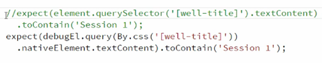

- Tree shaking removes the properties and functions from production build code that is never called.

- Enable production mode by calling enableProdMode(), the development runs an extra step though angular 2 change detection process. When it’s all done running change detection, it runs it one more time to make sure that nothing has changed. So, in production mode we want to disable this feature.

- Ahead of time compiler (AOT) benefits – in this precompiling our application like compiling template. We need to install compiler itself from platform-server. With AOT we cannot use full path but relative path. It provides faster rendering, fewer requests, detect template errors, better security.

- Optimistic bundle download – eager lazy loading of the module. It will download it as soon as there is available download. We do not want to wait to render the application until it is downloaded.

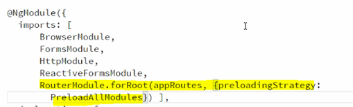

- If we set schemas: [NO_ERRORS_SCHEMA], it means we are testing shallow components, so angular won’t give error any error as it won’t render the child components. In provider if we use useClass or useValue then while doing dependency injection it will pass the instance of that class or value.

- For change detection angular is used zone library, zone listen all the asynchronous activity in a zone. It has a queue of asynchronous activity that it listens for and it waits until it finishes. So we can utilize this concepts using testbed to be able to know when these asynchronous activity is finished versus doing a “done” call-back as in traditional approach.

- The nativeElement property exposes the regular old browser’s DOM API to work with template. There is an another property called debugElement() it is like nativeElement() and it has a way to access to root element of our template. It has some different set of functionalities that is very similar to nativeElement.

- To make the ngOnInit() method to get called as a lifecycle event we need to raise changeDetect() event. We can manually call ngOnInit() but it is not recommended approach.

- Using the fakeAsync helper function to avoid slowness and increase readability. We can use tick() function to call any code that should be called inside of that time-frame, then we can call our expect() statement. The reason we can do this is because angular itself runs inside of zone.js and fakeAsync function makes this code run in a special kind of zone, that zone.js will create that allows us to essentially control the clock inside of that zone. So, we can tell it to tick forward.

- Fake Async in the tests – we need to wrap the test in fakeAsync method, it allows us to fake time. Using tick() method to fake time while using fakeAsync. Working with Async – it helps us to wait for while selecting any DOM to do test deep / child component as integrated test. We use a method fixture.whenStable() for this type of testing.

- If we don’t know the actual tick times then use flush() it will make zone.js to run all the pending tasks in its queue.

- Using the async helper function – it works with promises. Promises are also asynchronous. It also utilizes the same concept of zone.js. it is also a part of angular core testing module. It will ask our component to wait until it has stabilized. The component understands when it sees a promise inside of itself that hasn’t yet been stabilized until that promise resolves. But async() doesn’t deal well with setTimeouts.

- fakeAsync can work with both a promise and a setTimeout and with all other asynchronous types of code. But async is only works well with promises. We should prefer using fakeAsync approach.

- Interceptors allows us to write a small bit of code figure in a single place and apply to all of the HTTP request and responses. They are like services and implement the HttpInterceptor interface. They manipulate HTTP requests before they are sent to the server. They also manipulate the responses before they are returned to our app. Uses for interceptors – adding headers to all requests, logging, reporting progress events, client-side caching.

- Types of directives – component, attribute directive, structural directive. An attribute directive changes the appearance or behaviour of a DOM element. It makes DOM more dynamic, responding to run-time environments and quick & easy to reuse.

- structural directives - `*ngIf`

- Pipes modify data for display only. types - async, currency, date, decimal, json, lowercase, percent, slice, titlecase, uppercase

- Query decorator - if template is inside view then use @ViewChild otherwise @ContentChild if template is inside component

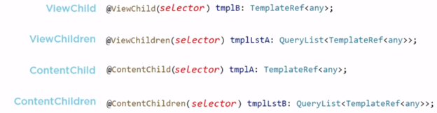

- Directive selectors

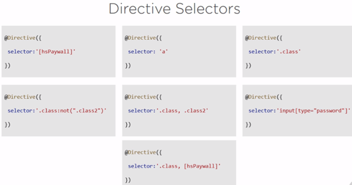

- Native element using cautions – it tight couple our back-end code with front-end presentation, it is unavailable in angular universal, and we cannot move any logic directly using nativeElement into a web worker. So, if we use it property then these problems will not arise. For this we should use Renderer2 class.

- Building templates with ngTemplate – by default it’s just add an empty element as comment `<!---->` on DOM. We can also use it with ngIf-then-else condition:

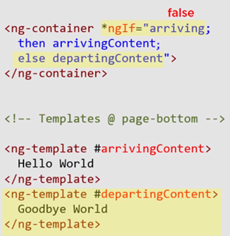

- NgTempalteOutlet – by this we can decide the position of template to display on the DOM, other use-cases can be alternate UI, repeated UI elements, dynamic UI placement:

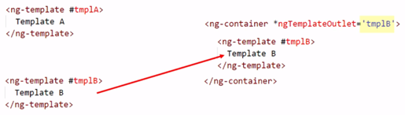

- ngTemplateOutlet Context: we can pass some JSON which will alter the templateOutlet, it is useful for simple template modification scenarios:

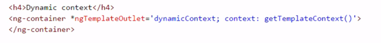

- Dynamic component creation - `*ngComponentOutlet`, `ComponentFactoryResolver`, `resolveComponentFactory`

- Use ng-container wherever possible instead of div or span.

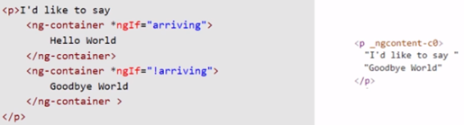

- ngSwitch Bloat – instead of this use NgTemplateOutlet:

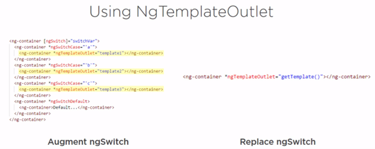

- A pipe shouldn’t do a lot, for this a component will be a better choice. All built-in pipe are pure, except - splice, json, async

- A better ngFor while iterating collections using trackBy function so that while manipulating the collection angular don’t have to re-create it on the DOM

- Angular lifecycle hooks – the blue blocks hooks don’t available in directives only in components:

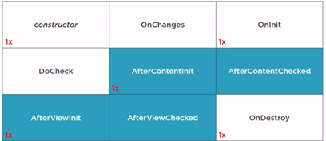

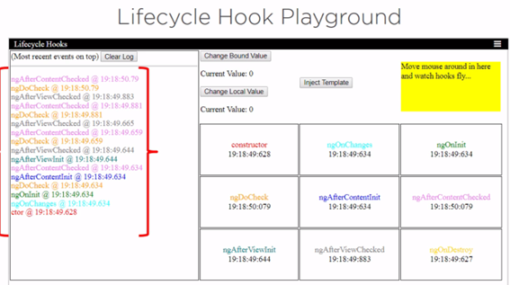

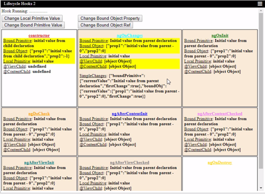

- Angular treats the UI as a DMZ, accessible to anyone untrusted and un-trustable. Angular treats all values as untrusted by default. Angular only trusts template HTML, binding expressions, and attributes. It will sanitize or cleanse any content it doesn’t trust before adding it to the DOM. It will still display it like a script by converting first into simple string text so that browser doesn’t parse it.

- View child - it is like getElementById() method.

- We can create three types of services to share the data – property bag, basic statement management of entities, and state management with notification. For advance we can use redux.

- For change detection we can use the timer pool if the property is not binding by angular expression:

```typescript
onOnInit() {
    timer(0, 1000).subscribe(t => {
        console.log(this.prod);
    }
}
```

- angular communication approaches

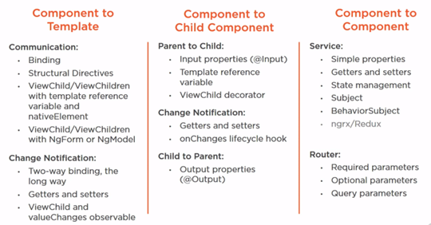

- Angular Material is a reference implementation of Google’s material design specification. It provides a set of reusables, well tested, and accessible UI components based on Material Design. It supports Asymmetric acceleration and deceleration which create more natural and delightful motion than symmetric motion:

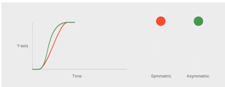

- The goal of angular CDK is to give developers more tools to build awesome components for the web. This will be especially useful for projects that want to take advantage of the features of Angular Material without adopting the material design visual language.

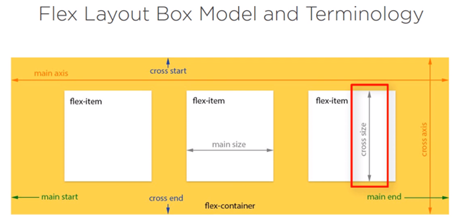

- AOT Compiler – improve performance, earlier JIT process compile the functions in DOM functions it takes time. But now using AOT it directly sends the DOM function without compiler.

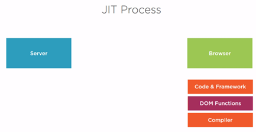

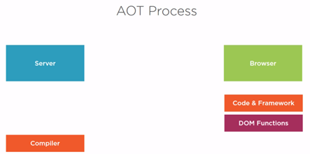

- We get the below CORS error unless the URL’s match, including the ports themselves:

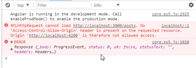

- Pure and impure pipe performance – pipes are pure by default means they do not work with data mutation, they only get re-evaluated if the object reference got changes that the pipes is applied to. We can resolve this by making the pipe impure but it will impact the performance. Like even initial loading of page this sorting pipe will be called many times due to object changes

- While doing interpolation we can’t use assignments, it only allows read-only data.

- If we don’t want to use brackets () for event binding then we can prefix it by “on”, like on-click.

- Content projection is same as transclusion in angular 1.x, now we use term ng-content tag for it

- Lifecycle hooks - Constructor() – only dependency injection will happen in this step, ngOnChanges() – anytime an input property changes this lifecycle hook gets called, ngOnInit() – input properties have been initialized, ngDoCheck() – when we are working with change detection, when input property gets changes if we want to perform our own change detection, ngAfterContentInit() – when the components or directives content has been initialized, ngAfterContentChecked() – content has been checked out and we are being notified that the checking is complete, ngAfterViewInit() – when the components view has been initialized, ngAfterViewChecked() when view gets checked, ngOnDestroy() – gets called right before the instance gets destroyed and we can free up any resources we have.

- Module organization – Core module should contain single use classes or singleton for the entire application, it should be imported only once in app module. We should have one more module i.e. AppRoutingModule for containing routing related information. Shared module should contain modules which are re-exported and shared throughout the app.

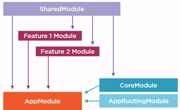

- Unit Test – jasmine is main testing framework, and karma is the framework that executes our tests.

- If we want to take up the control while newing up the instance of the recipe class, we need to create a factory that will be executed to create a new service instance. By this we will have more control for how it is created:

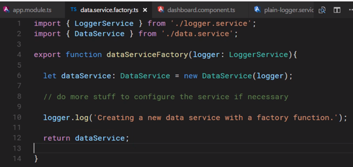

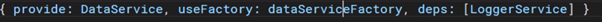

- SkipSelf decorators to make sure it is properly checking for a separate input of the core.module. SkipSelf tells the injection system to begin looking for an existing instance of the module in the parent injector. Optional instructs the injector to pass in null if no other instance is found.

- The execution will become pause at the await keyword, so we need to use async keyword in function method name so that it will not block the caller of this function.

- RxJS is a library for building asynchronous applications with observable sequences. It provides an API layer which abstraction different implementation of synchronous, async, single value or multiple value responses. RxJS is written in TypeScript.

- Subscribe method returns a subscription object, by this object we can cancel the execution of the observable. When we cancel an observable by unsubscribing from it, we won’t get a completion message that can be handled by the completion handler we write, but tear down code will still runs when we unsubscribe to prevent the memory leaks in the code.

- Subjects and multicast, they enable multiple observers to receive values from the single execution of an observable.

- Subjects – they are observables. They are implemented as a child class of the observable class. They can also act as observers. They have a state and maintain a list of observers. Due to which they can push values to more than one observer at a time. This makes them multicast instead of unicast.

- Subjects are similar to observables but have a few important additional features. Observables can only produce values for a single observer, so they are unicast. Since subject can produce the same value for multiple observers, they known as multicast.

- Multi-casting operators – multicast() it takes subject as a parameter, it returns a connectableObservable type on which we need to call method connect(). The refCount() operator can be used with other multi-casting operators to automatically trigger execution of the source observable when the number of observers is greater than 0. The publish() operator is thin wrapper around multicast that doesn’t require us to pass it a subject. It will create one for us behind the scene. The share() operator is similar to using publish and refCount together.

- A scheduler controls when a subscription starts and when notifications are delivered. Observables can be configured with schedulers to control the execution context for the observable. Types – queueScheduler (for sync operations), asyncScheduler, asapScheduler (micro tasking).

- Schedulers give us control on how our observables are executing. queueScheduler, asyncScheduler, asapScheduler, animationFrameScheduler, TestScheduler.

- Understanding Schedulers and the Event loop: microtask queue has high priority than async task queue.


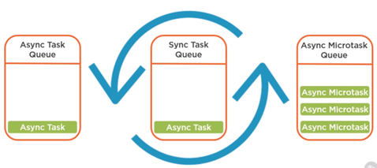

- Using flatMap to process inner observables – flatMap operator is more sophisticated than map operation, it will also subscribe to the returning observable and deliver it throughout the rest of the pipeline.

- In decorator we pass configuration objects that basically stores metadata, all this metadata is used to describe some object that follows like in below Class, Decorator is a feature of Javascript.

- RxJS is the reactive implementations of the Reactive Extensions API. The ReactiveX API is meant to help us to manage the flow of data in our app. RX is a combination of the best ideas from the observer pattern and the iterator pattern. The observer pattern – key things are subject and observer or observables and observers.

- Benefits of RxJS - It has a better asynchronous API, it has both readability and capability of handing multiple values. Callbacks, promises and async-await are only better for handing a single value.

- Libraries are supplemental pieces of functionality, they help us solve specific problems, but don’t dictate the overall architecture of our app. Ideally, they avoid conflicts with other libraries and let us selectively use their features as we see fit. Examples are RxJS, lodash, jQuery. Framework on the other hand are much larger and prescriptive. We typically only use choose a single framework to use when starting work on a new application, however we might supplement that framework with several libraries to help us with specific problems we are trying to solve. Example – angular, react, Vue.

- RXJS operators

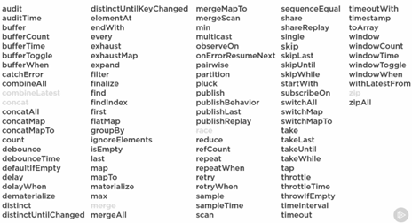

- Types of observables – cold (Netflix / movie @ home) and hot (movie theatre)

- observeOn – use different scheduler as javascript has multiple queues. This operator explicitly let us specify which queue on observable will processed on, means it let us specify a priority for the new values coming out of an observable.

- subscribeOn – it is similar to observerOn, it changes observable scheduler used by source observable.

- Multi-casting - Taking values from source and sharing or passing them along to multiple subscribers, typically placing some type of control or limit on how the subscribers receive values or the values they receive.

- Core and shared module – core or common module is designed for singleton type of services, which will be shared throughout the service like logging service, error service and data service. Service that are specific to a feature can go in the feature’s folder. Shared folder should contain reusable components, pipes and directives like calendar component, auto complete component. Shared module will be imported many times in different modules, but core module should be imported only one time into root module.

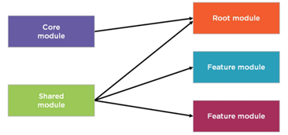

- Change detection strategies – in case of container presentation pattern, we don’t want the child component changing the state of the data at all, because that is the job of the parent or container component. When using OnPush detectors, then the framework will check an OnPush component when any of its input properties changes, when it fires and event, or when an observable fire an event.

- Reference vs. Value types – if our container component passing a value type it would update the child because change detection mechanism would catch, but when we do changes in some object property i.e. referenced type because object itself didn’t change and change detection won’t get fire, so to handle this we need to use cloning techniques.

- State management options – angular service, NgRx, ngrx-data, observable store, Akita, Ngxs, MobX

- A service is typically a class with a narrow, well-defined purpose. It should do something specific and do it well.

- HttpClient and RxJS operators – use forkJoin when we want to call two HTTP service and know when both of them come back and completed, it is like promises.all.

- General architecture of application with libraries

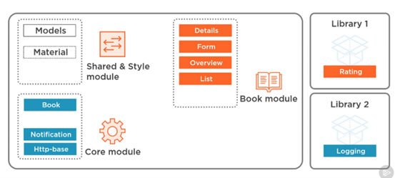

- The best way to test our angular library is to use npm pack command which is used to change directory into the library dist folder. We need to type command cd my-folder/dist then npm pack. It will create a tarball file (`*.tgz`) then we can install it using npm install my-folder/dist/package.tgz. other alternatives to test the library on local are npm install, npm link, but npm pack is best approach.

- Push based architecture using RxJS and Facades. Traditional pull based – we call them once, they respond, they are done. They are not going to return values over the future. Push based services – we construct a stream like user stream using another stream that will extract our users out whenever that state changes. Our views react to that change of data from that stream.

- For a state management we need single source of truth, immutable state that is needed for things like ngOnChanges so it can fire properly as it will only get fires when the reference will change, state change notification and track state change history and simple to implement and maintain, works with any front-end framework. To satisfy all of these things we can use observable store. It provides a simple way to manage state ina front-end application while achieving many of the key goals offered by more complex sate management options

- NgRX selectors - allow us to query our store for data, recompute when their input change, full leverage memoization for performance, selectors are fully composable, selectors are extensible

- Jest is built on jasmine, it uses snapshot which reduce test code and compares results with snapshot. By this the snapshot gets checked-in into the PR which reviewer can see and take decision whether it is make sense for which we are making against take PR.

- Effects are about controlling asynchronous operations and allow us to dispatch action based on this asynchronous operations.

- NgRx is a library, it is not a framework or another platform. NgRx supercharges the redux pattern with RxJs.Redux pattern is a state management container, it came from React community. The reducer will take the slice of state from action and create a new state. We don’t put HTTP service in the reducer as HTTP service call is not a pure function, it is a side-effect as it can return anything. We use effect for this situation, this effect is listening for all actions that are being dispatched in our application.

- Redux attempts to make state mutations predictable by imposing certain restrictions on how and when updates can happen. Three core principles – single source of truth by one big store, state is read only, pure functions drive state changes

- For communication between components, we need to action and selectors. As one component raise the action then reducer update the store and both components subscribe to that select which will make the components re-render.

- Now we can use `changeDetectionStrategy` onPush, it will optimize our view performance. It means that the change detector’s mode will be initially set to CheckOnce. Any asynchronous API events like XHR or promise based events will not trigger change detection once we change to this strategy of OnPush and the components template will not get updated. In default strategy it will every time changes in our application as a result of any user events, timers, XHR requests, promises, etc change detection will run on all components.

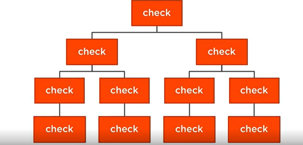


- Now above component will be changed only if new input reference is passed or a dom event is raised in our component or its children otherwise the view will not get updated.

- Angular language service main features – hover tooltip (quick info), go to definition, code completion Intellisense, diagnostics, syntax highlighting. It will automatically shows the properties which are available if we type [], and available events if we type () on a `<div>` element. Angular language service is built on top of Language Server Protocol (LSP) which makes is editor agnostic.

- Benefits of rendering the application on server-side using Angular universal – show the first page quickly, improve performance, facilitate web crawlers (SEO).

- On console if we type ‘ng’ it will give us below methods –

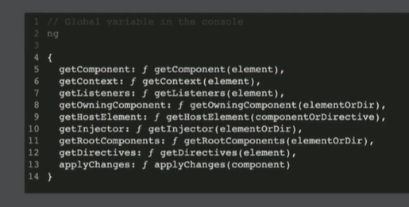

- Angular CLI Builders - Builder are wrongly given name, they just know that they are just given a set of options, run a function and return the results.

- The term ‘state’ is kind of fancy term for saying the data in your application that changes like list of movies. A side-effect is a term that we use to describe code that has to talk to the outside world like making REST calls, handling a web socket connection or dealing with time, these side-effects generally triggered by like ‘search’ button call. The term state change is the act of after we subscribe and get the movie list result, we update that component is managing to the results that came back from the API request.

- Selectors are consumers of action, but their responsibility is to help you bind your state to your components, it helps to bind state to our components. We have actions as some kind of indirection that allows a component to talk to the store without actually having to directly inject the store. Selectors are just functions. Selectors are like Global @input() for our application. Components don’t know how that state is derived or where that state comes from, their only responsibility is to subscribe to those selectors to be notified when that data changes, using async pipe in template which will automatically subscribe to that observable and then unsubscribe when the component is destroyed.

- Actions are unified interface to describe events, it just have data, no functionality, has a minimum a type property, strongly typed using classes and enums. This is the main communication layer between so many independent pieces of the application. It is how components are going to be describing events, and it is what reducers and effects are going to be using to trigger state changes and to trigger side effects. Unique events get unique actions, actions are grouped by their source, actions are never reused. Mention what caused it to happen, and who produced it.

- Optimistic UI is where we remove the records from the UI at once by assigning some temporary ID and then after getting call from server we update it, it makes UI more user friendly.

- If a user goes away from the desk for couple of hour, to avoid the stale data we can use web-sockets which will dispatch method in our backend that can notify clients when changes to our data model occur, and then using NgRx effects connect to that web socket and map notifications coming out of that web socket connection into actions that can then go update state by this we are always getting a live UI.

- To implement session expire functionality that to show message like ‘this is going to expire after certain minutes of time’ we can do it by setting up an effect that on enter could run like every minute of five minute or every hour to re-trigger that HTTP request and rehydrate the store if we don’t want to go the web socket method.

- To clear the data if user logs out, we can trigger the logout action and trigger state change that could pass undefined to our reducer and have them all clear.

- Effects are where all our side effect producing code happens like showing alerts, starting timers, opening connections to web socket, making http calls.

- Instead of having one heavy reducer function, we should have smaller reducer functions to update just slices of our state.

- Actions are like gluten of the NgRx loaf. We use unified interface to describe events. The ‘type’ property is the name of that event and it needs to be unique across all the actions in our application.

- Selectors allows us to query our store for data, they are almost like our SQL statements from a database.

- Anyone below we can use in effects. Exhaust map will discard any additional emission until one that is currently working on is complete, it is like going to postoffice and the front person is taking too much time and leave in-between. switchMap is opposite of exhaustMap, it will cancel the current work if new effect comes up. mergeMap, exhaustMap and switchMap can lead to raise condition as they are either cancelling the requests or discarding the new runs so concatMap is the safest operator but there is risk of back pressure and it will keep the emissions in order, it will lead to bad user experience of waiting. It is like waiting in a queue to get food, and we will only get the food when priors persons received the food.

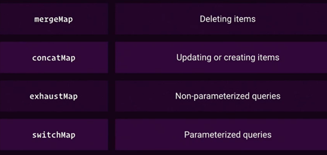

- Usage of RxJS operators in different scenario –

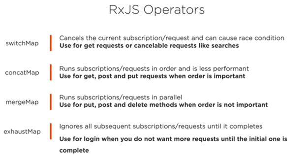

- takeUntil is like throwing a person out of lunch line but everyone else will just continue. exhaustMap is like no line will ever perform, if someone is buying a lunch the other will just went away from there and never comes back.

- We can use interval operators in scenario where we want to refresh a page within some duration. Also instead using the web-sockets we can use this to rehydrate our models.

- Monorepos – everything that belongs to a system should get in there and it should have one version for all of these libraries not different version for different libraries by this we won’t have version conflicts, no burden with distributing lists

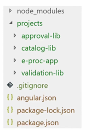

- Earlier compiler used to build the packages also if someone changes something in a project file, but now ngcc compiler will compile the package separately to make the build process faster. No more JSON conversion of typescript components.

- Faster tests – smarter recompilation model, earlier using view engine it will compile all of the components between every single test execution, but with Ivy unless we use some override method it won’t compile all of the components.

- HttpBackend will be last interceptor –

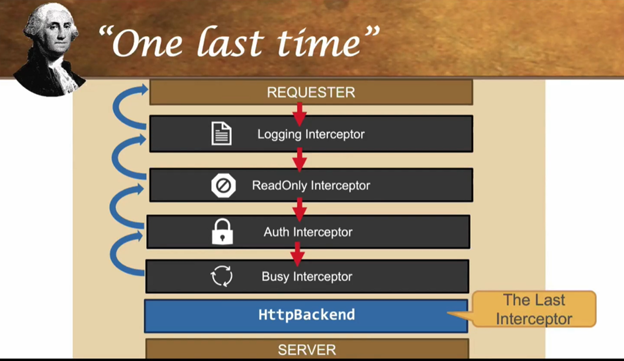

- Firebase was initial created to integrate online chat functionality. Google acquired it into 2014. Cloud functions can be triggered from different firebase services, google cloud services or even third parties through web hooks.

- Types of errors – external (HttpErrorResponse), business side and internal (Javascript error).

- When an Angular application is started, the main.ts file is loaded first, here we bootstrap the root module i.e. app.module.ts. In this module, we specify a component as the bootstrap component and tell angular to load this component and all its dependencies at start up and register it’s selector app-root. Now when browser loads the index.html file, it knows what is app-root and render all the contents of this component.

- The Bazel compiler is a build system used for nearly all software build at Google. When you compile the code with Bazel Compiler, you will recompile the entire code base, it compiles only with necessary code. It uses advanced local and distributed caching, optimized dependency analysis and parallel execution. In short, it only rebuilds what is necessary.

- @Inject is a manual way of specifying this lookup token.

- Injector tree – an angular application is a tree of components. Each component instance has its own injector. The tree of components parallels the tree of injectors.

- How angular router works – runs the guards that are defined, resolves the required data, activate the angular components, manages navigation and repeats the steps

- Three types of data bindings – interpolation, event binding, property binding. Interpolation is a one way data binding.

- Angular does not have built-in two way data binding, however, by combining property binding and event binding we can achieve two way data binding.

- Inbuilt structural directives are `*ngFor`,`*ngIf` and attribute directives are `NgStyle` and `NgModel`

- The main.js file contains all the code in our application, the polyfills.js file loads all the polyfill script to make sure it can be compatible with all the modern browsers. The runtime.js loads all the other files. The styles.js file loads the styles as the name suggests and vendor.js file loads all the imported libraries.

- The canLoad guards always blocks preloading, so if the canLoad guard is executed, preloading will not work. We can replace the canLoad guard with the canActivate guard, and the it works perfectly fine.

- React vs. angular - Are you type of developer who prefers guided path where everything is kind of inside of a box and works out of box then choose angular. If you like to deviate from certain patterns and build things your own way like routing and other things then react is suitable for you. So, it is more of the type of developer you are than technology.

- By using `ng serve` it run the application locally in memory by using web pack server. This server is not ideal for the production.

- Instead of using the nested subscriber we should use maps like switchMap, exhaustMap, mergeMap and concatMap they all internal use map operator it has a project function which will return whatever we return whichever we return from it. These above operators use flattening operators like mergeAll, concatAll, switchAll and exhaust so that they don’t return observable of observables but just a normal observable.

- We shouldn’t mock which we don’t own. For the external libraries we should write an adaptor and while writing the external integration tests, use that adapter along with external library.

- We can also store full page and resources locally by using application cache but it is deprecated now, we should now use the service workers and cache API to cache resources. The cache API is a cache object where request objects act as keys to their responses.

- Service workers are scripts that run separately from our web page, intercept network request so web developers can treat the network as an enhancement and contains certain events such as fetch, push and sync. It basically works as a proxy between the network and the browser and a work when we are offline or in the background even when our site is closed, so we can trigger events when our site is closed as-well. Alternative is application cache but it is complicated and has strict rules, inefficient with versioning, cannot update small areas. Due to this the web workers have been introduced in combination with Cache API.

- Service worker expands on web worker, this means that it has no access to the DOM, isn’t tied to a particular page and run on its own global script context, works only with HTTPS, run without a page and is event-driven, it also triggered again even when in inactive state.

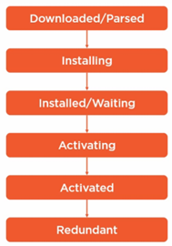

- What Is an "App"? - Application Richness and Reachability evolution, native app like IOS has increased the richness but reduced the availability.

- Expectations from an app - findable on app store, icon on home screen, touch controls, works offline, receives notifications, background processing, access to hardware feature and sensors.

- The progressive web app is a thing that will give us both richness and reach without compromise.

- Attributes of progressive web app – responsive, work offline, native app-like feeling, fresh and safe, discoverable, re-engageable (push notification), installable, linkable (URL based).

- Baseline requirement for progressive web apps – site is served over HTTPS, pages are responsive on tablets and mobile devices, metadata is provided for add to home screen, the start URL loads while offline, first load fast even on 3g, site works cross browser, page transition don’t feel like they block on the network, each page has a URL.

- The smart component will pass the updated data towards the dumb components

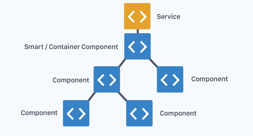

- We should only use behaviors like logging in the tap operator, we should not use side-effects in it.

- It is safest default for flattening, hard to create leaks like mergeMap. We should use it for HTTP request that can be cancelled (GET) and great for reset, pause and resume functionality. We should avoid it with POST request while saving the data.

- Catch errors on observables with catchError – we can either throw an error or return a new observable based on some condition. We can also return the EMPTY observable.

- Difference between [] and {{}} bindings - We can’t mix [] and {{}} together on the same attribute. Angular will complain.. Property bindings are actually manipulating the DOM and they get to preserve data types. Curly brace binding is string interpolation of the HTML and always results in strings.

- It comes down to how they function. {{}} is basically a form of string interpolation. You should think of it as simply replacing the HTML string with the results of the binding, and then the HTML gets evaluated.

- Property binding, [], on the other hand, works differently. You should think of this as manipulating the DOM after the HTML has been processed by the browser.

- So the [src] binding actually manipulates the src property of the image object, and NOT the src attribute of the img tag.

- The difference between ElementRef, TemplateRef, and viewContainerRef with examples.


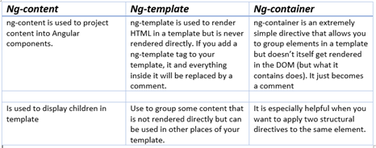

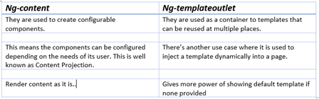

- Angular 2 we have structural directive which are indicated by the prefix `*` because it is changing the structure of our DOM.

- No more $apply, repeated digest cycles, no more watches, no more performance issues with digest cycle and watcher limits.

- @Injectable() is similar to angular 1’s $inject. Now in new case we are using a decorator.

- When we inject a service, angular searches the appropriate injectors for it. Angular 2 has a hierarchical DI system with a tree of injectors that parallel an application’s component tree.

- The great thing about the http object, the service that angular gives us, is when it gives us back the observable it will automatically unsubscribe when it is done. So we do not have to worry about cleaning up that particular one. If we create a manual observable and subscription, then we are going to have to clean up our own subscription.

- Types of guards – resolve, can activate, can activate child, can deactivate, and can load (can load is like can activate but it will not even go get the contents, html and the javascript until it get satisfied it is used in lazy loading).

- We can use tools like AOT, which is an angular tool to do ahead of time compilation that will use the angular compiler on the server to compile the template here and then send across the wire those compile templates. We will use things like tree shaking to shake out some of the dead code that we are not using. Use code splitting so we can split our bundles up in case we use eager or lazy loaded modules. Use bundling and minification. Angular CLI.

- RxJS subjects are like an observable, but they can multicast to many observers, they are like event emitters and they maintain a registry of many listeners or observers.

- Angular universal is a concept that because we are no longer tightly coupled to the browser, because we have this compiler, we can actually build our application, and then render it entirely in a server side. Render it without the browser context at all. In this angular give us single method within what’s called platform server that renders our application to a string. So, we import our root module, and then angular say render to string. We give it the context of the URL the user’s trying to load. Then we can cache, serve or sent the string to the other user.

- A decorator is a JavaScript language feature, the scope of the decorator is limited to the feature it decorates.it is always prefixed by @ sign. It needs to be define above the class signature with no semi-colon afterwards, it is like an attribute feature in other programming languages.

- Observables help us to manage asynchronous data; they treat events as collections. We can think it as an array whose items arrive asynchronously over time. As of now observables are not supported by ES6, angular currently use Reactive Extensions (RxJS) as a third party library for this.

- Observables allow us to manipulate sets of events with operators. Operators are methods on observables that compose new observables. Each operator transforms the source observable in some way. Operators do not wait for all of the values and process them at once. Rather, operators on observables process each value as it is emitted. Operator examples – map, filter, take, and merge.

- Bootstrap array - Every angular application should have one app module, and one app component, it should have one bootstrap component which will be loaded while opening of index.html main file. So, every application must bootstrap at least one component, the root application component. The bootstrap array should only be used in the root application module, AppModule.

- Declaration array – we use this to define the components, directives, and pipes that belong to this angular module. Every component, directive, pipe that we create must belong to one and only one angular module. Do not add other classes, services, or modules to the declarations array. All declared components, directives, and pipes are private by default. They are only accessible to other things in declared in the same module.

- Exports array – allows us to share angular module’s components, directives, and pipes with other modules. Never export a service.

- Import array – an angular module can be extended by importing capabilities from other angular modules. It allows us to import supporting modules that exports components, directives, or pipes. We should only import what this module needs. Importing a module does not provide access to its imported modules.

- Providers array – it can register service providers for our application. It allows us to register service providers at the module level. It is like the provider array of component, which register the service at component level. Any service provider added to the provider array is registered at the root of the application and is available to the any class, even classes in other feature modules. Do not add services to the providers array of a shared module. Instead of this we should build a core module for services and importing it once in the AppModule. Routing guards must be added to the providers array of an angular module so that router can use these services during the navigation process.

- If you have set of services that you want to ensure are loaded when the application is loaded, consider defining a core modules for those services. It should be imported once into the root module.

- Different types of modules which we can have: root application module (AppModule), feature modules, shared modules, core module, routing modules

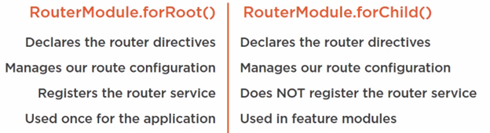

- We need to use query parameters to retain the user setting when navigating to the different navigation. To define parameters that work across multiple routes. Like on product list user has some search data, then navigated to the details page then coming to the product list page. Just like optional parameter we use query parameters to pass optimal or complex information. Unlike optional parameters they can be retained across routing paths. Like optional parameters, query parameters are not part of the route configuration and are not involved with matching route paths.

- We can use child routes to display routes within other routes for better route hierarchy, encapsulate and navigate through our application. Also makes easier to lazy load routes.

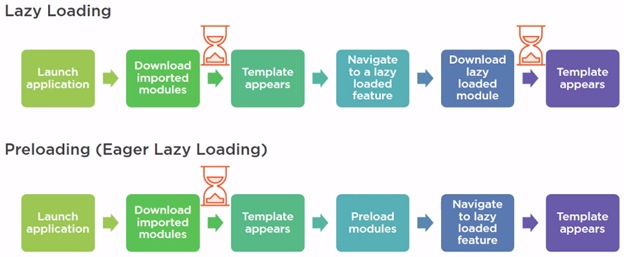

- A form model is the data structure that represents the HTML form – it retains the form state, form value, child controls.

- Creates a FormArray – we can call above created method to create multiple instances of that FromGroup, but we need somewhere to hold these multiple instances, that is the purpose of a FormArray. This array is simply a group of FormControls or FormGroups that are conceptualized as an array. These arrays are great for sets that are dynamic, or of unknown length.

- Building angular – during development time we are more focused on development speed and debugging and efficiency. In production we want to make sure the code is rock solid and secure and as fast as we can get it, even into the bundles/chunks.

- Ejecting – the angular CLI uses web pack under the covers and there is a configuration file to change the web pack configuration using command ng eject. By this we can eject our application and put proper web pack configuration so that we can run thing on our own, we would not be able to use ng build command anymore. Now a new file will be visible by name webpack.config.js. Now we can use npm start.

- When we use a form tag in an angular template, angular 2 is going to add a directive automatically to this form. We access a directive with a template reference variable. We need to have name property on an input field to make it register into angular with ngModel. We should also turn off browser validation to avoid inconsistency while handling error in browser validation using novalidate attribute in form tag.

- There is no guarantee that our model is set up when the blur or change event gets fire, so model might not be updated at that time. So instead of passing the $event model, we should use template reference variable.

- In earlier days while using cookie, another website open in different tab can also access the cookies for first tab. But using token-based protocol like OpenID connect or OAuth 2 it will require to put the token into the authorization header.

- For authenticating the user, we should use a separate server i.e. identity provider. Identity provider are also called SSO server.

- The OAuth access tokens have a fixed expiration time. If they got expired then calling a protected API result in 401 unauthorized. In this case we need to obtain a new token from STS to continue calling API’s. we can’t use OAuth 2 refresh tokens with Implicit Flow.

- Because all browsers do not support the newest version of javascript due to which we will use typescript. It transpile and change into javascript. We can let the browser let the transpile or we can transpile on server.

- Portal CDK – portal outlet - a portal is a piece of ui that can be dynamically rendered to an open slot on the page. this ui can be a component or templateRef. the open slot is a portalHost. tabs, dialog and snack bar uses the portal components. use domPortalHost to attach for an arbitrary DOM element outside of angular application context.

- Reactive extensions were originally developed by Microsoft as Rx.NET. It is a way to observe and react to data as it flows through time. Reactive development is a declarative programming paradigm concerned with data streams and the propagation of changes.

- For data caching we can use shareReplay and share operators.


- Angular is a tool to help you build interactive websites, you can call it a framework. It provides tools to communicate with the server and to improve the performance, package application, maintain state, organize code/logic, ease display of data, synchronize state as it changes.

- Angular 2 is more standard based (modern web standards), modern (state management, change detection, etc.), more performant.

- Angular releases major version every 6 months, 6 months of active support and 12 months of LTS support (only security and bug fixes, no new features unlike active support).

- Universal benefits – reduction of cost, standards compliance, extremely performance, open source, use typescript, backed by Google, very uniformity (make onboarding new developers cheaper and simpler), amazing documentation.

- It indirectly provides environment for router, HTTP, forms, RxJS, etc. Already configured with Typescript no need extra to configure, opinionated means fewer decisions to take. Provides support for progressive web apps, lazy-loading, fully reactive forms library support, fully featured router, animations library, supports strictly typed forms.

- Angular also supports server-side rendering, mobile friendly, angular language service (Intellisense and better debugging in templates).

- Standalone component doesn’t reduce work, but just reduce the learning curve for the new person learning angular, need to see what emerges further (new use cases).

- Tools provided by the Nx – ESLint, Cypress, Jest, Storybook, Prettier.

- Note that if your component has no inputs or you use it without providing any inputs, the framework will not call ngOnChanges().

- ngDoCheck - This hook can be interpreted as an “extension” of ngOnChanges. You can use this method to detect changes that Angular can’t or won’t detect. It is called in every change detection, immediately after the ngOnChanges and ngOnInit hooks. This hook is costly since it is called with enormous frequency; after every change detection cycle no matter where the change occurred. Therefore, its usage should be careful to not affect the user experience. Well, since Angular tracks object reference and we mutate the object without changing the reference Angular won’t pick up the changes and it will not run change detection for the component. Thus the new name property value will not be re-rendered in DOM. Luckily, we can use the ngDoCheck lifecycle hook to check for object mutation and notify Angular.

- ngAfterContentInit - This method is called only once during the component’s lifecycle, after the first ngDoCheck. Within this hook, we have access for the first time to the ElementRef of the ContentChild after the component’s creation; after Angular has already projected the external content into the component’s view.

- ngAfterContentChecked - This method is called once during the component’s lifecycle after ngAfterContentInit and then after every subsequent ngDoCheck. It is called after Angular has already checked the content projected into the component in the current digest loop.

- ngAfterViewInit - This method is called only once during the component’s lifecycle, after ngAfterContentChecked. Within this hook, we have access for the first time to the ElementRef of the ViewChildren after the component’s creation; after Angular has already composed the component’s views and its child views. This hook is useful when you need to load content on your view that depends on its view’s components; for instance when you need to set a video player or create a chart from a canvas element

- ngAfterViewChecked - This method is called once after ngAfterViewInit and then after every subsequent ngAfterContentChecked. It is called after Angular has already checked the component’s views and its child views in the current digest loop. If we continue clicking on the Update button many times, the ngAfterViewChecked will be triggered each time, as well as, ngDoCheck and ngAfterContentChecked.

- Note that the ngOnDestroy is not called when the user refreshes the page or closes the browser. So, in case you need to handle some cleanup logic on those occasions as well, you can use the HostListener decorator

```typescript
@HostListener('window:beforeunload')
ngOnDestroy() {}
```

- We can understand the lifecycle hooks by splitting the process into two steps,” first-time hooks”, and “in every change detection cycle hooks”. “first-time hooks”, the triggered hooks are: onChanges, onInit, doCheck, afterContentInit, afterContentChecked, afterViewInit, afterViewChecked. “in every change detection cycle hooks”, the triggered hooks are: onChanges, doCheck, afterContentChecked, afterViewChecked.

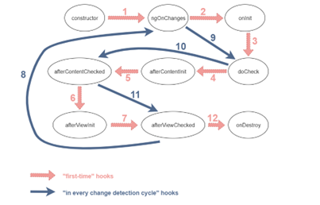

- How the Angular Compiler Works - The Angular Compiler (which we call ngc) is the tool used to compile Angular applications and libraries. ngc is built on the TypeScript compiler (called tsc) and extends the process of compiling TypeScript code to add additional code generation related to Angular’s capabilities.

- Angular’s compiler serves as a bridge between developer experience and run time performance: Angular users author applications against an ergonomic, decorator-based API, and ngc translates this code into more efficient runtime instructions. In this way, ngc can be considered an extended TypeScript compiler which also knows how to “execute” Angular decorators, applying their effects to the decorated classes at build time (as opposed to run time).

- The ngc has several important goals: Compile Angular decorators, including components and their templates. Apply TypeScript’s type-checking rules to component templates. Re-compile quickly when the developer makes a change.

- TypeScript by itself has no understanding of Angular template syntax and cannot type-check it directly. To perform this checking, the Angular compiler converts Angular templates into TypeScript code (known as a “Type Check Block”, or TCB) that expresses equivalent operations at the type level, and feeds this code to TypeScript for semantic checking. Any generated diagnostics are then mapped back and reported to the user in the context of the original template.

- Angular CLI works fine with either one: kebab case or came case. For my part, in the future we should try to stick to kebab-case because that is what the Angular CLI --help output uses.

```shell
ng new my-app --create-application=false | ng new my-app --createApplication=false
```

- Signals - Either change everything or keep a track which values have been changed which will cause internal housekeeping problems. It is better to tell angular by us which things have been changed for a better performance and predictability. A signal represents a value of some kind either a simple primitive value or something as complex as a list of objects. It will let the angular know if something is changed and what has changed.

- Angular is a single page application which means that the main JS bundle is downloaded from the server, and then the browser handles rendering the different views within the application. Without routing, we can manage changing views programmatically but navigating without changing the URL means that the native browser navigation will not work for our application. By bootstrapping the angular router module we can connect our application to the browser URL, which allows users to move between views using built-in browser functionality. Since angular is a single-page application, changing in the routing are not requesting new views from the server. Instead, route changes will replace portions of the current view.

- Declaring child routes with forChild() as we want to reuses the existing singleton router service instance but want to separate out routes into separate modules to keep our route declarations closer to the components that they route to.

- Path segment prefixing – we should use relative paths whenever possible to avoid large refactors if the parent URL structure changes. Also, we should define constant route tokens instead of using static strings across the application.

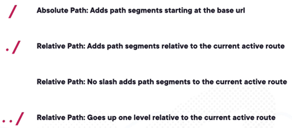

- The navigateByUrl() method is not able to handle the query params or setting the relative URL, the navigate method is more versatile. The navigate() method is default to absolute route.

- The canMatch route guard is very useful for feature flagged routes.

- We should avoid using the route resolvers as they blocks navigation until the function returns, it is not a great solution for prefetching data from slow endpoints and we should avoid to use it.

- In angular 15, we can use RouterTestingHarness to test router links with ease

- Angular’s compiler serves as a bridge between developer experience and run time performance: Angular users author applications against an ergonomic, decorator-based API, and ngc translates this code into more efficient runtime instructions.

- In this way, ngc can be considered an extended TypeScript compiler which also knows how to “execute” Angular decorators, applying their effects to the decorated classes at build time (as opposed to run time).

- ngc has several important goals: Compile Angular decorators, including components and their templates. Apply TypeScript’s type-checking rules to component templates. Re-compile quickly when the developer makes a change.

- TypeScript by itself has no understanding of Angular template syntax and cannot type-check it directly. To perform this checking, the Angular compiler converts Angular templates into TypeScript code (known as a “Type Check Block”, or TCB) that expresses equivalent operations at the type level, and feeds this code to TypeScript for semantic checking. Any generated diagnostics are then mapped back and reported to the user in the context of the original template.

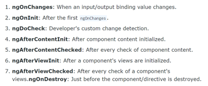

Innovation is more like a system or network not a single moment.

- Angular inspirations –


- FormControl is an entity that tracks the value and validation status of an individual form control. A FormControl is always created regardless of whether you use template driven or reactive forms. Instead of a native form control like input, any custom form control can interact with a formControl. The number of native form controls is limited, but the variety of custom form controls can be potentially infinite. So, Angular needs a generic mechanism to stand between Angular’s formControl and a native/custom form control. This is where the ControlValueAccessor object comes into play. This is the object that stands between the Angular formControl and a native form control and synchronizes values between the two. A ControlValueAccessor acts as a bridge between the Angular forms API and a native element in the DOM.

- Default value accessors - DefaultValueAccessor, CheckboxControlValueAccessor, NumberValueAccessor, RadioControlValueAccessor, RangeValueAccessor, SelectControlValueAccessor, SelectMultipleControlValueAccessor

- If we try to mutate the state in ngOnChanges() or ngAfterViewChecked() or ngAfterContentChecked(), it will give ExpressionChangedAfterItHasBeenCheckedError.

- View encapsulation modes – none, emulated and shadowDom.

- In the default emulated mode - It will add the random **ngHost and**ngContent attributes on the components if we have define some style properties on the component. Otherwise it won’t generate them. By this, these styles will be out from the global scope, this mode is handled by the angular.

- The none and ShadowDom modes will be handled by the browser not by the angular. With none mode, it won’t generate any attributes and the styling given at the component level will be applied on the whole DOM. We can use this mode in the root app component so that all the styles which we apply in here will be applied on all page content globally. With ShadowDom, it will create the actual shadow root element will be created which will separate the marker and CSS outside of the scope of the parent document. This approach will cause problem in older versions of browser.

- We should stick with the default Emulated mode.

- We can apply all the styles globally by externally link the style.scss into angular.json file or by turning off the view encapsulation to none and referring the style.scss into the app component. We should prefer linking them into the styles.scss file

- We should not apply all the styles globally except browser resets, colors, typography, layout, media queries and utilities as no all styles need to encapsulated.

- We have two system to apply global styles – class based system, mixing & variable based system.

- We should name the global class with prefixed like l-container or layout-container or lt-container to avoid collision, but it is not needed for local scoped class like navbar.

- Naming design for CSS – SMACSS, OOCSS, Atomic Design, B.E.M.

- B.E.M. is an acronym for `block__element--modifier`. A modifier would be any variation on a block or element within a block.

- Single responsibility principle - Let’s say you have a component called Order that displays information about a customer’s order, including the customer’s name, order date, and order items. This component has two responsibilities: displaying the customer’s information and displaying the order information. According to the SRP, these two responsibilities should be separated into two separate components. By following the SRP, you can create a well-organized codebase that is easy to maintain and modify. This, in turn, makes your applications more scalable, flexible, and adaptable to changing requirements.

- Open/Closed Principle (OCP) - The Open/Closed Principle (OCP) is a software design principle that states that software entities (classes, modules, functions, etc.) should be open for extension but closed for modification. This means that the implementation of a software entity should be written in such a way that it can be extended to meet new requirements without having to modify the original code.

- The OCP helps to make the code maintainable, extendable, and scalable. By following this principle, you can avoid having to make changes to the existing code base every time new requirements are introduced, which can save time and effort and reduce the risk of introducing new bugs.

- One way to implement the OCP is through inheritance. You can create a base class that implements the common functionality and then extend it with subclasses that add additional functionality. For example, if you want to offer discounts based on customer loyalty, you can create a new class that extends the DiscountService class and overrides the calculateDiscount method to include the customer loyalty factor.

- Liskov Substitution Principle (LSP) - The Liskov Substitution Principle (LSP) states that objects of a superclass should be able to be replaced with objects of a subclass without affecting the correctness of the program. This means that subclasses should be able to extend the functionality of their superclasses while preserving their behavior.

- A violation of the LSP can result in unexpected behaviors and bugs in the program. For example, consider a Rectangle class that has width and height properties. If a subclass of Rectangle called Square overrides the setters for width and height so that changing one also changes the other, then a client that depends on the Rectangle class may not work correctly when it is given a Square object.

- To ensure that the LSP is not violated, it is important to design classes and their hierarchies in such a way that subclasses inherit the behavior of their superclasses, but do not change it in any way that would affect the client code. This can be achieved through proper inheritance and polymorphism, as well as by defining clear contracts for each class.

- Interface Segregation Principle (ISP) - The Interface Segregation Principle (ISP) states that a client should not be forced to depend on methods it does not use. In other words, it is better to have many small and specialized interfaces than a few large and general ones. This principle helps to reduce coupling between classes and improves the maintainability and flexibility of the code.

- A violation of the ISP can result in large, complex interfaces that are difficult to implement and maintain. For example, consider a Document class with a large set of methods, some of which may only be relevant to certain types of documents (e.g. text documents, image documents, etc.). If a client only needs to work with text documents, it will still be forced to depend on the entire Document class and all of its methods, even if it only needs a small subset of those methods.

- To ensure that the ISP is not violated, it is important to design interfaces and classes in such a way that they are small, focused, and specific to the needs of the client. This can be achieved by breaking down large interfaces into smaller, more specialized ones, and by only defining the methods that are actually needed by the client.

- Dependency Inversion Principle (DIP) - The Dependency Inversion Principle (DIP) states that high-level modules should not depend on low-level modules, but both should depend on abstractions. This principle helps to reduce coupling between classes and improve the maintainability and flexibility of the code.

- A violation of the DIP can result in tightly-coupled code that is difficult to maintain and change. For example, consider a class WeatherMonitor that directly depends on a class WeatherService to retrieve weather information. If the implementation of the WeatherService class changes, the WeatherMonitor class would also have to change, even if the changes are not relevant to the WeatherMonitor.

- To ensure that the DIP is not violated, it is important to design classes and modules in such a way that they depend on abstractions, not on concrete implementations. This can be achieved by defining interfaces that define the required behavior, and by implementing the concrete classes that provide the actual functionality.

- Javascript based web applications, like angular, can’t maintain secrets, everything is public. A user can view page source, network requests and their payloads, and look at browser storage, nothing is secret to the user.

- For queuing promise we can use Promise.all(), it is like Array.every().

- Settling all promise by using Promise.allSettled(), for this we don’t need catch() as when it will be resolved it will have a specific key to specify which promise has been succeed or rejected. It is like Promise.some().

- We can listen any of the first resolved promise by using Promise.any(). We can use Promise.any() if we want fastest response from any of the promise, it will return and resolved the Promise.any() immediately.

- Promise.race() will also get settled even if any of the promise gets fails as-well. So, we need both .then() and .catch() block functions to make it work properly.

- Async-await is a syntactic sugar for promises to make thing easier to read or to express.

- UMD Modules – it check if it is AMD then use this format, otherwise check if Common JS then expose as CommonJS format otherwise it will export as Browser global. It doesn’t support standard ES Module as it was written before to it and ES module doesn’t work properly with this dynamic module detection approach.

- Sometimes we want to write library which supports multiple module formats, there is a standard for this called UMD (Universal Module definition). I will support AMD, common js and Global.

- The **proto** property has been deprecated to get the prototype of an object, instead of this we should use getPrototypeOf() function. Also, by using setPrototypeOf() function we can set a object with prototype inheritance with a parent object

- Dates are represented in JS in epoch manner, it stores it in milliseconds from the epoc. This epoc is in someway a arbitrary date chosen in past January 1st 1970. JavaScript tracks the number of milliseconds from that point midnight until the date we have. If we have earlier time, then it would be a negative number, after that it would be a positive number. We can get this number by calling getTime() on our date object.

- Instead of using the for loop, we should use for-in or for-of loop. It is better to use forEach also it handles sparse array value by ignoring the undefined values, however in forEach there is no support for handling the continue or break statements

- Function throttling – common scenarios for using a proxy to apply on a function to avoid being executed again and again. It can protect execution to avoid bugging down the system or prevent to hammering an API.

- A scope is called ‘lexical’ because it is linked to the to place where the function is written in the code.

- In constructor method we should only build objects and prepares them for use. Don’t construct other dependencies, talk to external resources, execute initialization logic or application logic. Don’t write any logic in constructor. Just use assignments. We should inject dependencies assign to the private variables inside constructor.

- Actually, legacy code is the one which doesn’t have automated test for it. It makes the code more brittle and harder to maintain and extend.

- 

- Types of testing - unit testing, integration testing, acceptance testing (user interface).

- Immutability – an object can’t change its state. Anytime a method would change the state of the object like pushing an item on a stack, it needs to return a new copy of the object with the change. The previous instant remains unchanged. It helps us in writing concurrent code more easily

- Test doubles - it is a generic term for any kind of pretend object used in place of a real object for testing purpose.

- Fake – building on a stub and adding a bit more sophistication is the idea of fake. It contains a bit more complex implementation by having state but not functional implementation. Like below we actually add and delete the list.


- Spy – it records the information about the interaction that it has with the SUT. This information can be available for assertion purpose by the test itself.


- Mock – can be used to simulate complex behavior. We should not develop mock our self, we should use mock libraries which allows us to configure mock behavior. Libraries example – type mock, rhino mock and MOQ.

- Test doubles – dummies like a placeholder, stubs objects that return predefined data, fakes slightly more realistic, mocks objects pre-programmed with expected outputs for given inputs and also able to verify their calls, spies real object and verify interactions like mocks it is an hybrid of stubs, fakes and mocks.

- Unit tests are less brittle that’s why they are preferred a lot. It tests smallest behaviour.

- What is pragmatism? A reasonable and logical way of doing thing. that is based on dealing with specific situations instead of ideas and theories.

- Testing structure types - AAA (Act, Arrange, assert), Behavioral (Given, When, Then)

- Anti-patterns – we should test the overall behavior details instead of implementation details. So, don’t overuse of mock, prefer stub. Focus of return of the function instead of inner details. Tests should be short and to the point.

- Static method should be used only for pure functions like those methods which returns same value for same input, and in future there would be not change needed for those method implementations like math library inbuilt function.

- When adding code to a fixture setup or teardown is that only code that is 100 percent common to all methods should go over there. If a lot not all methods have some common code then use helper method.

- In unit testing don’t use random number to generate random number to test some value, it can generate random failures. So, we should not have random logic.

- Naming convention of the test method – choose any naming convention for unit tests that works for you and only try to stick with it consistently throughout the project.
- Instead of using the manual mock we should use automatic mock like MOQ library.

- We should avoid loops and branching instruction in tests, they may lead to bugs in testing code. It also reduces the cyclomatic complexity.

- Precondition and post-conditions of a method pattern, like passing an empty array to an method. In this case the caller function should check the param input before calling to the function, in preconditions a Boolean condition which must be satisfied before a method is invoked, in post-condition a Boolean condition which must be satisfied after a method completes

  - Method pre-condition - condition which must be satisfied before method is invoked.
  - Method post-condition - condition which must be satisfied by the invoked method after it executes.

- If a method does not want to accept null parameter then it should not throw an exception as it would be meaningless to the caller function.

- We should handle exceptions like below -


- Styles of unit testing – output verification or functional verification, state verification, collaboration verification.

- Writing the test is easier then running the application. Testing is not like frosting on the cake, but it is sugar or flour which needs to bake when we are preparing the cake not in the end. This is also same issue with automation testing.

- We should break into code into two type of classes, one which have business logic and others which make stuffs. Don’t combine both classes.

- Benefits of unit testing – higher quality, fewer defects, living documentation, well-crafted code, automatic regression harness. A unit test confirms functionality of a small unit of functionality or component in a larger system.

- Code refactoring should not change the functionality of the application, in the same way the unit test case should not be fail. Refactoring is like cleaning the kitchen after serving food to customer. It improves readability, maintainability and scalability of code. We should refactor the code after fixing a failing test, before adding a new feature or after identifying a quality problem. Simple refactoring – rename, introduce parameter, extract method.

- Isolating code - Dummy, stubs, Fake, Spy, Mock

- Dummy – it is the simplest and most primitive type of test double and will contain no implementation.

  ```typescript
  var person = new Person();
  person.first = 'John';
  person.last = 'Snow';
  Assert.IsNotNull(person.fullName);
  ```

- Stubs – it is a minimal implementation of a class that likely implements a given interface or some abstract base class. It doesn’t maintain state and leaves method unimplemented like it just return some hard-code value directly:

  ```typescript
  public class StubRepo: IOwnerRepository
  {
  public IOwner FindById(int id){}
  public IOwner save(IOwner owner)
  {
  return new Owner();
  }
  public void Delete(IOwner owner){}
  }
  ```

- We can have separate build environment for acceptance test running and can trigger once a day. We can also share it reports to business for progress:


- Prudent code coverage – 100% code coverage doesn’t mean no defects. Use code coverage as a developer tool not a performance metric. Let the code coverage find things that are important enough to add test, but realize that it is only contextually important and it is very rare that we need to strive for any sort of code coverage numbers up around 90 and 100%.

- Devi’s advocate, Gollum style and Ping Pong technique to write unit test case:


- While creating an interface it should either contains all properties or all functions not both.

- It is not creation of millions of objects that keep application from being efficient but it is rather the efficiency of methods that we are executing that may make it slow. So, we can create many objects using immutable objects without causing any performance issue.

- We should only throw exception if there is no way for the application to continue working under circumstances, otherwise implement different use case as-well. Also, don’t handle the exception in immediate caller but at the top most caller, the one which initiated the whole operation, by this the lower parts of the code will be clean from complicated error handling code, they will focus on normal control flow. We can handle this by showing a pop-up to user, retry the function or simply ignoring the error and moving forward. While using the immutable objects try to keep them small.

- While designing a class it should contains operations which naturally belongs to the class, if operation doesn’t belong to a class the move it out to a dependency and use the dependency to complete the operation.

- Marble testing is a technique where we draw marble diagrams using ACSII characters while writing unit test to visualize asynchronous observables behavior in a synchronous way. Benefits of marble testing – readable code, test synchronously and helps to find out race condition in our code. Marble syntax - -, |, #, ^, !, a, ()

- For empty observable use `|`, for never use `_` or `----`.

- Hot observables start emitting the values before any subscribe method is called on. Any subscribers can subscribe at any time and they can get the latest values at the time of subscription. They are multicast means more than one subscriber can subscribe to this observable however they will listen to the same producer. Publish and share are used to make a hot observable like tune radio channel, cinema theater, mouse clicks, live movies, live cricket match, stock tickers, live life events.


- Cold Observable – In RxJs the observables are cold by nature. Cold is when the producer is owned by the observable. Observable creates and activates the producer at the time of subscription only. The data is created from the observable itself. Will produce data only when subscribe method has been called. Subscriber get their own copy of values and they are unicast i.e. one subscriber per producer like of, from, interval, timers. Real life example – watching downloaded movies, recorded podcast or song, snapshot movies in which each have their own copy.


- Frame – Jasmine-marbles converts observable sequence into frames. Frame is a JSON that consists of RxJs notification object that wraps the actual delivered value with additional metadata and message type.


- RxJS schedulers are centre to control the time for any operator or observables in our project. Also, RxJS has made this schedulers injectable so that we can mock these schedulers and control the time in our test cases.

- Scheduler is a primitive inside RxJS, RxJS operators take scheduler as the second optional parameter. It is async by default. Marble testing uses virtual time so that we can test these async function synchronously.

- Race condition scenario – in a scenario where we are searching a string, and first search return the value with a delay than second one, then in the result we will get the first result as a final response by overriding the second one. To avoid this we can use the switchMap operator, it will cancel the previous Http request in-case of second has been triggered and always return the latest result.

- In integration test we test component and its template together. In integration if we only test parent component then it becomes shallow integration test otherwise if we also test its working with its child or directive component then it becomes deep integration test.

- To write the integration test to test the template along with component, we need to use the ‘Testbed’.

- A component fixture is a wrapper for component that also has few extra properties for testing, we can use its one of the properties called componentInstance to get the instance of the component itself.

- Use fixture.detectChanges() on component spec files to tell the component to run change detection and update any binding that may exist on the component. It will also cause to ngOnInit() lifecycle to run.

- The flush() method lets us decide what data to send back when the call is made.

- Content Security Policies (CSP) Reporting - It is regarding the policies send alongside with website says where can this page load images, scripts and styles from, and where the form can post the requests and the browser will restrict the page accordingly. We can send it either in http header or meta-tags. We can also mention the report-uri where those reports will be sent. It was originally design to stop cross side scripting.

```typescript
Content-Security-Policy: upgrade-insecure-requests
Content-Security-Policy-Report-Only: default-src https:;report-uri https://demo.report-uri.com/r/default/csp/reportOnly
```

- Certificate Authority Authorization (CAA) Reporting - CAA is much safer than HPKP, by which we can say whom we want to authorize some particular CAs to be able to issue certificates for us.

- Cross-site Scripting (XSS) Reporting - Now, the browser has built-in an XSS auditor, in XSS attack we generally have kind of get parameter they sent to the server, rendered into the DOM and then reflected back to the browser.

```typescript
x-xss-protection: 1; report=https://report.uri.com/xss/enforce
```

- Cross-site scripting (XSS) – latest frameworks are helping to prevent this vulnerability.

- Broken Authentication – passwords are very vulnerable and very in-secure. We can refer `haveibeenpwned.com` and avoid user to choose the password which were breached in history. The password rotation was never a good policy and it works against us as humans are terrible at passwords.

- Sensitive data exposure – SSN, credit cards information, addresses, religion, health records, political affiliation, birthday. Combination of these information can become dangerous.

- XML external entities (XXE) – SAST static source code analysis (manual code reviews), we can also use DAST tool for testing.

- Broken access control – IDOR, indirect object references, where we can twiddle a value in the URL to get someone else’s data. We should test access control so that we can’t do things outside of our privilege level.

- Security Misconfiguration – weak ciphers, SSL problems, we can use tools to check them.

- Insecure deserialization – remote command execution (RCA) running command on other server, and another thing is changing the serialized objects to elevate our privileges to do something interested, tempering of objects. To avoid this, we can use HMAC and check the validity of object type on server to check its integrity.

- Using components with knows vulnerabilities – we should break our build if any vulnerable component is found. Latest package manager automatically detects such problem with 3rd party libraries and CICD we should break the build. We can use CSP to avoid such issues.

- Insufficient logging and monitoring – we should have some sort of audit trails in place.

- HSTS helps us ensure that connections are always made securely and they never drop back to HTTP.

- What Is Serialization and Deserialization? - When we want to store an object to disk then we need to represent the multi-dimensional object into a flattened format. So, serialization is converting an object into a byte stream. A byte stream can be a file or a data stream over a network.

- Insecure deserialization – (serialized) data abusing the security of an application when being deserialized. Abuse of logic, corrupt data, denial of service, remote code execution. It is possible to execute arbitrary code merely by deserializing a corrupted or untrusted file. It affects confidentiality, integrity and availability.

- We should not use equal sign to compare the two strings as it is not cryptographically secure, as it will lead to timing attach, so always use built-in functions to compare hashes with each other.

- The dangers of logging too much – legislation, confidentiality (credentials, payment details, sensitive information), information overload, cost of processing information. Information exposure through and error message – the dangers of showing users, or non-privileged accounts error messages.

- Certificate authorities – it is an entity that issues digital certificates. Our machine needs to trust a CA. The CA signs the certificate; and when it is returned to the browser from the website, our machine validates that the certificate is legitimate by referring to our local list of trusted authorities. To check this list use certmgr.msc from run command, this list is used by windows, ie and chrome.

- SSL vs. TLS – we should ideally use term TSL not SSL as SSL is dead already:

- HTTP strict transport security (HSTS) – now redirect will give 307 status instead of 301, also the size would be 0. The browser will perform 307 internal redirect. Once our browser sees the STS response header, for the period of time, specified in that max age value, it will not make an insecure request to that domain.

```typescript
strict-transport-security: max-age=2592000
```

```typescript
Status Code: 307 Internal Redirect
Non-Authoritative-Reason: HSTS
```

- Using HSTS (HTTP Strict Transport Security) – it will tell the browser you may not make an insecure request. Internally within the browser, you need to redirect or effectively go and make that request securely. That’s it also took only fraction of millisecond for first request with 307 status code, so by this the man in the middle won’t see this first request but the second request only.

```typescript
Strict-Transport-Security: max-age=31536000; includeSubdomains; preload
```

- Secure cookies – capturing someone cookie will lead to session hijacking. Secure cookie will not get send over insecure connection. So, always use secure cookies flag as default setting:


- Using HTTPS will reduce the load on client and server both sides. As HTTP uses 1.1 protocol but HTTPS uses h2 protocol i.e. HTTP2, and HTTP2 allows for a binary stream of content, so lots of data coming down to the parallel. HTTP2 is only supported over TLS.

- Getting new certificate and renewing it has very less cost involved. We can use letsencrypt.org for free certificate authority. We can use `cerbot.eff.org` for automatically renewal of the certificates.

- To avoid enumeration risk, show below message when login failed, like a generic message, don’t say that user doesn’t exist:


- Even in below case, if user type unavailable password then don’t show that it doesn’t exist, as we don’t want to show presence of a user on our system:


- To solve an issue where account is already exist, sent an email to their registered email, so do not show message like "Username already taken".

- Brute force attack is to guess someone else password again and again, hackers use botnet for this which provides thousands of different IP addresses, so we cannot verify the request per address. If someone try to do failed login with many attempts, we can simply lock his account or can have a buffer for some minutes to let them retry. Or use OAuth with google or Facebook to delegate this problem to them.

- Brute force attacks – an attacker trying over and over again to execute some sort of online process like trying to login into someone account with different password.

- In password strength do not put maximum limit threshold, as user want to use pass phrase.

- With anti-automation aka Captcha is bad for user experience, it is used to avoid bot to create spam registrations. Using Captcha on registration/sign-up is okay as it will be one-time activity for a user, but we should not use it on login.

- Using CAPTCHA for anti-automation – suppose someone made a automation tool and in make thousands to call for sign-up then that email person will get those many emails which will lead to spamming. To avoid this, we use re-captcha.

- Protecting the logon against brute force – degrade the service means for each time failed logon take some more time for re-login and sending the response back by using thread sleep, and we can return a message that maximum retry has been exceeded, please try after sometime. So, each request will take longer time, server can track number of hits against the account.

- Multiple simultaneous logins – it depends upon business needs, like for bank website we should not allow it, but for website like stackoverflow.com we might allow it as user wants to open that website from multiple of devices. It is also not feasible on server to know whether a user is logged-in or not, as the cookie is based on client interaction.

- Broken authentication and session management – to protect the cookie from session hijacking, we can secure it by setting it as HTTP only by this cookie cannot be read by client script to avoid XHR attach to read that cookie, if we also set the secure flag to true then it can only be sent over HTTPS connection.

- X-Frame-Options – if we use deny value then it means this page cannot be framed, means cannot be put inside iframe of any other page. This helps in prevent click checking.

```typescript
X-Frame-Options: Deny
```

- The frame-ancestors – to avoid click jacking attacks. Attacker would embed the targeting website in his website into an iframe, then making that target website transparent putting content the attacker provides under the target website and enticing the user to click what they think is a button the attacker’s website but instead clicking a button on the target website. We can avoid this by this header so that our websites won’t be framed into some other website.

```typescript
frame-ancestors: 'none';
```

- Security threats on server side - SQL injection, insufficient authorization, weak credential storage

- Security threats on client side - Cross site scripting, insufficient transport layer security, click jacking.

- Non-standard and browser prefixed headers – headers started with X was browser specific and has been deprecated now – X-Content-Security-Policy, X-WebKit-CSP, X-Frame-Options, X-XSS-Protection.

- HTTP Public Key Pinning (HPKP) - This is progression over HSTS, which tells the website must also serve a particular certificate that the browser expects, not just on that’s valid but one that adheres to a very specific set of criteria, to avoid a scenario where certificate authority itself gets compromised.

```typescript
Public-Key-Pins: pin-sha256=[pin 1]; pin-sha256=[pin 2]; max-age=2592000; report-uri=[uri];includeSubdomains
```

- Cross site request forgery – changing the password or account details using context of hacker. Use anti-forgery token to avoid this.

- Encryption is also not secure, because as soon as the encrypted key is found, entire system can be decrypted back. Instead of this we should use cryptography using hash so that no one can decrypt them back.

- We need to use hashing with a salt to avoid getting same output with same input, it also protects with rainbow table problems, but we need to use hash algorithm properly:


- Email as username vs. free text for username for uniqueness – we should prefer email as username. Email as username is easier to remember, one less field to capture at sign-up, it is already unique per user, must be able to change in future. Free text for username can be displayed to user with less privacy risk, enable multiple accounts against one email, requires a "retrieve my username feature".

- Password strength criteria – don’t limit the max entry criteria, also don’t put any condition for not having special characters, don’t discriminate with some character, allow user to pass any character. Pass phrases are stronger. We can use utility like 1password to generate password and saving it into centralize place.

- We can also make backend call to check whether password is very simple to crack, then show as invalid like below, we can check it with bad list of passwords.

- Don’t disable the password paste option on the field. People disable it to avoid brute force attack, but disabling the paste option, make the other worst problems like bad UX. To solve a problem, if that solution makes the problem worse than it is called as cobra effect.

- Verifying accounts via Email to avoid entering fake and corrupted emails, as user can use any random or someone else email’s id.

- Don’t lock an account out as it will lead to DoS (denial of service) attack. We should degrade the service and log everything. Don't lock an account out, restrict logon by IP and limit attempts with a cookie.

- Remember Me - This feature frequently implemented insecurely, by using user name and password in cookie and using it for re-login. It is a feature which requires trade-offs: security versus usability. It can disclose the credential of a user. It reduces the fiction of return visits for frequently used services like stackoverflow.com. It allows long-running sessions. But it increases numerous risks – someone else using the PC, a CSRF risk being exploited, if someone has access to unlocked machine. To make available this feature, it depends upon the nature of the application. We can give this option just for remembering the Client ID not password for sensitive websites, but this is not a remember me feature completely as it won’t do the auto login when user comes back to the website

- If we have expiry as ‘session’, then if we close the browser and reopen it, we won’t be able to logged on, the cookie will go away. If we use remember me feature, then it will have one more cookie for expiry of 1 year, it will not go away and reauthenticate the user again automatically. To implement it securely, don’t create remember me cookie, just change the auth token cookie from session scope to sometime duration scope like for a week, also mark http and secure flag as true. Additional security controls – like ebay we can choose an approach where we are breaking the cookie into two parts, first for user identity for long expiration time, and another cookie which requires for financial activity for short duration and re-authenticate user for the financial activity only.

- How attackers change account details – direct browser access, credential theft, CSRF, session hijacking (sending session on HTTP connection on in query strings), social engineering.

- Account attributes attackers want to change – password, email, identity, credit card, attackers can chain together these many information and processes in order to gain access to a victim’s account.

- To change the password or email, we should also ask the current password as-well, also keep change password feature on its own page

- Account change notification – to cater a scenario where attacker already got the access for legitimate password, we need to notify the changes on different channel as-well like email or SMS. We should not allow to change the email address without first confirming via the original email address on the account. But if user not have access to original email then it will be a problem, then we can solve this by directing to manual human interaction at support desk.

- The risk of password hints – don’t use password hint in any circumstances.

- Why logging off is important – due to remember me we can have a long running session – also in browser if we choose below feature, then browser won’t delete the cookie after browser gets closed browser even if we don’t use remember me feature, so to avoid this we need to provide explicitly logoff functionality.

- What constitutes of logging off – it removes the authentication token, by setting remember me token as empty and setting cookie expiry one day ago already.

- Web application firewalls (WAF) – we can get it by using Cloudflare service, it will look request pattern and reject it if it found malicious before allowing it to hit the actual web server:


- We humans are the weakest link in the security chain.

- In symmetric cryptography same key is used to decrypt and encrypt the message, but asymmetric cryptography uses different keys to avoid man in the middle attack

- Types of cryptograph algorithms – symmetric, asymmetric and hash functions.

- Asymmetric algorithms – public and private keys, the RSA algorithm.

- Big O notation allows us to express in terms of the size of the input, the amount of work takes to solve the problem -


- Public key can identify somebody, and their private key can prove their identity.

- OpenID Connect – it allows users to log in to 3rd party sites using their Facebook or twitter or google credentials. It is built on top of OAuth.

- The role of OpenID Connect and OAuth – OpenID Connect is a simple identity layer on top of the OAuth protocol. It allows clients to verify the identity of the end-user based on the authentication performed by an Authorization Server, as well as to obtain basic profile information about the end-user in an interoperable and REST-like manner. OpenID is for authentication and OAuth is for Authorization

- OAuth2 is about requesting access tokens from an authorization serve, then we can use this token to talk with backend service. OAuth is an open protocol to allow secure authorization in a simple and standard method from web, mobile and desktop applications. OAuth is about delegating authorization; means we want to authorize a client to access our resources on our behalf.


- OpenID connect means the application doesn’t need to connect with back-end service, but it needs to know who the user is. It is for authentication.

- OpenID Connect - It is built on top of OAuth2, and sometime we just need authentication at least to begin with to identify user in an application. OAuth2 is regularly abused for that.

- OpenID connects adds some new concepts like ID token and UserInfo endpoint. OpenID code flow – identity provider, authorization endpoint, token endpoint, user info endpoint.

- OAuth2 Concerns - Specification bloat, bearer tokens, security theatre, attack surface.

- Evolution of software ecosystem -


- Types of versioning – calendar based, sequence based and semantic based versioning. Recommended is semantic based versioning.

- Common sources of untrusted data – in the URL via a query string or route, posted via a form, in cookies, in the request headers, external services, our own database.

- We should sanitize the data right after receiving from the user. So, if user trying to search like `<i>enzo</i>` then the text should display on the screen in encoding form of it i.e.`&lt;i&gt;enzo&lt;/i&gt;`

- We should trim down all the header from HTTP response which might disclose the framework or the server underline technologies details. We can also change the header properties sort order and default bad request or default response format which was specific to some server format to avoid attacker guessing the server details.

- HTTP fingerprinting of servers – it is to identifying various attributes of a particular website which might lead it to disclose what is running underneath.

- Fuzz testing – it is the process for searching for vulnerabilities does commonly adhere to a very regular pattern like in XSS to avoid laborious manual testing, and we bombarding an application with random data with those patterns. We can use third party tool like intruder21 or fuzzdb for doing fuzz testing.

- Mounting a click jacking attack – in this the attacker will also get the access of anti-forgery token by rendering the website into iframe and setting as opacity to 0, and below to that page will render the corrupted website. In below the I “Wanna win!” button is overlay on “Change Password” button

- We should store password using hashed approach while saving the database. If we store it into plain text then there is cryptography, everything is immediately exposed if the password storage is breached. If we use encrypted approach, then it can also get decrypted which makes is less secure. Only if we use hashed approach, it would become one-way, deterministic algorithm which means that password can't be un-hashed.

- We should re-authenticate the user before key actions, like asking current password on change password screen.

- Unlike browser, mobile app doesn’t have secure paddle lock icon, as mobile app doesn’t run in browser. The mobile app, company itself handle the client communication, so we should not always trust the mobile apps.

- We can have two types of certificates DV and AV. Below is an AV certificate, it requires a business name also need to be registered.


- We can connect fiddler for the remote machine-like android device from our computer. By this we can intercept mobile app data in fiddler. By we can get a sense for how device is communicating with backend servers.

- Instead of using the .png format we should use .jpeg format as it has better compression and can reduce the data size 75%.

- By using Wi-Fi Pineapple and LAN Tap, we can monitor the traffic even for those devices which makes hard to proxy traffic like IOT devices.

- Discovering leaky API’s – we should not return sensitive data from the web API in normal text form, also don’t return the data which is not need or non-essentials data on client side

- Configuring fiddler to decrypt encrypted connections – it will install its root certificate on our windows machine, by this we just compromised our system (PC) only.

- LDAP kept our user directory together, assign roles and query information about the user.

- The idea of OAuth2 is how we can create valet parking key, not the master key. By which a resource owner gives the client a key to access the resources on the resource’s behalf, without giving the client master key aka the password.

- Security tokens are protected data structures, contain information about issuer and subject, signed and typically contain an expiration time. A client requests a token, an issuer issues a token and a resource like API consumes a token, that resource has a trust relationship with the issuer.

- History of token - SAML (XML based, very expression, many encryption & signature options), Simple Web Token (SWT), JSON web tokens (JWT).

- JWT structure and format - headers (metadata, algorithms & keys used), claims (issuer, audience, issue at, expiration, subject, other application defined claims)


- There are two type of tokens access tokens (short lived) and refresh token (long lived).

- History of accessibility


- Who needs accessibility –


- Create accessible forms – each control should have label or aria-labelled-by, use grouping of controls, provide clear notifications, break up long forms. We should avoid placeholder text in your forms. It is often low contrast and difficult to see.

- Assistive technology – screen readers, screen magnification software, speech input software, head pointers, eye tracking, single switch entry devices.
- Web accessibility guidelines – WCAG (A, AA, AAA).

- 4 types of disability – physical, vision-related, cognitive and hearing-related.

- Focusable elements – links, buttons, form elements – text input, text area, select, checkboxes, radio buttons.

- On the website load, the first tab should go to the ‘skip link’, it generally skips the site navigation or repetitive contents.

- In radio button, if a radio is selected then we need to use the arrows to move around other options, but if none is selected then we can use tab key to move around other options. It is called widget navigation where too many focusable elements on a control, it provides skip links functionality.

- Interactive form controls are activated with SPACE key. For links to activate use enter key.

- For low vision user, the content should be zoomable, it should not lead to any loss of functionality and content.

- Too much use of the animation can cause distractions among users, the website should also provide pause, stop and hide the animation. We can use chrome emulation for testing
- We should have language, charset=utf-8, title tags on the HTML page. The title bar of browser should also include company name.

- HTML landmarks such as header, nav, main, footer, aside, form and section should have accessible name by providing aria-label attribute.

- Links are for navigation or change of context, buttons are for action.

- The email field should have autocomplete attribute as `email`.
- The WCAG (web content accessibility guidelines) measure to accessibility of a website. Level A, Level AA, Level AAA. Who benefits – who only has one arm so can’t operate mouse, only the keyboard, a person who is blind so uses a screen reader, a person who has dexterity problem, can’t click on a small item, uses keyboard if she is struggling with the mouse.

- Basic commands on form which can be interacted with like button, link and input controls, they are called focusable elements, pressing enter on that link or button should activate it. Space bar is used to toggle a checkbox and open a select control. Up and down arrows are used to scrolling the page or scroll through select component.

- Mouse should be required only for drawing in an art program, some games, but drag and drop and resizing and rotating can be handled through the keyboard.

- If we set tab index as -1 then we cannot tab to it with keyboard, but can set focus programmatically. If we set 0 then we can tab to element and focus order determined by the HTML.
- ARIA is a technical specification for improving the accessibility of web pages, it allows us to update the accessibility tree.

- Common navigation patterns are navigation bars, sidenavs, breadcrumb and hamburger menus.
- It will be hard and require more money to support accessibility if we try to implement it after project has been complete, if we start the project with accessibility in mind then it will become easy and without any additional budget.
- Typography – choosing right typeface and hierarchy of font sizes it should be in rage of 16px to 20px.
- Every transition or animation should have purpose. When everything is just flashing and sliding around all over the page, it is not good for anyone, it makes user sick. We should provide an option to the user to disable animations.
- Images are inaccessible so we need to use alt attribute to provide description of content of the image.
- Aria roles is about filing the gap between what is available and the semantics of the code that we are using and what’s actually occurring in our rich internet applications.

- ARIA states – describe dynamic states and changed with JavaScript: aria-busy, aria-disabled, aria-grabbed, aria-hidden, aria-invalid.
- For forms the spacebar should activates controls and the enter key should submit the default action of the form.

- We should only use custom elements, widgets and ARIA when we either do not have an HTML equivalent control or when we absolutely cannot use the existing control because it doesn’t have the functionality that we need.

- Software has to work and be easy and enjoyable to work. User can easily and quickly accomplish their tasks.

- Wireframe types - Low-fidelity, High-fidelity.

- Principles - Alignment, Contrast, Visual hierarchy, Proximity, Layouts, Whitespace, Consistency.

- UX Testability

  - Visibility of System Status - the system should always keep users informed about what is going on, through appropriate feedback within reasonable time. Like showing username on login, showing copy/delete progress windows OS.
  - Match between system and the real world - the system should speak the user's language, with words, phrases and concepts familiar to user. Like not using words like `Accept/Decline` but `Save password/Nope`.
  - Error prevention - like showing auto-complete, showing confirm dialog before deleting the record.
  - Recognition rather than recall - showing dropdown, intellisense

- The good user experience has 3 desired results – happy, satisfied and productive. Our ultimate results should be delighted, contented, and empowered.

- Avoid common pitfalls - throwing data on the screen, exposing tech to the user, forcing the user to think like DBA, Messy UI, coding for expert user.

- Low friction clicks are okay, vertical scrolling is okay.

- Leading hack - making the user brain work less by leading them to their goal. Showing steps (wizard) on the screen.

- Limit the number of colors used should be 5 or less.

- Reading in upper case takes 10% more time than lower case, so avoid using them.

- A UX developer can bring efficiency, logic, relevance, user advocacy, research, communication, effectiveness, interaction, elegance, simplicity.

- Types of industry - Finance, Education, Retail, Healthcare, Business & IT Services, Research & Development, Government and Defense.

- In natural world there is no monochrome except blue sky overhead on a clear day, even sky is a gradient. So, while creating UI component use gradient from light to dark as top down lighting bias to makes the screen appear as more natural not as artificial monochrome. And the gradient shouldn’t be noticeable and flashy

- Instead of rectangle design, we should use curves. Humans usually prefer curved things over sharp-edged things – curved connotes safety, sharp-edged connotes danger. Curve soften the design and less stressful.

- We should bring the UI element on screen on more gradual way and move that from one place to another in gradual way too or changing the size. Using animation as it feels more natural and don’t surprise or confuse user. While changing the screen from one to another also try to implement a subtle animation. Animation also help in maintaining context.

- When an action is not appropriate, prevent the user from doing it, provide a visual signal that the action is not available, like disabling a button instead of allowing it to click and showing error message or any popup.

- Sliders component are good for numbers with large increments of numbers where the user is not quite so interested in precision.

- Reserve confirmation for very exceptional circumstances, otherwise it will dilute its value like in windows vista. Instead of this we can provide some undo like functionality or show a countdown before making the commit to the database, this is called forgiveness

- Web fonts recommendations

  - 
  - 

- Color meanings

  - 
  - 
  - 
  - 
  - 
  - 
  - 
  - 

- Color preferences

  - 
  - 
  - 
  - 
  - 

- Try to avoid the horizontal arrangement of radio buttons. Horizontal radio buttons can be difficult to scan — it can be challenging for users to tell which label the radio button corresponds to.

- Toggle switch control is easier for the thumb. This property makes it suitable for mobile devices.

- Dropdowns should be the last resort. Whenever possible, instead of dropdown, try to use alternative controls that help the user to complete the task but have better usability.

- Interaction Design (IxD) – the process of designing interactive products, focusing on how users will interact with them. sometimes called “conversations design”. Interaction design dimensions – words, visual representations, physical objects or space, time, behavior.

- Fast, cross platform, intellisense and auto complete, debugging, rich refactoring, sits perfectly between editor and IDE.

- What is Editor - lightweight/fast, file/folders, many languages, many workflows, keyboard centered

- What is IDE - project systems, code understanding, debug, integrated build, file->new, wizards, designers, ALM integration, platform tools

- Electron is a native shell for widows, mac, and Linux that hosts JavaScript-based app like Monaco. Visual studio code is a combination of Monaco and Electron.

- Installing extension locally – copy your extension to the VS code extension directory. (windows - `%USERPROFILE%\.vscode\extensions`)

- We should use arrows one way and two accordingly and shapes doesn’t represent any meaning, we just need to be consistent in shapes.

- We should have a key section to define the meaning of different attributes used in the diagrams

- We describe the following levels and diagram names:

  - Level 0 — Business Capabilities Diagram: The key audience is business executives and non-technical stakeholders.
  - Level 1 — Technology Capabilities Diagram: The key audience is CIOs, CTOs, CISOs and Strategy & Planning managers.
  - Level 2 — Architecture Diagram: The key audience is Designers and Project Managers.
  - Level 3 — Design Diagram: The key audience is coders, testers and architects.

- Five architecture diagrams types

  - Application Architecture Diagram
  - Integration Architecture Diagram
  - Deployment Architecture Diagram
  - DevOps Architecture Diagram
  - Data Architecture Diagram

- The Flow Diagram - This diagram illustrates the moving parts in a business process.


- The Persona Diagram - It is important to show that your architecture solves the business problem. A persona diagram describes a chronological view and actors in a particular workflow. This is your best tool for proving that you’ve taken the business into consideration when developing your solution.


- The Infrastructure Diagram - The purpose of this diagram is to show what has been built and how the system currently works. Consider this a blueprint of the application you built.


- Software Architect - Make high-level design decisions and document them, Mentor more junior engineers, Do code reviews, Develop the most critical part of the codebase, Refactoring to get rid of technical debt, Drink coffee.

- Types of architecture - classic three-layer database-centric, domain centric, application layer, CQRS.

- Software architect role - how to design software and works, functional architecture,

- Technical architect role - microservices, how pieces are connected with each other, design how software hangs together, cloud aws learning

- Code review serves as an exchange of best practices and experiences. Code reviews should be classless, it should provide an opportunity for mentorship and collaboration. Means a junior can also review the pull request raised by senior member.

- The PR should be small, it can contains changed lines from 100 to 500 and 5 to 10 files changed.

- We should have a self-review, before submitting the pull request. Also, We should reply to all comments, whether we fixed them as suggested, or fixed the way we preferred or push back the comment.

- We should have at least 2 code reviewers and one of them should know the business logic behind the code and customer requirement.

- Praise the author in the comment if work exceeds expectations, new team member picks up quickly, high quality code, reinforces good practices.

- If we found a nitpick and still want to approve it then we can comment like “nitpick: several types in comments. Approving anyway”. We should not be doing pre-approving frivolously.

- Git was developed by Linus Torvalds for managing the Linux kernel. It can be used offline and online for doing all the related operations. We can push or pull our changes after connecting with the network. Git is actually a bunch of individual scripts, most of which are written in Perl.

- Other source code control system works with files, but Git works with content. When we say add to a file, it takes a snapshot of that, adds that to the index and then that’s what gets committed. We can fake this file based thing by saying Git commit –a, this commands stage any changes that are in the whole project right now, add those and do commits.

- The Git commands are called porcelain commands. At core Git is simply a map (a table with keys and values), a simple structure that maps keys to values. This structure is persistent and stored on our disk. Values are content of file, when we give values Git will calculate a key for us i.e. a SHA1 hash.

- Git Branches - Another layer will make it a revision control system which includes features like branches and merges. When we do our first commit, Git creates a default branch the name is master branch. Git save its details in heads folder in refs folder of .git folder, it is the SHA1 of the last commit, the branch is nothing else but a simple reference to a commit. Branches are just references to the commit.

- Detached Head – it is a situation when we checkout a commit. Then the head will refer to that commit, not the current branch. Git also runs a garbage collection like in below scenario, if we wanted to avoid that then we must create a branch which will refer to these isolated commits.

- By using tags, we can tag a commit with a tag name. The command can be git tag –a dinner. The tag information saved into tags folder inside ref folder. Tag is also just a reference to an object just like branch but it doesn’t move. On a new commit, the current branch will move not the tag.

- Git Fork – it is kind of like clone, but it is a remote clone. By this we are cloning the project from someone else account to our GitHub account, and then we clone it from out account to our local machine. Upstream – to track the changes to the original project, then we need to add another remote point at it. It is called upstream. We can pull and push the changes to our account project, but only do pull from the upstream original account. We can send a pull request to this original account maintainer to pull our changes.

- Git is a source control system used by GitHub. GitHub is a Git Repository for open source. Along with Bitbucket they provide a great user experience for Git users in the cloud. Git uses snapshots instead of deltas like other source control system. Atlassian Source Tree is a famous GUI toll for Git.

- Stashing – it means if things go messy, save changes for later and then apply when needed. It is like shelve set in TFS; they will no longer be present in working area.

- Recovering deleted commits – we can recover this dangling commit, we need to get back the value of SHA1 using commands reflog, and fsck.

- Reverting commits – use command git revert #commit SHA1. Be careful while reverting the reverting a merge. Revert doesn’t mean undo operation.

- Peer to Peer Model -


- Centralize Model -


- Pull request model -


- Dictator and Lieutenants model


- In general, we have integration, release, feature and hotfix branches.

- Constraints – we can use Git Hooks feature to raise some notification on different Events before committing like checking if build is red on server then showing warning while doing another commit.

- Evil merge – we should never introduce changes in the merge commit.

- Disadvantages of doing all work in main branch instead of multiple feature branches - difficult to track, difficult to manage merges, difficult to back out, difficult to experiment

- Creating a Hotfix - If we spot something wrong in release production code to fix these issues are called hot fixes by creating hot fixes branch. In this we create this branch from master and then merge the code back into master and development.

- Version control system: it is a time travel machine for our project.

- Evolution of version control - Local computer -> local version control systems -> centralized version control systems -> distributed version control system


- Git maintained integrity using check-summed generated by SHA1 hashing algorithm.

- The three stages of a git project - working directory, staging area (index), .git Directory (repository)

- Rewriting History - Rebase – it replays a set of commits on top of a specific base commits. D*and E* are new commits but with same messages:


- Difference between collaborators (key people) and contributors (everyone outside from the core team and have lower permissions).

  - Maintainers - key decision makers within your company who are responsible for driving a project's vision and for managing day-to-day contributions.
  - Contributors - Members within the company that help drive the software forward. Contributors are no necessarily part of the direct project team but help build software by contributing code, submitting bug fixes, and more.
  - Community members - people who use the project or software within the company.

- Creating GitHub pages – to share information, it can be a static site hosting website without server-side code.

- Label can be applied on issues and PR. Labels are used to organize and also prioritize items such as issues. Built-in labels - bug, duplicate, enchancements, help-wanted, question, wont-fix, good-first-issue, invalid.

- GitHub calls it pull request instead of merge request because it let you tell others about the changes you pushed to a branch the action they would do is pull those changes in once that merged. Repo permissions related to pull requests.


- By using cherry pick we can copy specific commit to another branch. It creates duplicate commit in each branch and can cause confusion. Just use command git cherry-pick `<commit>` by specify the commit sha.
- Popular open source licenses – apache 2.0, bsd 2-caluse, bsd 3 clause, gnu gpl, gnu lgpl, mit (or expat license), Mozilla public license, cddl, eclipse public license version 2.0.

- License file deals with the legal side, Contribution Guidelines file deals with the technical side, Code of Conduct file deals with the ethical side.

- We can use fence block of code syntax by using 3 back ticks like ```html

- Two of the most popular of the lightweight variety are Markdown and reStructuredText.

- Use `_` for italics, `**` for bold, ` `` ` for code words. Use `_` for unordered list and `#` for numeric list.

- Artifact are the result of the build, if this process of creating artifacts doesn’t require any person to do anything for it to happen, other than make the change to source control, the you have continuous integration. If it also gets deployed automatically then I become continuous deployment as well.


- For technical document writing reStructuredText is better than Markdown.

- Purpose of technical writing: Developers (Get information out of the heads of the creators), users (into the heads of users in a way they can use it).

- Writing process - plan -> research -> write -> review/edit -> launch

- Don’t be vague but be simple and user friendly. Don’t use passive sentence but use active sentences:


- But sometimes we should use passive voice, which makes a sentence a bit soft -


- Layout and Design

  - Serif fonts are considered classic, traditional, and embellished.
  - Sans is French for Without, Sans Serif fonts are considered modern, minimalist and clean.
  - Script fonts are more fluid in their stroke and they resemble handwriting particularly cursive handwriting. They are considered as handwritten, calligraphic and fancy.
  - Decorative fonts are also known as ornamental or display fonts. They should be used sparingly and for a very distinct purpose. They are fun, unique and expressive.

- Recommendation of uses -


- If document is more than 10 pages then use table of contents. It will allow readers to locate information and pages quickly and easily.

- Use visuals – screenshots, icons, tables, graphs and flow charts.

- Create story stories as per below format -


- Software design document (SDD) - A written description of a software product that gives a development team overall guidance to the architecture of the software project.


- README Files – a file that helps users/other developers know how to do things with your software. Even we should write README file before we code.

- Release notes – documents the differences between two versions of the same software.

- Dynamic Components with ComponentFactory, also we should also avoid

```typescript

export abstract class Widget {
  abstract render(data: any): Component;
}

export class ChartWidget extends Widget {
  render(data: any): Component {
    return ChartComponent;
  }
}

export class TableWidget extends Widget {
  render(data: any): Component {
    return TableComponent;
  }
}

export class FormWidget extends Widget {
  render(data: any): Component {
    return FormComponent;
  }
}

@Injectable({ providedIn: 'root' })
export class WidgetFactory {
  getWidget(type: string): Widget {
    switch (type) {
      case 'chart':
        return new ChartWidget();
      case 'table':
        return new TableWidget();
      case 'form':
        return new FormWidget();
      default:
        throw new Error('Unsupported widget type');
    }
  }
}

@Component({
  selector: 'app-widget-renderer',
  template: `
    <ng-container *ngComponentOutlet="widgetComponent"></ng-container>
  `,
})
export class WidgetRendererComponent {
  @Input() widget!: { type: string; data: any };
  widgetComponent!: Type<any>;

  constructor(private widgetFactory: WidgetFactory) {}

  ngOnInit() {
    const widget = this.widgetFactory.getWidget(this.widget.type);
    this.widgetComponent = widget.render(this.widget.data);
  }
}

@Component({
  selector: 'app-dynamic',
  standalone: true,
  template: `<ng-container #container></ng-container>`,
})
export class DynamicComponent {
  constructor(private viewContainerRef: ViewContainerRef) {}

  createComponent(component: any): ComponentRef<any> {
    this.viewContainerRef.clear();
    return this.viewContainerRef.createComponent(component);
  }
}
```

- Error Handling with Global Interceptors

```typescript
@Injectable()
export class ErrorInterceptor implements HttpInterceptor {
  intercept(
    req: HttpRequest<any>,
    next: HttpHandler
  ): Observable<HttpEvent<any>> {
    return next.handle(req).pipe(
      catchError((error) => {
        console.error('HTTP Error:', error);
        return throwError(() => new Error('Something went wrong!'));
      })
    );
  }
}
```

- Real world Use cases of -
  - Implement APP_INITIALIZER to load configuration information. Suppose, you have to load API endpoints, application static contents like images/texts which are kept in different repo.
  - Implement APP_INITIALIZER to load authentication information. Suppose, you need to check login status before opening the application. Only if login is authorized then only aplication will be opened, other will display unauthorized error.
