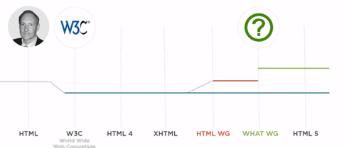
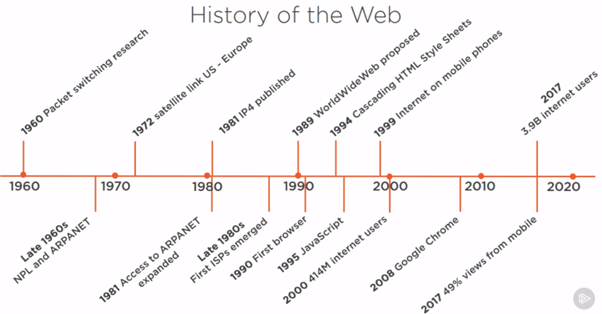
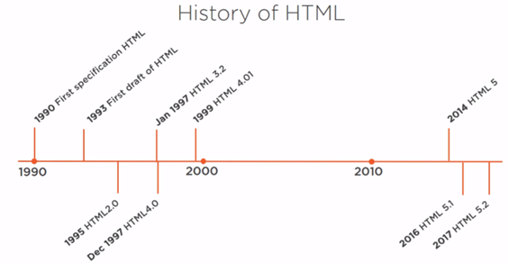
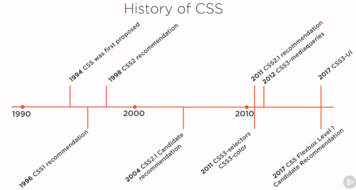
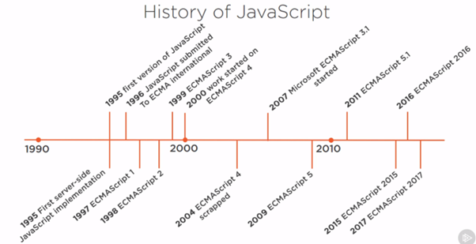
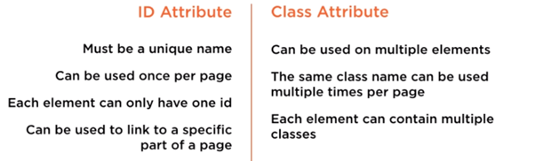
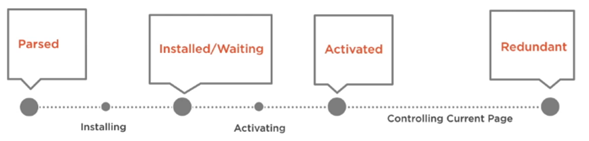
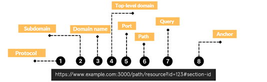

# Extracted Notes

## HTML

- HyperText Markup Language – HTML is the language that we use to create document that we want to share across the world wide we or more appropriately across the internet. HTML was created to share research documents which includes text, data, images, and all linked together.

- We should not have plan text into HTML it should be enclosed in some element like div or span.

- The doctype declaration let the client know which standards we are following.

- To enable the proper parsing, use doctype tag on first line of the HTML page. Specify the lang attribute for main language of the page it is important for screen reader. For proper parsing and rendering use http-equiv and content attributes.

- `<head>` tag is used for metadata information which includes title, meta elements, script, style, link, base. The link specifies the related documents and base specify base address for all relative links on the page.

- Block vs. Inline – Block elements are container for elements for grouping they can contain other block elements and in-line element example – paragraph. Block level element will start from new a new line.

- Use `&nbsp;` for telling browser, do not break at this particular point. So, when we resize the browser it will not break that words in between but it show it as a whole in any line.

- We used links to linking within a document or another document. Likes can be absolute or relative. If files on the server use absolute path, or if they in our local site content folder then use relative path.

- History of HTML5 – WHATWG accounted that it will no longer work on named versions of HTML so there will be no HTML6, HTML7, but the HTML spec is now a living standard. So HTML 5 no longer exists as new features are found in living standard.

- Standard Bodies for HTML – W3C, WHATWG, ECMASCRIPT

- Inbuilt APIs - Elements with API – canvas, audio, video, Forms element – meter, progress, math, data-list, New JavaScript APIs – canvas, web animations, Interaction, events and messaging APIs - battery status, clipboard API and events, cross document messaging, device and screen orientation, full screen, geo-location, media capture, notifications, touch events, vibration, Storage and files APIs – Blob URL’s File API, File Reader, IndexedDB, Local Storage, Real time communication APIs – Push API, server sent events, web sockets

- Fallbacks and Polyfills – fall back is to provide similar functionality as a native feature but maybe just with a different API. A Polyfills, on the other hand, is meant to replicate the exact same interface as well as functionality as how the native implementation would be built in the browser. For this use <www.html5please.com> website.

- Types of images

  - Vector – used for displaying simple images, and we can enlarge them without losing pixels. The image is made of a set of instructions of how to draw an image. It is rendered on fly when image is displayed.

  - Raster image – jpeg, png or gif. These are images with a set dimension where every pixel within the defined space of the image has a designated color. These are great for pictures but will lose pixels when enlarge. HTML5 canvas works upon raster images.

  - Canvas - it is just a drawing surface. We can draw shapes, apply colors and even manipulate images on the canvas. Due to rasterize nature of the canvas gives us a pixel by pixel control of that drawing surface. It uses underline grid system.

- Semantic HTML – mark-up that conveys meaning about its contents. It is mostly beneficial for the machines and also helps human too. Tags – small, footer, address. HTML mark-up is also used by search engines and screen readers and machine are not smart enough to understand the meaning of content.

- We should avoid using generic elements, inconsistent structure, presentational (CSS) mark-up into HTML. Like we should not use `<strong/>` tag just to bold a text, we should use it if we wanted to give text more important to other text. It should not use just for presentational purpose.

- Sectioning elements – elements whose intended use in to divide content up into logical sections like div, aside, article, section, figure, main, address, header, nav, footer

- To avoid CSS styles and JavaScript scripts to override our DOM subtree, The shadow DOM seeks to solve these systemic problems by creating an encapsulate spot to define our mark-up in CSS by creating a hidden and encapsulate subtree that is separate from the light DOM. Shadow DOM in native HTML like video, date, input type range tag. To see the shadow DOM, we need to enable setting `show user agent shadow DOM` in browser. Native elements already using shadow DOM.

- Shadow DOM alternatives – we have iframe but it is clunky to read, nondescriptive, excessive encapsulation, no clean API. We also have canvas but has accessibility issues, seo issues, can not easily compose, cannot extent existing elements.
  Shadow DOM encapsulates DOM subtrees and styles. Shadow DOM is like an iframe without all the baggage in a friendlier API

- Web real time communication lets us incorporate peer to peer video, audio and data communication in the browser without any plug-ins. Use cases and inspiration of WebRTC

- History of web

- What is WWW – is an information space where documents and other web resources are identified by URL in linked by hypertext links and can be accessed via the internet. The internet has been around since the 80s and the web has been around since the 90s.

- History of css

CSS is the styling mechanism for the web. It is a standard of selectors, properties and attributes. As it is just a standard so it doesn’t do anything, it just tells the people of created the web browsers how to interpret the CSS language and how to style HTML with it.

- History of JavaScript

- Html file naming conventions – always start with a lowercase letter, no special characters, no spaces, hyphens, underscores, or camel case can be used for file names with multiple word. Index.html is the standard name for a home page, browser looks for this name page to display as your lading or home page.

- HTML is made up of tags, tags tell the browser where an element should start and end. Tags should be lowercase, and each tag and its content is an HTML element.

- For checkbox and radio box, wrapped them into `<legend>` and `<fieldset>` tags

- Disabled field doesn’t get included into form data submit, but read-only field will be included. Generally, we use read-only if that user has filled its value in previous page and we don't allow to edit it on current page.

- ID vs Class attributes – use class attribute for styling instead of id.

- If images are deemed as part of the content, we should add it as HTML. If its is there for presentation and style, it should be added using CSS.

- The full form of SASS is syntactically awesome stylesheets.

- SASS has two different syntax, the original SASS syntax a bit different from CSS. It essentially removes the curly braces and semicolons from CSS, and it relies on white space. Because of this we can’t take a CSS spreadsheet and change the extension and treat it as SASS. So, for exiting projects with large CSS stylesheet porting to SASS is problematic. Due to this an alternative syntax has been developed by name SCSS. SASS is built on Ruby, LESS and Stylus built on Node.

- Responsive Page - text, images, buttons size become large/small, also page layout changes based on screen size changes. We can use media queries for it
- Cookies are just additional pieces of information that the server asks the browser to store and send back to the server with every request. But now local storage is preferred. These generally stores authentication and configuration related information which server needs to see in any request. In JavaScript object we can define properties that are functions, in JSON functions are not a legal property.

- Page request lifecycle: when we request a webpage in our browser, either by clicking a link to a new page or typing a URL in the browser. The server sends down the HTML to our page in the body of the response. Now after this browser has received the HTML it begins processing it. And part of that processing is to look four kind of different directions in the HTML i.e. CSS links, scripts tags of the source attributes, image tags, and font face directives in CSS rules. New requests were made based on these and response included their assets.

- App shell architecture – cached shell loads instantly on repeat visits, it is a main u ser interface for our application without any content. by this we can avoid showing black page while loading which frustrates users.

- We will use the service worker to cache the app shell. The cache API is a cache storage for requests and responses, it is a pre-requisite for service workers. It stores values in key value pairs, and available from window scope and service worker scope. Like below it will cache the entire request and response.

- Web worker – a script running int the background. It initiated from the main document, runs separately from main document and doesn’t have access to the DOM. It is often used as a programmable network proxy which lets you control incoming and outgoing network request. We can combine it with the cache API to serve requests from the cache. Specially if network request fails from server, it can handle it

- Web workers – it brings background threading as a first-class citizen to web browsers. We can splice an intensive process logic into a worker and it will run independent of the UI thread.

- Workbox caching strategies –

- Browser cache, if files are already in browser cache then it will not make request to sever for them. In application, all the cache files will be in grouped to a single manifest file. We should not mix browser caching and application caching. In browser, we can specify when a file will be expired, but in application cache we can only send updated files if we change the manifest file.

- Web storage comes in two flavour in local storage and session base. Security is per session and per domain. Capacity is between 2 to 10 MB. Web storage is client only (don’t need to send every time to the server) and larger capacity unlike cookies. It has simple API, key/value pair and widespread availability.

- Two types – dedicated (linked to browser that spawned the worker so it has a very tight relationship), shared (runs in the background and basically any script that’s running within that domain can send messages to that worker. It is largely unimplemented in browser currently.).

- The data which is stored in a sandbox so if website A creates it then it cannot be access by website B. local storage will work as session storage if working in private mode. Data is serialized to file system in a hard drive outside of the browser. It is synchronous.
- Browser represent a web page in memory is through the document object model.

- Using javascript we cannot set a class using .class, we need to use classList as class is a reserved word.
- To indicate emphasis use italic tag in the text, we can use `<em>` for meaning purpose and `<i>` for just styling purpose. So, use `<em>` not `<i>`, same with use `<strong>` not `<b>`.
- HTML is derived from SGML.

- Why should we structure our text – users can get to information quickly, enables accessibility tools to understand information, enables browsers to style the content, helps search engines to understand content.
- The term progressive enhancement refers to the use of newer features that add to the experience in modern browsers that support those features, but doesn’t detract from the experience in older browsers.
- URL part composition

- ARIA full form - Accessible rich internet applications
