# Extracted Notes

## Table of Contents

- [ASP.NET Web API](#aspnet-web-api)
- [Cypress](#cypress)
- [Data Structures](#data-structures)
- [Interviews](#interviews)
- [Others](#others)
- [Soft Skills](#soft-skills)
- [Wellness](#wellness)

## ASP.NET Web API

TBD...

## Cypress

- We can use Cypress to test any web application built on any type of technology.

- It has four key folders – fixtures, integrations, support and plugins.

- Best practices – we should avoid using id’s or css classes to select element from the DOM, it will make the test brittle, because those things are likely to change. We should either use data attribute or actual component name itself.

- With Cypress, all related things are available out of the box –

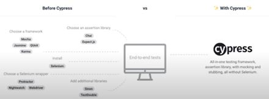

- Cypress command API – it is a chained API where subject is passed through the chain.

- Test commands are executed in a deterministic manner, resulting in flake-free testing. Cypress will automatically wait for this assertion “.should” (4 seconds by default). So we don’t need to write code for wait and sleep until element is ready

- In cypress we can also stub network response with fixtures by using cy.server() command.

- Whereas selenium executes remote commands through the network, Cypress runs in the same run-loop as our application. Other tools like protector uses selenium under the hood unlike Cypress. It provides features like real time loading, time travel, consistent results.

- Selenium and similar tools were designed to test applications that require a full-page refresh. Supporting SPAs with Ajax data fetching was an afterthought. This lead to many issues with timing and flakey tests. Tests would sometimes fail due to slow API requests or network latency. Fixing these flakey tests typically required adding sleep statements and increasing timeouts. This made the test code more brittle. Not to mention extremely slow.

- It’s worth mentioning Google’s Puppeteer has inner access to web browser events, allowing us to wait on things like Ajax calls. However, writing tests with Puppeteer requires more initial setup work and more effort to write each test than it should.

- Cypress.io is a relatively new framework. It overcomes many shortcomings found in Selenium, Phantom.js, and others before them. It uses an event-based architecture that hooks into Google Chrome’s lifecycle events. This enables it to wait for things like Ajax requests to complete without using a polling/timeout mechanism. This leads to reliable and fast tests. In short, it is truly the future of E2E testing and how it should have been in the first place.

- You can run Cypress in two modes: full-mode and headless-mode. The former lets you see your app’s UI and tests performed one step at a time. This mode is excellent for building up your test suite and debugging. The latter is great for a Continuous Integration (CI) environment. Another use case for headless-mode: you just want to make sure you haven’t broken anything with new changes but don’t care about the detailed steps.

- Headless-mode is useful for running on a Continuous Integration (CI) server like CircleCI. Once you start writing tests more regularly as part of your development, you should invest time in getting a CI server configured so that every git commit runs the entire test suite.

- Cypress is an end-to-end framework that was created by Brian Mann, who wanted to solve some pain points that a lot of developers face when writing integration tests: hard to write, unreliable and too slow. Similar to TestCafe, it was built on top of Node, with no dependencies on Selenium, and is a standalone testing framework that supports Javascript.

- You can have a 100% code coverage with unit-tests that test all your components in isolation, but your application might still fail when components start to communicate with each other.

- The real important tests are the ones that test functionalities that your users use every day. These are things like: “Can a user buy a product?” and “Will my order be shipped to the right address if I change the address later?” These kinds of things are impossible to test with unit tests, as they use all components of your application.

- Cypress additional events -

- .click(), .click({force: true}), .click(5, 10), .click('topLeft'), .type('text'), .type('text', {delay: 10}), .type({backspace}), .select('value'), .select('val', {log: false}), .select([val1, val2]),

- Cypress commands do not return their subjects. They yield them. Cypress commands are asynchronous.

- Cypress uses retry-ability for the commands automatically to avoid hard code waits. Below if the assertion is failed then it will go back to the command and wait for a certain period of time

- It only retries commands that query the DOM like get(), find() or contains(). Commands that are not retried are the ones that could potentially change the state of the application. Also, it will only retry the last command before the expression like in below it will do the several retry for the .find() but no retry for the get().

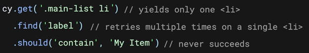

- Types of commands – parent command start a new change and ignore previously yielded subject, child command cannot be directly used and need to apply on parent command or another child command. The dual commands can do both.

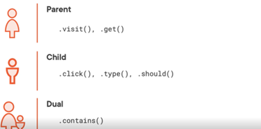

- It is suggested to do the clean-up before and not after tests.

- There are two design pattern while writing the E2E to make it more maintainable and free from future breakage – Page Object Model and App Actions.

- App Actions is an approach where tests directly access the internal implementation of the application under test. It enable changing application’s state without interacting with the application through the UI.

- Page Object model is a wrapper over a web page and a design pattern where web pages are represented as classes. Encapsulates the mechanics required to interact with the user interface. Second one, is the example for page object. By creating page object classes, it will increase the maintainability, code reusability and readability of our code.

- We should identify steps to automate through the UI and then use the App Actions for supporting steps. Like for login workflow use it once by browser interaction and then for other dependent tests use via App Actions. Also, we should use precise and future proof selectors.

- Before and After Cypress –

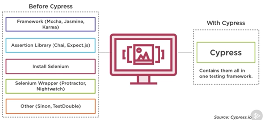

- While writing the plugins, they run in Cypress background tasks in Node, since they executed in Node not in the browser, we can’t use Cypress syntax while writing plugins code.

- By using plugins, we can modify or extend the internal behavior of Cypress. We can write our own custom code that executes during different Cypress stages. By this we can also tap into node process running outside the browser. We can also alter the configuration and environment variables or customize how test code is transpired and sent to browser or to manipulate the database.

- Javascript mouse events are easy but CSS mouse events are hard. Cypress can’t easily trigger pseudo-classes like :hover. There are docs and options for this, but it is difficult.

- We should not select element by using text. We should use consistent selectors like id, class. Even better, use test-specific attributes like `
`

- Benefits of automated tests vs. manual human –

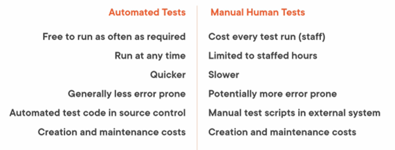

- Subcutaneous tests – a level above than the unit and integration tests and just below the surface of the UI. In this we can test all the non-UI components working together.

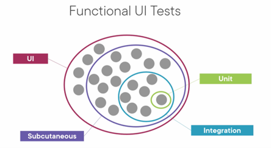

- We should write the smallest number of tests possible to reach the required level of quality or confidence in the system being developed.

- Characteristics of good automated tests – isolated (no side effects on other tests), independent (can be run in any order), repeatable (always pass or fail), maintainable, valuable.

- When a bug is found, a failing automated test can be written to reproduce it. When the bug is fixed the test will pass. In some future change, if the bug reoccurs it will be caught by the automated test.

## Data Structures

- Node chains –

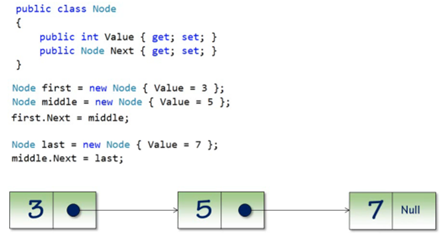

- Linked list – single chain of nodes, head pointer, tail pointer, operations – add, remove, find, enumerate.

- Doubly linked list – singly linked list works great when we need only forward access to the nodes, but for backwards compatibility as-well we need to use doubly linked list.

- Stack - It is based on LIFO concept. Each pop reduces the stack depth.

- Stack using linked list – pros with linked list approach – no hard size limit, easy to implement – no bounds checking, empty list means empty stack, cons – memory allocation on push, per node memory overhead, potential performance issues.

- Stack using arrays – cons with arrays approach – over-allocation of array. While enumerating we need to iterate it backwards.

- Postfix calculator – postfix notation also known as reverse polish notation in this approach operator follows the operands by this, we can avoid the ambiguity in operation order.

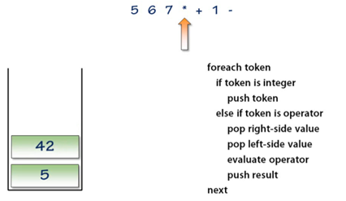

- Undo implementation using Stack – we use stack to store the changes and to reverse the changes when undo is clicked.

- Queue - It is based on FIFO concepts. We can do enqueue and dequeue operations on it.

- Queue using linked list implementation – in this we will add last and remove first, not add first and remove last due to enumeration order. Add last/remove first allow list enumeration to “just work”. Queue allows to take incoming data and store it in a way that allows us to process it later, but in the order, it showed up, which is a sort of fairness.

- Handling growth of an array – we also need to copy from 0 to head – 1 in case of non-empty values. Arrays has benefits over linked list approach like data locality and performance gains, reducing the overall number of allocations and incredibly fast enqueue and dequeue times when there isn’t an allocation being performed.

- Priority queue – highest priority items dequeued first, not first in and first out. Only enqueue operation need to be change in implementation others operations will be same.

- What is a tree – instead of a linear structure which can be traversed backward and forward, these are a hierarchical rather than a linear manner. Terms are root or head node, leaf nodes, child nodes. A node can have any number of children but only one parent. Fundamental rule for a tree structure is that there is exactly one path from the head node to any other node in the tree and likewise exactly one path from any node in the tree back to the head node, therefore there is exactly one path can be taken between any nodes in the tree.

- Binary tree – it can have most 2 child nodes called left and right children.

- Binary search tree – sorted hierarchy of data. Small values on left and larger values are on right. Left most node contains the smallest value and right most node contains the largest value.

- Finding data – searching. Data ordering requirements make the binary search tree a really efficient structure for searching for data, as we don’t need to traverse all node to search the data.

- Traversals – to enumerate in well-defined order they are pre-order, in-order and post-order. Pre-order and post-order are used in mathematical expression evaluation, and evaluation of run time behaviour in a language like compilers use trees, dependency graph for which depends upon which operation.

- Hash Tables - Hash tables are fit into the broad category of structures knows as associative arrays. Associative arrays provide the storage of key/value pairs into an array or an array like collection. But unlike an array, the index can be any comparable type not just an integer, each key is unique. The key type is mapped to an index.

- This GetIndex() method hashed the string, hashing is a process that derives a fixed size result from an arbitrary input. Any string of any length when hashed would return a fixed size i.e. 32-bit integer hash value. The features of a hashing algorithm - stable (same input generates the same output every time), uniform (hash value should be uniformly distributed through available space), efficient and secure.

- String hashing - Naive implementation - summing of the ASCII value of character.

- Handling collisions – if two distinct items have same hash value, then we have collision as items are assigned to the same index in the has table. To handle this, we can follow two strategies – open addressing (moving to next index in table), chaining (storing item in a linked list)

- Counting words – real world example of hash table. Hash table shines in a scenario where key/value pairs we are updating the values and we have a stable key.

- Sorting means arranging data in a collection based on a comparison algorithm like any object with a notion of greater-than/less-than/equality. Two general families of sorting algorithms – linear sorting, divide and conquer. Linear algorithms treat the problem of sorting as a single large operation. Divide and conquer algorithms partition the data to be sorted into smaller sets that can be independently sorted. Measuring performance – number of comparisons, swaps operations.

- Bubble sort – simplest sorting algorithm. Consist of many passes until no swaps are performed in a pass. Performance is not good O(n2), not appropriate for large unsorted data sets. But for the best-case performance is very good i.e. O(n) also for the space requirement it is good i.e. O(n) as it directly operates on the input array and it is a candidate algorithm when minimizing space is paramount.

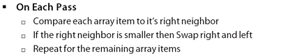

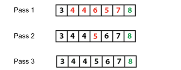

- Insertion sort – sorts each item in the array as they are encountered. It uses only simple pass, everything left of the item is known to be sorted and everything to the right is unsorted. Performance and space matrixes are same as bubble sort.

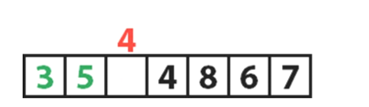

- Selection sort – another linear algorithm, hybrid between bubble and insertion sort. It sorts the data by finding the smallest item and swapping it into the array in the first unsorted location. Performance is similar to bubble and insertion sort. Best case performance is O(n2). It Is not appropriate for large unsorted data set. For a system where comparison is cheap and swaps are costly then we can use this algorithm.

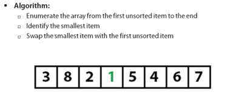

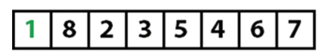

- Merge sort – it is a divide and conquer algorithm. They array is recursively split in half, and splitting continues until the array is in groups of 1, it is reconstructed in the sort order. Each reconstructed array is merged with the other half. Worst, average and best cases performance is O (n log n), data splitting means that the algorithm can be made parallel, that’s why it is appropriate for large datasets. Space required is O(n), merge can be, but is often not, performed in-place. These extra allocations increase the memory footprint required to sort data.

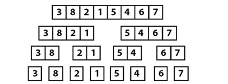

- Quick sort – commonly used general purpose language and also based on divide and conquer. Pick a pivot value and partition the array.

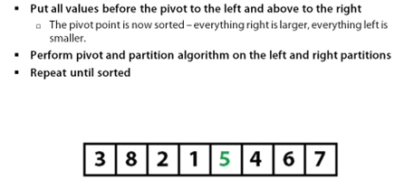

- Worst case is O (n2) not appropriate for large pathologically sorted (inverse sorted) data sets, average case performance is O (n log n) appropriate for large data sets, best case performance is O (n log n) very good best case performance and can efficiently sort small and nearly sorted data sets, space required O (n).

- AVL Tree - Binary tree is a collection that stores data in a tree structure. AVL tree are self-balancing binary tree invented by Adelson-velsky and landis (1942). Only insertion and deletion differ in running the balance algorithm from binary tree. AVL tree new concepts are self-balancing, height, balance factor, right/left heavy. An unbalance binary tree can cause performance issues like reduce the search time; it might become a linked list as below, like loading a English dictionary –

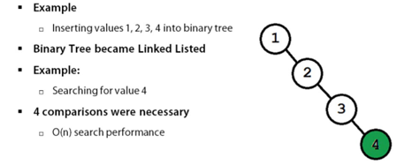

- Balanced binary tree – the tree remains balanced as nodes are inserted or deleted, height or left and right tree differ by at most 1.

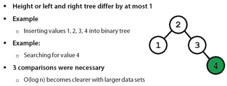

- Balancing is done using node rotation. Rotation changes the physical structure of the tree within the constraints of the binary tree, smaller values on the left and larger or equal on the right. Rotation algorithms are right rotation, left rotation, right-left rotation, left-right rotation.

- AVL tree vs. Binary tree visualization – AVL tree won’t get much height and depth unlike binary tree. For bad 100 number, the binary tree will become the linked list like linear structure. Also, it is shows the difference between balanced tree and unbalanced trees.

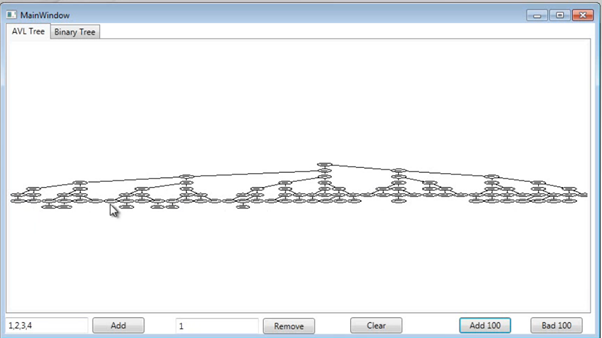

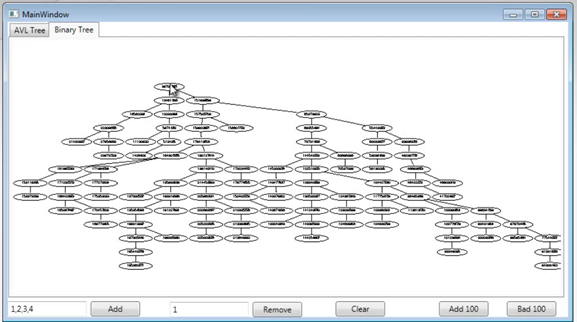

- String Searching Algorithms - API Overview – by using interface we can implement algorithms in a uniform manner and this will allow us to use them interchangeably.

- Naïve Search - We can use run the loop till the string length minus the search string length to get some optimization. This algorithm is most appropriate when the string to search and find are both small.

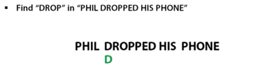

- Boyer Moore Horspool Search – it minimizes the overall cost of search by skipping as many characters as possible. This is appropriate as a general-purpose string search algorithm. It will also improve the performance if search string is longer.

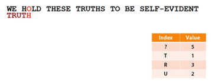

- Data structures is a way of storing data. Data structures and algorithms are heavily linked. DS typically use some sort of algorithm to perform their inner organization, and algorithms typically uses data structure to store internal states.

- Ways of measuring performance – timing with stopwatch (but it depends on hardware, programming language, environment, etc.), counting instructions executed by machine, looking at execution curve, best case, worst case, average case.

- Asymptotic performance – In Asymptotic Analysis, we evaluate the performance of an algorithm in terms of input size (we don’t measure the actual running time). We calculate, how does the time (or space) taken by an algorithm increases with the input size.

- Big Theta – it can be used to express the complexity of a program.

- Big O – worst-case complexity of the program.

- Binary search – complexity in terms of Big O

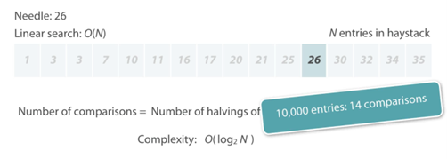

- Amortized complexity – it deals with the complexity of performing the same operation multiple times for varying inputs like inserting multiple elements in a data structure.

- Priority queues – internally elements are organized in a data structure called heap, types of heaps are min heap, max heap and min-max heap, interval heap. A heap is an binary balanced tree structure where each node has at most two children, in min-heap each element is smaller than its immediate children.

- Hash table – two flavours – first is a container that store the values that are added directly, just like arrays and linked lists, this container is often called a set or a hash set. The other flavour is a container that maps a setup of keys to a set of values, this is referred to as a map or a dictionary. Search operation is much faster in hash table.

- By hash table we can quickly lookup the name of a certain user id and this makes hash tables ideal data structure for caches, fast insertion, fast lookup and fast deletion, but elements order as per we receive them can’t be possible in hash table unlike arrays.

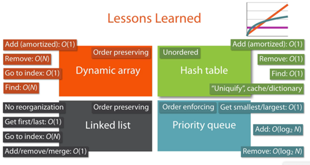

- Brute force and greedy algorithm – problem solving strategy where all possible combinations or solution candidates are tried out blindly until a solution is found is called brute force.

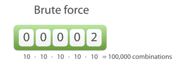

- Greedy algorithms work smarter than brute faster, they may speed up the search for a solution, but they come with a catch of stalling at a local maximum or minimum if we search for a small solution.

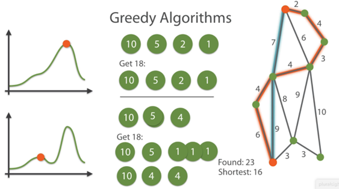

- Divide and conquer – key ingredient is to discover how to divide the larger, original problem into sub-problems. Once divided, each of the smaller and easier-to-understand sub-problems are solved, leaving us with sub-solutions. Finally, find a way to combine, or deduce these sub-solutions into a solution to the original and larger problem, thereby conquering it. We can also apply it recursively. Example – quicksort

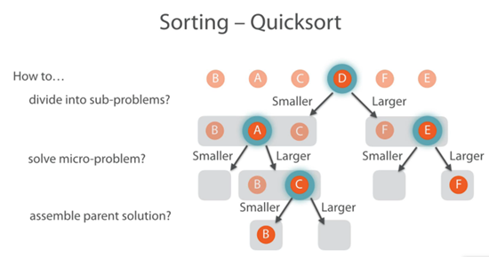

- Dynamic programming – this is also built on the core idea of divide and conquer. If sub problems cannot be separated but overlaps, then overlapping part would need to be solved in both sub-problems. We can cache the solved result of sub-problem. It will improve the performance.

- The 0/1 Knapsack problem – using dynamic problem we can get the performance advantages as it has lower complexity.

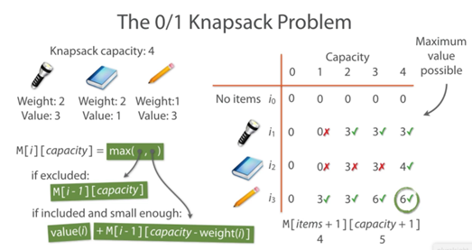

- Other examples – where to put line breaks to obtain a nice and even text justification, finding shortest paths, finding difference between two files, sequence alignment, various games

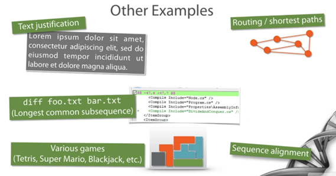

- P vs. NP – exponential functions grow much faster than polynomials. The complexity category P covers problems that can be solved in polynomial time i.e. easy problems like sorting, traversing, lists, etc. But problems in NP category are decision problems (in which answer is yes or no) verifiable in polynomial time.

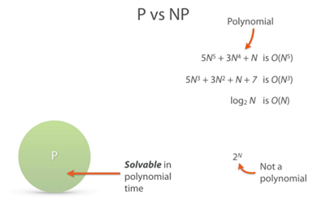

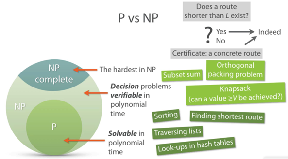

- NP hard – at least as hard as NP complete, they don’t need to be decision problem, and they do not need to be verifiable in polynomial time like knapsack problem, halting problem, traveling salesman problem.

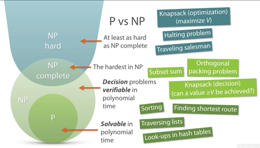

- Heuristics and approximation algorithms – they are general techniques for dealing with computationally hard problems. Heuristics – wanted speed, trade with accuracy.

- Cuckoo hashing to create hash table – it is an open addressing scheme, inspired by cuckoo bird.

- Prefix-querying Sequences Efficiently with Tries - Tries – represent a number of strings in a single tree structure where the root node represents the enter string with no letters added yet and with each subsequent level of the tree corresponding to a pending one more letter to a string.

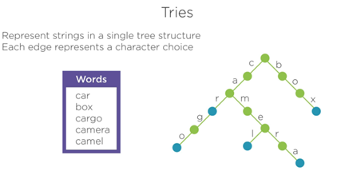

- Radix tree – a compressed tries structure, it improves the performance. We can use it if read-only or read-mostly operations. Tries is useful for autocompletion, prefix only scenario.

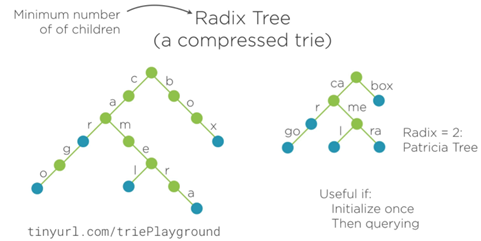

- Suffix trees also allows to search a pattern anywhere in a string.

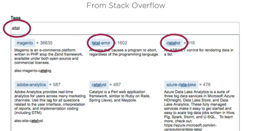

- Data structure is a method of organizing information so that the information can be stored and retrieved efficiently.

- Big O notation – computer science defines performance by something called Big O notation. It shows how the data structure will perform as the data increase.

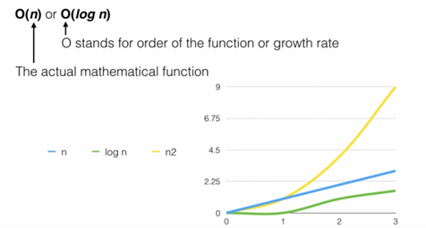

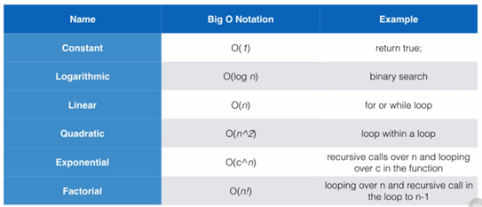

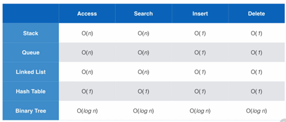

- One of the problems with a hash structure is when we run into collisions when putting data into the hash. Collisions slow down the performance of the hash, which kind of defeats one of the main points of using the hash. We can reduce has collisions by increasing the has capacity or improve the hashCode() method quality to improve the uniqueness of hash value.

- The binary tree doesn’t need to always have two nodes per parent. the tree additions are based on comparisons rather than keeping the tree balanced. Because the tree data is dispersed based on comparison, it makes adding and finding the data quite efficient, so don’t have to traversed all the elements like array list due to which the Big O notation would be logarithmic which is one of the best access performance we can get out of a data structure. But implementing a tree data structure is a bit of complex in code.

- Safely Using Arrays - Arrays are used in examples like storing share prices of a company in different points of time, use arrays of pixels to store and process images. Arrays properties – contiguous memory locations as it is a very cache friendly data structure, same element type cannot have mixed up type of elements in a same array, direct fast element access by index, indexes are zero-based.

- Data transfer algorithms – physical vs. internet data transfer. We should pick the constant one because at some point it will be faster than linear complexity.

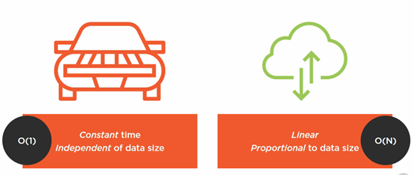

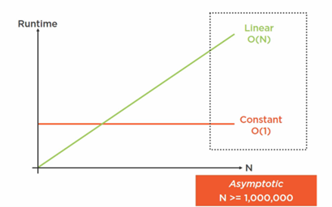

- Stack overflow – if internal array to store stack values gets full, then push operation will cause it outside of stack area which is not owned by stack. In this case, we should throw an exception from code.

- Arrays vs. linked lists – memory layout – direct fast element access by index not possible in linked list we have to traverse all the elements, also it is not cache friendly as it is not having continuous memory allocations. Linked list is good for inserting new item as all don’t have to shift. So, no reallocation overhead. The nodes of the linked list are stored in sparse memory locations. They are scattered all over computer’s memory.

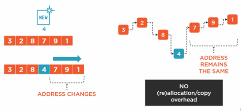

## Interviews

TBD...

## Others

- Common full stack technology stack - Python + Django, PHP + Laravel, NextJs + React, Nuxt + Vue

- URL segments - <https://example.logto.io:8080/blogs/index.html?param1=value1&param2=value2#introduction> - Scheme, Host, Port, Path, Query Parameters, Fragment Identifier

- ORM makes life easier. Various different database varieties focus on or good at different part of the database like cache (Reddis), utility, storage engine, etc.

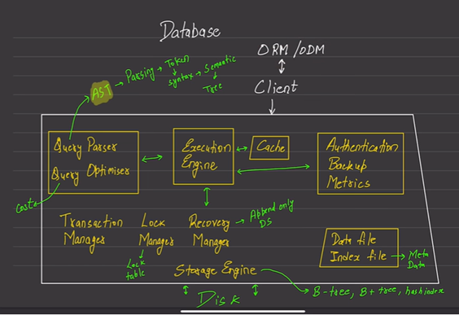

- History of database -

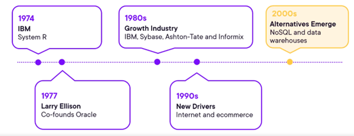

- HTML is a parser language or abstract layer for C++ to parse on the browser. The browser are very good at networking and timers capabilities.

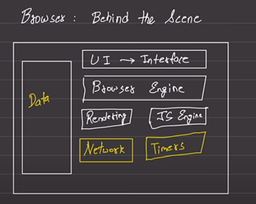

- Browser works on simple working concept to display the data and provide interaction to the user. It converts the token into scattered objects which gets constructed into the Document Object Model.

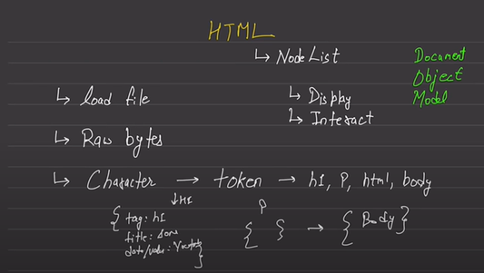

- Afterwards, to create the relations between them, it creates node list which is given by rendering engine.

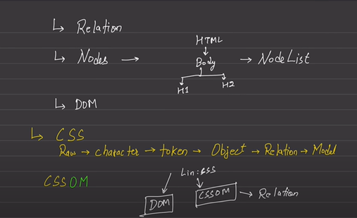

- Browser engine is very good at math to create render tree as per client screen size and components size based on CSS then it starts painting to actually showing elements on the UI.
  Whenever browser sees a script tag it will stop executing the DOM or whatever works it is doing, the first preference always goes to JS as JS has the capability to modify DOM or CSS so no point to painting before evaluating all the JS. That is why we should not first send the JS but the HTML and CSS so that browser will show the page without any delay on first load, then send the JS for interactivity. However in case of CSSOM, JS execution will be halted until CSSOM is ready.

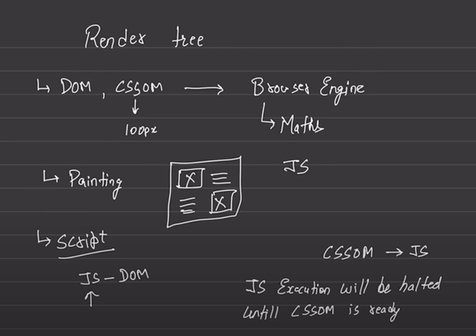

- The early 2000s was the era of the virtual machine. We are now firmly in the container era. They have much smaller footprint, quicker to download and a lot less resource needed to run them.

- Container image – a file system bundle containing all files, packages, dependencies, and kernel needed to run a service. To the host this is a single process. Container run isolated from other containers so software and dependencies installed on one container do not affect other containers. It has small footprint because there is no complete operating system with a container making them are much less resource hungry than running virtual machines.

- If you like ray tracing in your games, you would want to get an NVIDIA card. And if you primarily like to work on Linux, then an AMD card is what you should be looking to get.

- Wired audio devices offer superior audio quality, are generally more reliable, and do not require charging. Wired peripherals continue to dominate in terms of reliability, low latency, and security.

- Consider the task of finding a specific item in an unsorted database. A classical computer would need to check each item one by one, requiring, on average, N/2 checks for a database of N items. However, Grover's algorithm, a quantum algorithm, can find the item in roughly mod N operations, showcasing quantum computing's potential for speedup in search problems.

- Engineers used to give complex names for the technology but under the hood it is very simple and have same base concept.

- JWT has three segments, each separated by dots. If it is a base64-encoded JSON then its first two segments would start from characters “eyJ” because when decode it becomes base64({“). First part it has Header that describes the token itself and how to read & validate the token. It has properties like type, alg and kid. The second part is the payload, it is the content of the token itself. It contains claims about the entity. The final part is the signature value, it is created using the header, payload and signing key. Its length varies based on the algorithm and key.

- The JWT pronounce as “jot”. It is originally created by the OAuth working group due to demand for JSON representation of claims and to replace SAML assertion.

- When to use JWTs – for API access, for information transfer (identity token), security proofs. We should always use JWTs in combination with something else like OAuth or Open Identity Connect protocols where rules are defined and low risk of misuse.

- JWTs are not a replacement for cookies and sessions. Browsers cannot maintain JWT sessions, we have to implement token storage and management. There is no out-of-the-box method to invalidate a single JWT.

- We should not store application or permission data as we should keep our JWTs small as it can easily hit header size limits.

- JOSE (JavaScript object signing and encryption) standards – JWON Web Tokens, JSON Web Signature, JSON Web Encryption, JSON Web Key, JSON Web Algorithms.

- Initial format check of JWT - three sections, two dots, base64url data, valid JSON objects.

- We should first validate the token like checking the issuer, subject value, audience, expiration date, before parsing it.

- JWE has 5 distinct section instead of 3 of JWT –

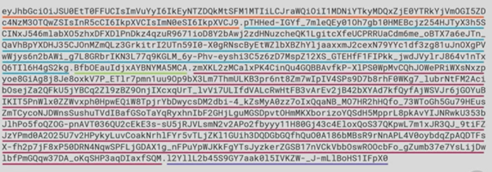

- When to use JWE – if we use PII (personally identifiable information) like names, email address street address, IP address, account number, telephone number etc., if token needs to be passed through multiple systems (including the 3rd party).

- It is short for YAML aren’t markup language. It is human-readable data serialization language. It can be used to keep and transfer the data. Its most common purposes is the configuration files. It is a true superset of JSON.

- YAML use cases – cross-language data sharing, configuration files, log files, object persistence, working with language like ruby, python, etc.

- It has two style – block (human readable) and flow (less human readable like JSON)

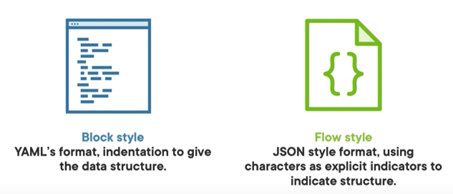

- Building blocks – sequence (arrays), mapping (key-value) and scalar (string, number, boolean and dates). We should do indentation with spaces not with tabs.

- For list we need to use (-) and for key-value we need to `(:)`.

- Scalar values – with string values we can use quotes or without quotes. By using the `#` we can add comment.

- One YAML file can contain multiple documents. The documents can be separated by 3 hyphens (---).

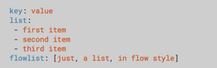

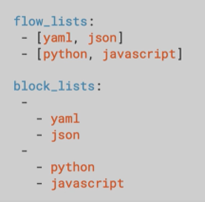

- Explicit typing – by using like !!str is an explicit typing which will convert the date into a string type.

- Repeated nodes – to avoid code repeat.

- Processing of YAML –

- YAML vs. JSON – YAML is standard for configuration and JSON is standard for service API.

- YAML vs. XML

- GitLab is a single platform that provides entire DevOps toolchain for organizations of any scale and size.

- A pipeline contains below things – jobs, runners, stages

- To create table of contents from headings automatically, we can use [[_TOC_]] syntax.

- Github is a cloud based git repository hosting service.

- We can run a workflow on any Github event –

- WordPress is an open-source, free platform for building and developing websites. WordPress is the most user-friendly and efficient blogging and website builder on the market right now.

- Anonymous comments can cause serious damage to your website’s reputation.

- WWW or no WWW – whether your website is brand-new or has been hosted for a few months already will depend entirely on its stage. If it brand-new, you must definitely choose whether to use www or non-www in the URL of your site.

- One calorie of heat energy is the amount of energy that is required to raise the temperature of 1g of water from 14.5 degree Celsius to 15.5 degree Celsius.

- Temperature is defined as a parameter that helps us define the level of hotness or coldness of its body.

- The quantity of heat that is absorbed by a body is generally dependent on three factors, which are as follows – mass, increase in temperature, material.

- Not all the materials can have transfer of heat through this process, for example, plastic. Such material called insulators. Conductors are known to carry heat easily because of their low specific heat capacities.

- The process of heat transfer through a vacuum is called radiation.

- Motion is a combined outcome of a body under observation and the observer.

- Magnetism – The core of the earth was made from iron, while the planet itself was a magnet, which he quoted to be the reason for compasses to point to the north. The unit of the strength of a magnetic field is Tesla. Magnet types – permanent, temporary and electromagnets. A current-carrying wire produces a magnetic field around it. Magnet uses – scrap lifting, surgical extraction, dc motor, ac generators. The payment card strip is made of magnet, audio cassette, CRT’s monitor, speaker system. Over-exposure to static magnetic fields can be harmful to our health.

- Skill transfer is very easy in angular, as most of the angular projects looks the same. When you use angular, you are getting everything like route, forms package, http package, there is a kind of prescribed way to code with angular but products like react are much more pick and choose, so you can choose which router you want, which http package you want to use.
  By low-code we can deliver better software faster. One way is to abstracting automating things so professional developers can go faster. It also takes the constraint away from people who can only build that and it open an ability to adapt to this new world in real time with people who has no traditional skills in software development. It provides speed, simplicity, no huge army of engineers and get live quickly and save tons of the cost to the business, anybody can develop software, business and IT will be on same page by providing common language, has guidance and guard rails, no long red tape of processes.

- Chrome dev tools - Elements, console, sources tabs are called panel and windows inside each of them are called pane.

- Time begins on 1st jan 1970 with the unix epoch, when we say Date.now(), it gives milliseconds from this time.

- IDE’s Evaluation - vi -> emics -> vim -> neo vim -> nano -> notepad++ -> Dreamweaver -> visual studio code -> visual studio -> WebStorm (features looks more reliable and polished than vs code)

- Choosing the framework depends whether website mostly have static content or highly interactive, if highly interactive then whether it needs SEO, if SEO and content rarely change like in blogs website then use JAM stack and pre-render the content and cache on the CDN. if dynamic content then need full SSR + hydration.

- Angular bootstrap process - angular.json (main) -> main.ts (bootstrapModule) -> app.module (bootstrap) -> app.component -> app.component.html -> index.html (`<app-root></app-root>` selector is used as an element to get the app component) -> The javascript files {runtime.js, polyfile.js, … etc } are responsible to make our application a single page and they are handled by the browser itself. But, the Html code should be available in our application itself.

- Google searching tips - cut the crap - Forget “what,” “how,” and other words that serve only a syntactical purpose. Demand answers using meaningful and descriptive verbs example - instead of 'what is algorithmic complexity' use 'define algorithmic complexity'. Order keywords from broad to specific, instead of 'consume an api using typescript with axios' use 'typescript axios consume api'. Use Images for Diagrams and Visualizations. Many times, Images will contain concise and informative graphics that will answer your question much faster than a web page could.

- Useful http status codes - 100 Information - 100 — Continue; 101 — Switching protocol; 103 — Checkpoints. 200 Successful. 300 Redirection - 301 — Moved Permanently; 302 — Found; 304 — Not Modified; 305 — Use Proxy; 307 — Temporary Redirect. 400 Client Errors - 400: Bad Request; 401: Unauthorized; 403: Forbidden; 404: Not Found; 408: Request Timeout; 410: Gone; 429: Too Many Requests. 500 Server Errors - 500 — Internal Server Error; 502 — Bad Gateway; 503 — Service Unavailable; 504 — Gateway Timeout.

- Cloud learning path - docker -> kubernetes -> helm -> istio

- Video game evaluation - game watch -> gameboy -> gameboy colour -> gameboy advance -> gameboy advance sp -> nintendo ds -> dsi -> 3ds -> switch

- Low-code no-code (LCNC)

- We should not create any features of functionality when we are carrying out the refactoring process.

- Event based learnings (like office training) vs continuous learnings (like from pluralsight).

- Young bright minds ready to snipe every job opportunity that comes their way.

- Foley artists give life to shapes like footsteps, actors walking in leg chains. They reproduce every day sounds like waves crashing, rain coming down, cars passing by, punches, kicks, wind blowing, doors slamming. Three major kinds – feet, movement, specifies. Like roaring of a tiger in a scene or helicopters flying over the heads of the actors in a scene are produced by artists working on specifics.

- Freemium – providing a free, basic version of the app with the option to upgrade to a premium, paid version.

- SNES 8-bit games.

- There is no need to defragment the SSD as they do not work the same way as traditional hard drives. In fact, defragmenting an SSD can cause unnecessary wear and tear on the drive.

- To prevent screen burn-in, avoid displaying static images or leaving the monitor on for long periods of time. Use a screensaver or power-saving mode when monitor is not in use.

- A good song will develop as it goes along, taking us on a familiar path sprinkled with surprises along the way to make sure we are listening. A bad song, on the other hand, will remain stagnant throughout its entirety.

- Overclocking will make your phone run hotter and shorten your battery life, but I can squeeze every drop of power out of your device.

- Stable diffusion is a latent text-to-image diffusion model capable of generating photo realistic images given any text input. The model employs a technique called diffusion modelling, which works by incrementally reducing the noise in a sample over several iterations, eventually producing a final output. Diffusion model is a type of model that generates a chain of increasingly noisy images by adding Gaussian noise to an image and then training a model to predict the noise added to an image from one step to following one. It uses a fixed and finite number of steps to generate images, resulting in a stable repeatable image generation.

- Experience is the name everyone gives to their mistakes. Oscan Wilde.

- Zero-day Exploits - Attacks exploiting vulnerabilities in software before the developer has issued a patch.

- Types of MFA - SMS codes, authenticator apps, hardware tokens.

- Writing clean code is what you must do in order to call yourself a professional. There is no reasonable excuse for doing anything less than your best.

- A piece of code should be where you expect to find it - and, if not, you should re-factor to get it there.

- The early bird catches the worm. Don't put off until tomorrow what you can do today.

- YOu should name a variable using the same care wit which you name a first-born child.

- It was the bad code that brought the company down.

- it is unprofessional for programmers to bend to the will of managers who don't understand the risks of making messes.

- Clean code reads like well-written prose.

- It is not the language that makes programs appear simple. It is the programmer that make the language appear simple!

- The length of a name should correspond to the size of its scope.

- One difference between a smart programmer and a professional programmer is that the professional understands that clarity is king. Professionals use their powers for good and write code that others can understand.

- Our real goal is to tell the story of the system, and that the function we write to fit cleanly together into a clear and precise language to help us with that telling.

- when people look under the hood, we want them to be impressed with the neatness, consistency, and attention to detail that they perceive. We want them to struck by the orderliness. We want them to perceive that professionals have been at work.

- The newspaper metaphor - think of a well-written newspaper article. you read it vertically. At the top you expect a headline that will tell you what the story is about and allows you to decide whether it is something you want to rad. the first paragraph gives you a synopsis of the whole story, hiding all the details while giving you broad-brush concepts. As you continue downward, the details increase until you have all the dates, names, quotes, claims, and other minutia. We would like a source file to be like a newspaper article.

- There is a reason that we keep our variables private. We don't want anyone else to depend on them. We want to keep the freedom to change their type of implementation on a whim or an impulse.

- Learning tests - in learning tests we call the third-party API, as we expect to use it in our application. we are essentially doing controlled experiments that check our understanding of that API. the tests focus on what we want out of the API.

- Cohesion - classes could have a small number of instance variables.

- Software systems are unique compared to physical systems. Their architectures can grow incrementally, if we maintain the proper separation of concerns.

- Writing clean concurrent programs is hard - very hard. it is much easier to write code that executes in a single thread.

- We should keep our concurrency-related code separator from other code.

- Keep synchronized sections small - locks are expensive because they create delays and add overhead. Also, avoid calling one locked section from another. This requires a deep understanding of whether something is or is not shared.

- Programming is a craft more than it is a science. To write clean code, you must first write dirty code and then clean it, it is called successive refinement. Most freshman programmers don't follow this advise particularly well. They believe that the primary goal is to get the program working. Once it is "working" they move on to the next task, leaving the "working" program in whatever state they finally to it to "work. Most seasoned programmers know that this is professional suicide.

- Refactoring is a lot like solving a Rubik's cube. There are lots of little steps required to achieve a large goal. Each step enables the next.

- Much of the good software design is simply about partitioning - creating appropriate places to put different kinds of code. This separation of concerns make the code much simpler to understand and maintain.

- Each of us has the responsiblity to leave the code a little better than we found it.

- We should take pains to minimize both the number and extend of extra languages in our source files.

- You don't become a software craftsman by learning a list of heuristics. Professionalism and craftsmanship come from values that drive disciplines.

- al killed the curious star - we are giving up our creativity to make things more convenient. it is what fast food did to us.

- Keep your eyes open for new programming languages, tools, and ways of working that might improve your company’s development process. Don’t be afraid to ask the team to try new stuff, or to try it on your own so you can show them how valuable a new tool can be. Learn about the company’s business, who its customers are, how the product is sold, and what products you compete against. Competitors have good ideas too, ideas you can incorporate in your next feature.

- Be a mentor to a new team member. Help everybody do their best work. The nail that sticks up, gets hammered down.” Don’t stick up. When the company considers employees to lay off, it’s the ones that require management that get let go. The easy ones get to stay. While doing this, keep up to date on tools and methods, because you never know when you will need to find a new job. This increases your value to the next employer.

- We have now become a lego builder not a programmer after using so much of frameworks.

- The code should be easy to modify as requirements change.

- use astro framework for a content heavy fast website

- display technologies - lcd, led and micro led

## Soft Skills

- LinkedIn - A place to find and be found. Profile pic should be a head shot with proper background color.

- 5 parts of formula for more effective message – don’t have the long paragraph. Next step is phone call, over the email, or face to face meeting.

- As an interviewer we also need to sell the opportunity like the projects, team, company, perks, contribution impact, preparation, promptness, attitude and vibe, our stories.

- Interviewee’s tell their experience in stories, concise answers, thoughtful questions, choice of words, body language and kindness.

- Don’t ask many yes / no questions but open-ended questions like “tell me about a time when,”, “tell me more about that project” or “how you solve this problem”.

- We can ask the complex problem they have worked upon, any new technology how they will learn, any project or shared code or ask for any homework. And then ask questions based on that homework. We can first have panel interview then give homework then call.

- Interview questions -

  - how many technologies you have worked and how much you would rate each of these?
  - which languages are you proficient in and could teach others?
  - tell me about the users you have worked with? what do your users do that make you upset
  - how long have you worked with this language? what are the best and worst changes you have seen since started
  - if you were asked to present to a group of engineers about a particular technology, what would you present?
  - what technical projects do your do at home
  - if you had more time what technology you would study
  - what do you think of working with older technology
  - when you are learning a new technology, what process do you use to bring yourself up to speed
  - what do you do when you see a colleague is approaching a problem the wrong way? let them do it and learn, or...?
  - do you read books? what are the last three books you have read?

- Illegal questions – age, religion, arrested, married, children, weight, personal finances, alcoholic, health, nationality, disabilities, military discharge.

- Enunciate – speak the words clearly.

- Key elements of a email – subject, introduction, the message, call to action (last part of the body), email signature.

- We should avoid using BCC feature, but we can use it to hide addresses from the recipients. If you are BCC recipients then you should not reply to that email.

- We should avoid underlining and italic, but can use bold and yellow highlighting. Some emoticons fine but don’t overuse. Also, use bullets points. Do not change background, use default white.

- Try to avoid acronyms.

- In capitalize title casing the connection words should be lower case i.e. a, an, and, at, by, for, in, of, on, or, the, to, etc.

- Animals names should not be capitalized or foods.

- We can use parenthesis to add additional information in a sentence. Dashes better at interrupting and emphasizing an important point. Colons indicates what follow is an explanation, a description or a pertinent list of items.

- Use semicolon when comma is insufficient but colon or period is excessive. It serves the same function as an audible pause when speaking.

- We should try to use active voice instead of passive voice, as active voice is less wordy and more clear. But if the action is more important than subject then we can remove the subject from the sentence like “by the team” in below passive example. Passive voice is often preferred in scientific and technical writing.

- Try to avoid overused and unclear words – almost, basically, different, feel, good, just, large/small/long, never, new/old, very/really, thing(s). instead of using them, we should be more precise.

- It is the editing and proofreading the text which separates from the bad writer.

- High performance consultant would often arrive the next day with a solution to a problem that he’d managed to solve at home the night before.

- A consultant who handles this competence with difficulty, takes on too much and then finds it hard to admit that the workload is too much for him.

- Whether you are young professional, a student, or a CEO, understanding yourself is critical for becoming a better professional. It will help you enhance your strengths and improve your weakness to make you a better boss and a better colleague.

- Values act as our personal compass, helping us to navigate choices and decisions, both personally and professionally. Values are formed by your life experience.

- Credibility is essential for hiring, promoting and trusting people. Those who end up establishing expertise are confident about showcasing their qualifications and achievements. The more we care about the success of others around us, the more they will trust us, paving the way for collaboration.

- Just being chatty is not same as being open. The attributes of openness are vulnerability, transparency and maintaining confidentiality.

- If we do something extra over and beyond which we normally do early on that will help us build the trust, then we can reap onto it rest of the time of the relationship.

- Rebuilding credibility and reliability – coming to a meeting prepared, putting your point across and taking notes to share with other are great steps to rebuild credibility, be more knowledgeable, communicate confidently. For reliability, be punctual, dependable, consistent with action, avoid last minute surprises.

- Rebuilding openness and self-orientation – should have candid conversations about feedback or misunderstanding, give help people in small ways, be interesting in entire person (hobby, past things).

- Put yourself into other person shoe to reduce self-orientation, be fully present while listening.

- Teams Calling - It uses phone system technology and PSTN to call internally and externally.

- During presentation instead of saying word um… just use silence.

- Update in a stand-up meeting is to talk about what you did yesterday, what you will do today, and if there are any blockers. Even if you don’t have any PR or documentation ready, don’t be afraid to discuss what you did yesterday. It includes telling the team that you are spending time trying to understand the new architecture or the product definition for the entire day. The manager wants to know whether or not you are blocked during this status update. However, most importantly, they want to hear the delta of what you did yesterday compared to today. A status update is a good environment to reiterate your efforts on the project and set timeline expectations, such as any delays in the project delivery. Create a short summary list before the status update.

  1. What did I do? - Research on System X and Product Spec Y. Found out that System X requires IT approval.
  1. What will I do? - Look into the codebase of architecture X. Does anyone know which repository I should start with or who the owner of system X is?
  1. Blockers - No Blockers for now

- Gobbledygook – intentionally meaningless language – we deliberately use unclear language so that general people don’t understand it and won’t raise any counter question.

- Email should have amplification structure – beginning with a declared main idea, followed by supporting details and elaborations, and ending with logistics.

- Email is asynchronous communication and instant messaging is synchronous communication.

- Fast is fine, but accuracy is everything.

- We should different visuals like screenshots, icons, symbols, table, graphs and charts, flowcharts to make it easy to understand and engaging.

## Wellness

- to prevent cancer, simply avoid stress, tobacco and opt for a clean diet

- beer is the worst drink to have

- do not drink any type of juice, always have whole fruit or vegetable

- No treatment in the world will have even as remotely similar results as regular exercise. This is the silver bullet for your health. Your construction crew will repair everything in your body from injuries, sicknesses, inflammation to cancer cells. In fact, the "crew" will keep your body in such good shape that it will prevent 99% of afflictions.

- Unfortunately, the least healthy foods usually offer the most comfort.

- it is not the finances that should scare you, it is the loneliness and illness during your sunset years

- bertrand russell: “the fundamental cause of the trouble is that in the modern world the stupid are cocksure while the intelligent are full of doubt.”

- don’t interrupt the other person while they are speaking - by your interruption, you’re insinuating that your thoughts and ideas are more important than theirs.”

- be tough on the process, but gentle on the output - you need to set aside time to write and that is where you cannot be easy on yourself. you need to follow the process. if you plan to write for two hours every day, do that. if you wake up at 5 and your process is to be at your desk by 5:30 and you feel like sleeping in, that’s the time to be tough on yourself. protect the process of writing every day.

- you can go fast or go far. not both.

- mind is made for processing of things not for remind them. so note down everything which are important to you.

- we should never ask our children, instead we should tell them what they will be eating for dinner – a steady, simple and nutritious meal.

- ayurveda rejects the stale, easy, ready-in-a-minute choices in the urban world and encourages all things natural.

- the nature of water is dry and sharp. it slowly pulls natural oils from our skin, which is naturally unctuous in its healthy state. that is why ayurveda advises us to oil our bodies before rinsing with water.

- we should have seven inner small bowls with one lid – mustard, jeera, kalonji, ajwain, turmeric, panchaparan and fennel.

- life is very short and anxious for those who forget the past, neglect the present, and fear the future.

- what would have happened, doctor if you died first, and your wife would have had to survive you?

- don’t try to see god. act in such a way that god will see you.

- many japanese people never really retire – they keep doing what they love for as long as their health allows.

- the greater the stress, the greater the degenerative effect on cells.

- if you keep moving with your fingers working, 100 years will come to you.

- put your hand on a hot stove for a minute and it seems like an hour. sit with a pretty girl for an hour, and it seems like a minute. that is relativity.

- flow state is when pleasure, delight, creativity, and process when we are completely immersed in life.

- we often think that combing tasks will save us time, but scientific evidence shows that it has the opposite effect.

- food won’t help you live longer. the secret is smiling and having a good time. to live a long time you need to do three things: exercise to stay healthy, eat well and spend time with people.

- the things we love are like the leaves of a tree: they can fall at any moment with a gust of wind.

- surround yourself with good friends.

- we should never forget what a privilege it is to be in the here and now in a world so full of possibilities.

- the Being John Malkovich movie is based on body-mind problem

- consciousness is a terrible curse. I think. I feel. I suffer

- when you have power without responsiblity, that is a recipe for a bad governance

- movies have time pressure as essence just like water and sky have blue as essence

- walk (create manufacturing assembly line) -> run (create components) -> sprint (create own branding)

- it's weird, i wouldn't recommend this movie to anyone but at the same time i would love that every single person watches this masterpiece.

- india loves thrown body at problems - classic poor management strategy. engineering is quite the opposite.

- avoid referring to colleagues or friends as family members; maintain the relationship as it is without altering it. For instance, let a father remain a father and not become a friend

- those who are genuine and focused are not affected by the evil eye, whereas individuals who are insecure, show off, and lack authenticity may attract it.

- the degree to which other people want to work with you is a direct indication of how successful you’ll be in your career as an engineer. be the engineer that everyone wants to work with.

- i protect my weekends. i don’t engage in work-related stuff during those two days. i removed any work-related stuff from my smartphone. i try to reduce my computer screen time after work.

- play long-term games with long-term people. all returns in life, whether in wealth, relationships, or knowledge, come from compound interest.

- discipline may be necessary, as without discipline, there can be no order in society and no social progress would be possible. however, too much discipline tends to reduce human rationality and kills creativity, innovation, humanity, love and compassion. the best course is, therefore, to educate and develop rational thinking in the people to cultivate self-discipline so that they are driven to do the right things due to their inner conviction rather than due to the fear of authority.

- i don't want heaven if it going to arrive into my life, if that heaven does not contain your soul - ramayana

- don't compare with others like if you driving alto and someone land rover crosses you then you don't give that much importance.

- consciousness and time are worlds biggest mysteries.

- Athletes have no taste buds.

- when a company lays off individual workers, it doesn’t pick them at random. it lays off the least productive, least knowledgeable, and most senior (expensive, but also old) workers. these are workers which the company has unfortunate experience with, whose absence won’t be felt.

- now a day, the technology and hardware are not the bottlenecks but the people skill sets.

- many developers still behave like unskilled, unmotivated workers, providing very poor service to their employers and clients.

- companies are demanding professional software developers and not just cheap coders who do whatever they are told to do.

- software development should be qualified as art, craft, trade, engineering, or science.

- well-crafted software means that , regardless of how old the application is, developers can understand it easily. the side effects are well known and controlled. it has high and reliable test coverage, clear and simple design, and business language well expressed in the code.

- software craftsmanship is a mindset – a lifestyle that many professional developers adopt. software craftsmen live and breathe software. they see software as a craft and are committed to do whatever they can to master their craft.

- when we say yes, people take that into account and make plans based on it. our bosses will make promises to their bosses, other teams, customers, or partners based on what we said. not being honest and transparent may cause huge damage to the entire team company.

- always saying no is also not a professional attitude. every no, ideally, should be followed by a list of alternatives. remember the story of getting orange by two different persons with different approach.

- craftsmen are gardeners. they are constantly looking after the code base, quickly refactoring it without fear – they are backed by a good battery of automated tests that can test the entire application in just few minutes.

- use job description template provided at page #127. (software craftsman)

- when a software craftsman makes recommendation, it is implied that the recommended developer is also a software craftsman, and that he or she shares the same passion, values, principles, and dedication.

- a good interview is like a good and informal chat between passionate developers. it is an exchange of information: a good debate about techniques, tools, challenges, and approaches to software development.

- clients may decide not to pay for quality and ask for a quick and cheap solution, but deep inside, they will always be expected quality and won’t be happy if they don’t get it.

- well-crafted code is simple, small, testable, easy to understand, and most important, does the job.

- software craftsmen are humble, always ready to learn from more-experienced developers and eager to help the less experienced.

- if you act without thinking, you are wasting the very edge that you have over machines. you are a candidate to being replaced in the near future (either by a thoughtful human or for a cheaper dumb machine). always try to understand what’s the purpose of the task you’ve been assigned to. unless, of course, you want to become a bad developer.

- for me a good employee is one that is consistent. in other words they produce the same quality and quantity of work/results every day consistently. they are set and forget with little to no effort required from me or their supervisor. i don't need them to be a superstar. i am happy with them giving me 80% of what a superstar could give me in theory because i know i am always going to get it from them and i can more easily predict business/job outcomes as a result. the above employee tends to arrive on time and have less than average personal/sick leave too in my experience. by contrast, the mediocre employee is brilliant one day and off with the fairies for the next three days, then rounds out the week with a day off for a sprained eyelash! mediocre employees work output is up and down and hard to predict resulting in far more time spent supervising them. this adds cost and complexity to the business as a result. so if you want to impress a boss - work consistently. produce at the same level everyday and try and find ways to gradually improve or become more efficient.

- The cow does not give milk. "What are you saying?" Asked the boy incredulously. As you hear it, son: The cow does not give milk, you have to milk it. You have to get up at 4 in the morning, go to the field, walk through the corral full of manure, tie the tail, hobble the legs of the cow, sit on the stool, place the bucket and do the work yourself. That is the secret of life, the cow does not give milk. You milk her or you don't get milk. There is this generation that thinks that cows GIVE milk. That things are automatic and free: their mentality is that if "I wish, I ask..... I obtain." 'They have been accustomed to get whatever they want the easy way...But no, life is not a matter of wishing, asking and obtaining. The things that one receives are the effort of what one does. Happiness is the result of effort. Lack of effort creates frustration." "Cows don't give milk; you have to work for it."

- Indians are very touchy about their place in history and world. Instead of working hard to better their country, most people prefer to belittle others achievement and have false delusions to feel good about themselves.

- Most Indian ideas about history and current affairs does not come from books or university, but rather from jingoistic TV news, silly Bollywood movies and fake WhatsApp forwards.

- RDR2 - Revenge is a luxury we can't afford.

- Animal rewarded for good behavior will learn much more rapidly and retain what it learns far more effectively than an animal punished for bad behavior. Later studies have shown that the same applies to humans.

- A dog is the only animal that doesn’t have to work for a living? A hen has to lay eggs, a cow has to give milk, and a canary has to sing. But a dog makes his living by giving you nothing but love.

- A man without a smiling face must not open a shop.

- You can’t win an argument. You can’t because if you lose it, you lose it and if you win it, you lose it. What about him? You have made him feel inferior. You have hurt his pride.

- If you want enemies, excel your friends; but if you want friends, let your friends excel you.

- When we have some time to chat, I ask them to share their joys with me, and I only mention my achievements when they ask.

- The truth has to be made vivid, interesting, dramatic. You have to use showmanship. The movies do it. Television does it. And you will have to do it if you want attention.

- I have no right to say or do anything that diminishes a man in his own eyes. What matters is not what I think of him, but what he thinks of himself. Hurting a man in his dignity is a crime.

- A sick person only has one wish, and a healthy person has a ten thousand wishes.

- Great programmers maintain their humbleness and are looking for knowledge. teaching others allows us to gain a greater view of specific topics/situations that might otherwise appear foreign (or intimidating) if we only watch via text/video.

- unhealthiest habits for your brain? - sleep little, skip breakfast, consume a lot of sugar, smoking, overreacting, speak rarely, do not stimulate thoughts, working the brain while sick

- working after hours a good idea if it must be urgent, important, and clearly defined. Then, it should also be an area of expertise, learning, or relationship building.

- some trees flourish, others die. some cattle grow strong, others are taken by wolves. some men are born rich enough and dumb enough to enjoy their lives. ain't nothing fair.

- when you’re young and a summer lasts forever, and the school year lasts eternity to the 10th, it’s because your perception of time is marked by new events….almost everything is new, so your brain is constantly marking events as passages of time. we cram a lot of events into short passages of time. when we’re youth challenged, there just aren’t that many new events… it’s not new to go to work, come home, clean, go to bed, go shopping and talk to the cashier… we’ve done this thousands of times. so the event markers are spaced farther and farther apart. we need to mark new events… do new things. the more often we do them, the more our perception of time slows down.

- a jack of all trades is a master of none, but often-times better than a master of one.

- be a modern renaissance man. jacked, intellectual, romantic, artistic and ambitious.

- it’s not the strongest or smartest who survive, it’s the ones who are most adaptable to the changing environment.

- old age came a lot faster than i expected! now to answer when i started to feel old. i think it was when my body started to break down. first it was high blood pressure, and then knee replacements, hearing loss, a-fib, more heart problems, and weight gain. it became more and more difficult to go places and do things. if i were given the opportunity to live the last 10–15 years over, i would not allow myself to put on extra weight and i would not stop exercising, something i stopped doing when i retired. i am sure i would feel a lot younger even with my health problems.

- europeans appreciate healthier and tastier food, better choices of shopping and traveling, higher quality of education and healthcare, etc.

- Only those who become “spreadsheet managers” become redundant. Everyone should exercise (and I don’t just mean physical exercise). Always ask the following questions to yourself: Am I expensive? Is there anyone junior and cheaper who can do my job equally well? Do I bring value for the salary paid to me? Am I ready to take up a new role? Does the company believe that I can take up a new role? If you have positive responses to the above, you can last way beyong 45. Else you will not even last that long.

- pretentiousness doesn't impress me, being genuine does.

- those who have a why to live, can bear with almost any how. if you don’t have a why, game over.

- rich people educate themselves about money, investing. — poor people escape into entertainment. rich people live within their budget — poor people make impulsive buys to impress others. rich people focus on creating an upward spiral in their life — poor people stay in a misery loop. rich people know wealth is built long-term — poor people want the money tomorrow. rich people plan their expenses — poor people have no clue.:life is just a series of upper brain and lower brain fighting

- improve your mood: exercise, think more clearly: meditate, understand the world better: read, understand yourself: write, enjoy the process: have fun, grow faster: consistency, love others: love yourself

- no scolding children on minor things, create memories together and use camera for special events, focus on their creative development through games or activities, take child opinion into consideration, educate them about money by giving them pocket money, hug children often

- "Debuggers don’t remove bugs. They only show them in slow motion." Using a debugger doesn’t scale. Types and tools and tests do.

- we should keep a journal by writing gratitude, affirmation (i am kind/loyal/hardworking/honest, writing forgiveness), put pictures, clips or news cuttings, stress or any conflicts, write after a negative experience or before to a big event like an exam, book in a day like in morning and night before day with gratitude, progress and challenges and what have you done throughout the day and what to do next, recap your day, give day a review starts, what i did today i am proud of, i can work on, help others in a immediate way, what can i do to help me grow, things looking forward to, how can i achieve my goals

- A good driver sometimes misses their exit but a bad driver will never miss their exit.

- Alcohol is a parasite to a brain

- Don't eat any milk products, only have milk in night

- Punya is the currency of the heaven

- Life in US - Reality hits hard after few years: High likelihood monotony sets into life. Whatever seemed ideal, pristine could start looking like they are bland and boring. One might start missing the chaos, genuinely caring people, amazing food and the liveliness Indians are used to back home.

- Diabetes happens not because sugar but high carbs food

- Nobody starts from Scratch - Sometimes it is good to remember that nobody starts from scratch, not at least since the Big Bang event approx.13.8 Billion years ago. Everything, all adventures, stories, landscapes, trails, experiences and cultures builds on something, good or bad, something that was all-ready there.

- Therefore, I advise foreigners who travel to China: China is not America, nor is it Europe. When traveling to China, you must abide by China's rules and do not bring your own domineering ways in other countries to China. Respecting the elderly is a part of Chinese Confucian culture. In China, you should respect the elderly. Don't push old people who are smaller than you. The elderly in China are different from the elderly in wheelchairs in your country. They have strong hands and feet, are healthy, and know Kung Fu.

- Regarding dental health, I'm pretty good with the brushing and don't eat sweets or drink anything sugary. My usual issue is pocketing as I don't floss enough.

- 'Aging is the accumulation of chemical damages (add：and operational abnormalies 😉) over time.' The end result is Death. Short and precise.
  To be honest, the 'Good way' to immortality is not 'Reversing' or Reverting such damages, instead, is having 'Good copies' of bodies & genetic combinations, ready for 'patching'.
