# Extracted Notes

## SCSS

- types of selectors - The pseudo classes are just something that the browser will implicitly apply.

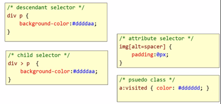

- The 1.0em; states for the size which is default to the page. If we say width: 50%; then it will be half of its parent width.

- We also have a star selector which matches everything on the page:

```css
* {
  color: White;
}
```

- Ordering rules – if two conflicting rules are coming from the same source it just uses the last rule.

- CSS Reset – it is a stylesheet that effectively override the default styles given by a web browser for all HTML elements. Because every browser has slightly different default styles, it will remove this different in style by making it all to reset. There are many available like from yahoo, meyerweb.com. we need to just give the reference of that stylesheet to our main page.

- Specificity – the higher is the specificity number the more important the rule is. It contains 3 parts ABC like below:

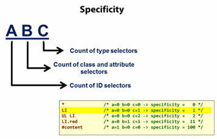

- Inheritance – some property values of an element will be inherited form the elements parents. Like text in div which is inside paragraph will inherit paragraph font size. But border, margin, paddings will not inherited form the parents. So, border set on paragraph will not have border on div or em or other tags inside it.

- Vertical margins collapse – when top and bottom margins meet they will overlap or collapse, technically the will overlap until one of the margins touches the border. But horizontal margins do not collapse.

- Width – when we specify the exact width it will specify of the content area. Any border, margin, or padding that we add will add to the width and require more space.

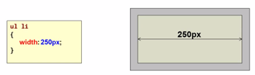

- Layout with CSS - default position value is static. it stacked up elements one after the other down the page. relative position moves an element from its default position in some direction. we can set the top and left properties values. fixed and absolute removes the elements from the flow of documents. Absolute position moves an element to a specific position relative to the body of the document the top and left will be consider from the body element. while fixed position is relative to the window itself. When we apply relative position, we can set top or left kind of properties on it, it is unlike the padding and margin. It will sit on top on the element instead of just pushing them around.

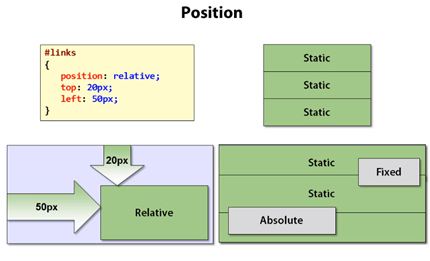

- Fixed positioning – it fixes the position of an element relative to the browser window. The element always stays fixed in place, even when scrolling. Generally, we use this in menu bar or navigation.

- Absolute positioning – it will not scroll with the browser window unlike fixed positioning. It takes an element out of the document flow, meaning the browser acts as if the element has no width and height, and the other elements on the page move up as if it was never there.

- By default, if the element is inside a container and we apply absolute on the element then it will relative to the body top left corner, but if we apply absolute on the container as well then it will be relative to that container.

- Relative Positioning - in this, other elements do not ignore its width and height. It doesn’t take out from the document flow. The original space will be maintained. The bottom: 0 value will make it to stay as it is because the bottom will be the same bottom of the element unlike absolute which will move it to the bottom of the window. And setting the position of the container element as relative does nothing at all unlike absolute positioning. If we have container with relative positioning and element as absolute, then the element will be relative to the container.

- Z-index – it allows us to control the stacking order of the elements. It will start from the negative value -1 and all the way up to highest z-index value.

- We should not have an orphan character on a new line, we can use typography module to make last two letters with “no break space” on every line.

- Instead of putting money to make UI better for older browser which market is going down, we should put it in the modern browser to make it better for future.

- Visual break points in Bootstrap

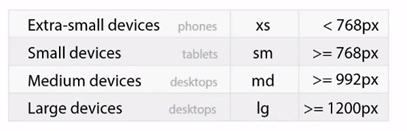

- types of selectors - relational, attribute, structural

- Relational selectors

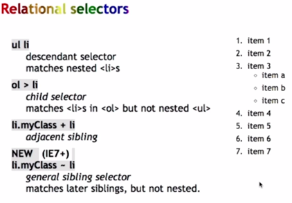

- Other selectors

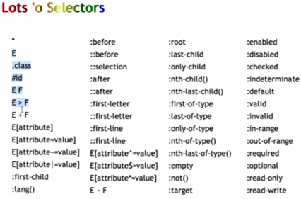

- Earlier we use table-based layout, then fluid-based layout came, now flexbox is the latest layout technique.

- The full name of flexbox is flexible box module, it is an extension of display property. It is a set of CSS properties to create flexible layouts and distributing extra space and aligning content. Because in CSS block, inline, table and positioning properties do not provide enough control for flexible layout, it becomes hacky and awkward to layout some more complex web applications which is why flexbox has been created.

- Flexbox is all about the relationship between a parent container and its direct descendant child items named by flex-container and flex-items. Flexbox was made for layout, float was not.

- Flexbox controls how items flow in one dimension, where the grid controls how items flow in two dimensions. Flexbox is great in handling alignment, distribution and order of content in space. CSS grid on the other hand is suited to lay items out in both dimensions. CSS grid, like flexbox, is all about the relationship between parent container and child items, grid-container, grid-items. It establishes a grid context for its children.

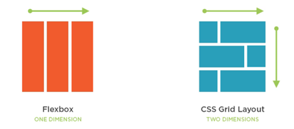

- Responsive web design is a technique for creating a website that adapts to accommodate various device widths. It involves Fluid Grid, media queries, flexible images.

- raster vs. vector images

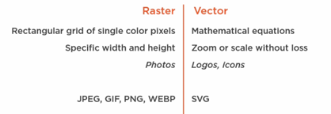

- JPEG format usage: progressive JPEG means it will render with the lowest quality first then get improved over time, unlike normal JPEG which gets render line by line paint with full quality. It is a best format for photos, lossy compression and progressive.

- Other formats - GIF (now a days use in animation only), PNG (lossy compression not as much as JPEG, mainly used to allow transparency scenario), WEBP (created by google, animation and transparency, limited browser support), SVG (XML vector image format, points, lines, shapes, resolution independent).

- We use use SVG images wherever possible.

- Lossy optimizer and lossless optimizer: the lossless compression will remove lots of metadata/properties information from the file without affecting its visual quality unlike lossy which don’t remove the metadata info but other data related to visual looks.

- Use radio buttons for less than 5 options, use dropdown for more than 5 options.

- CSS is crafted to be simple, but scaling simplicity is difficult. It is Sass not SASS, full form is syntactically awesome stylesheets. Its extension is “.scss”.

- We should follow mobile first approach, then add media queries rules medium and large screen as required. So, we don’t have to add media queries in CSS reset and small screen. Due to this maximum CSS style rules will in small.css, then fewer in medium.css and few in large.css:

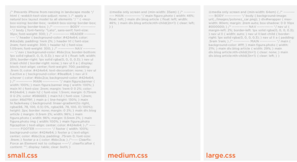

- In progressive enhancement we first apply rule for small screen then by media query apply rules for medium screen and then finally for large screen.

- Icons are vector based not pixel-based like the sprites, this means icons are very smooth specially on screens with high resolutions.

- Flexbox is a collection of CSS properties used to align content and distribute space. It includes concepts such as flex containers, flex items and flex lines. Flex containers control layout of child items.

- The flexbox model provides an efficient way to layout a line and distribute space among elements within our document. By this we can control the layout of children in a parent container. We can tell the children to line up left to right or right to left, or top to bottom or bottom to top, we can tell them fit on one line or wrapped to multiple lines. We can control the spacing around images and text and align the items either top or bottom. By this we can make responsive design much easier. We can use flexbox for creating an image gallery website.

- When not to use flexbox – they are good for simple layout where we can control over the components. But they are not meant for complex application grid systems. Better suited for individual components. So, should use more CSS grids instead of flexbox on entire page. Flexbox provide limited control over order. CSS grids provides better control over text layouts.

- The Origins of Styling Scroll - 1920’s cartoons are the earlier example of scrolling effect, often used when character was walking. In 1980’s video games used the same technique as cartoons but added triggers which increase interest. Web designers began using parallax scrolling in 2011, Early design used only 2 layers.

- Responsive design got started when Steve Jobs launched iPhone in 2007 with web browser. Four mobile strategy - ignore them, build a seperate mobile web site, build an app for the apple store, build a responsive site

- In 2007 iPhone release a phone in which he made the browser tell a lie to the website that it is having desktop size browser and then it shrinking the size to fit on the mobile, in other mobile on those days were not able to render complete website and making the website unusable. But as a responsive design now a days we want to know the actual size of browser on mobile not a lie, so we need to add below tag.

```html
<meta
  name="viewport"
  content="width=device-width, initial-scale=1.0. maximum-scale=1.0. user-scalable=0"
/>
```

- Pseudo classes allow us to conditionally select an element based on state or position, they start with a colon `(:)`.

- 12 column grid layout – it has history in newspaper because when we had multiple editions coming out in a single day, we need to lay them out quickly and 12 columns can easily be divided into halves, quarters or thirds. So, it is an easy layout to achieve.

- The `data-*` attributes on HTML allows us to store extra information on standard, semantic HTML elements without other hacks, such as non-standard attributes, extra properties on DOM, or Node.setUserData(). So, they are allows us to target javascript.

- By using forkJoin we can make two calls simultaneously, it is like q.all() functionality in promises, these calls will happen in parallel.

- Popover – It is like tooltip but gives us additional features like title. Tooltips are usually smalls, quick hints, and appear on hover. Popovers have an explicit title area and get additional related content. They are generally bigger and typically dismiss with click rather than hover status, popovers are more like a modal.

- Fonts of a typeface –

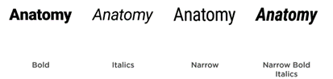

- Anatomy of typeface –

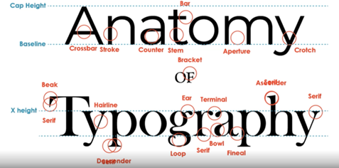

- Hyphenation – dividing words at the end of a line. Doesn’t look clean. No clear advantage. On digital application do not hyphenate.

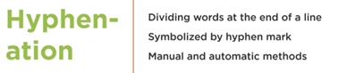

- Don’t put indent first paragraph in digital world –

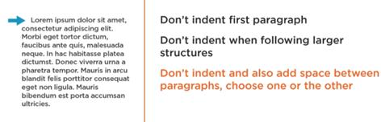

- Use all caps sparingly – instead of this try to use title cases

- Pull quotes – it should not be a copy of original text.

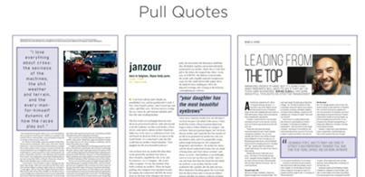

- Use maximum two different typefaces in the application like serif and sans-serif. Like one for header and another for content. We can use website fontjoy.com and fontinuse.com for font pairing.

- Font file types –TrueType (.TTF), OpenType (.OTF), Web Open Font Format (.WOFF), Embedded Open Type (.EOT)

- Pseudo-classes - :hover, :nth-of-type, :first-of-type, :last-of-type, :nth-child, :first-child, :last-child

- CSS grid properties –

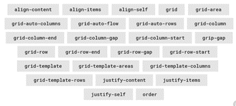

- Building colors in RGB

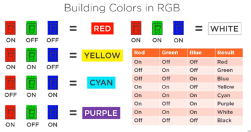

- Different ways to represent colors – RGB, CYMK, HSL, HSV and Pantone. RGB rules the world.

- Choosing an image format (bitmap, tiff, compressed TIFF, gif, jpeg) only gif and jpeg can be used over the internet. Use gif for illustrations, logs and backgrounds and jpeg for photographs. We don’t use gif for photos because the compression would be lousy and if we use jpeg for illustration then its compression will be lousy.

- Portable network graphics (PiNG) because GIF compression was patented. PiNG (PNG) provides lossless compression means we can save it over and over again without losing information. JPEG still have smaller size than PNG. But PNGs don’t do animation. GIF and PNG can do transparency, JPEG cannot. Transparency allows the color of the parent layer to shine through. So, use PNG unless we are sure you need JPEG, JPEG compression is lossy, don’t use for working copies.

- Rater vs. vector based images – for vector we use .svg files -

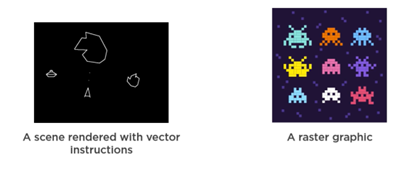

- CSS filters – we can apply effects on images or other elements. Supported filters – blur, brightness, contrast, drop-shadow, gray-scale, hue-rotate, invert, opacity, saturate, sepie

- What is missing in CSS – no CSS constant and no cross browser supports, for this we should use SASS. SASS is the technology platform and SCSS is syntax. It has more features like nested style as below second one is more cleaner with SASS. SASS modules – color, list, map, math, meta, selector, string.

- Difference between without and with fluid container in flexbox – The grid will take all unused horizontal space.

- Theme colors –

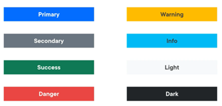
