# Extracted Notes - Node.js

## Table of Contents

- [REST](#rest)
- [Middleware](#middleware)
- [HATEOAS](#hateoas)
- [Architecture](#architecture)
- [NPM](#npm)
- [Express](#express)
- [Async/Await](#asyncawait)
- [Event Emitters](#event-emitters)
- [Authentication/Authorization](#authenticationauthorization)
- [Folder Structure](#folder-structure)
- [Mongoose](#mongoose)
- [CORS](#cors)
- [Deployment](#deployment)
- [Streams](#streams)
- [Gulp](#gulp)
- [Overview](#overview)
- [HTTPS](#https)
- [Distributed APIs](#distributed-apis)
- [Security](#security)
- [Unit Tests](#unit-tests)
- [Modules](#modules)

## REST

- REST means representational state transfer (ReST). If we are storing information about the request or about the client, then we are not writing a truly a restful service. We also need to tell the client of caching, means caching timeout so that next time client doesn't to call server to fetch data. One more constraint is the uniform interface, we need to deal with resources those are nouns not actions so don’t name authorize or login but like books and authors. HTTP verbs defines actions, also use PUT for update the object.

- Updating data - PUT verb replaces and item but PATCH only changes a piece.

- Implementing PATCH – Need to use the Object.entries() method to out an array of key-value pairs from req.body and run for-each on it to modify only those properties on object which got change, so need to check every property manually

  ```typescript
  const { book } = req;
  if (req.body._id) {
    delete req.body._id;
  }

  Object.entries(req.body).forEach((item) => {
    const key = item[0];
    const value = item[1];
    book[key] = value;
  });

  req.book.save((err) => {
    if (err) {
      return res.send(err);
    }
    return res.json(book);
  });
  ```

- REST is not a framework nor HTTP pattern or protocol. Its full name is representational state transfer. The request should be stateless, it should not pass around the information about previous requests or next one. It should transfer data in JSON or XML. We should design the routes to access the resource like business modal.

- Blueprint of a restful service -

  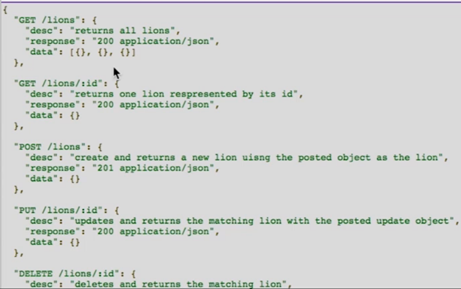

- Use express.static to serve everything within client as a static resource, and it will serve the index.html on the root of that directly on a GET to `/`

  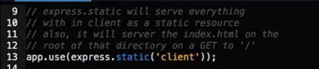

- Always send back the data which has been created or modified on POST request itself so that we don’t have to call it back by using another REST service.

- While using PUT request to update the object, use assign / extend function like below -

  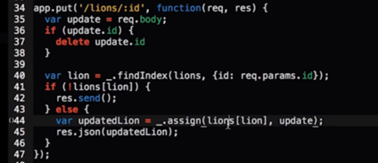

- If we are building API for our application then don’t return all other unnecessary details from API, but if we are building API as a service then we can return all the information.

- Parsing URLs and query strings – components of a parsed URL. Use url.parse for parsing an URL and other helper methods -

  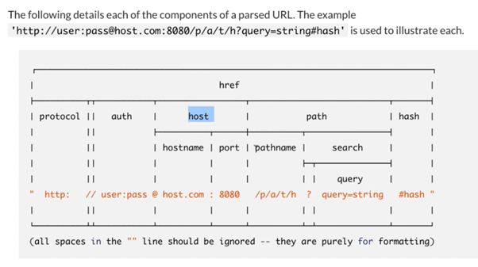

- Underneath all the http calls uses XML HTTP Request (XHR) object which is a javascript API to create AJAX requests. Its methods provide the ability to send network requests between the browser and a server.

- In case of wrong entity/data send from frontend and it fails the validation of server, then we should return 422 – Unprocessable entity status code. We should not send status 200 if the data is not valid.

- In case of cookie scenario, if server sends a cookie to the browser, then for further requests the browser automatically sends the cookie to the server for that same domain, so we don’t to write any specific code in client side unlike token approach in auth header. If our token contains sensitive information then we should use JSON web encryption (JWE).

- Sample REST API

  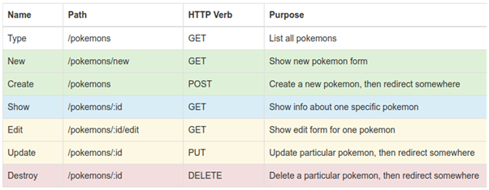

- We need to set the form attribute enctype as multipart/form-data for and input type as file.

- For the https communication, the default port is 443 and for http the default port is 8080.

- Cookie gets deleted whenever user closes the browser.

- Common formats of data - JSON, XML, JSONP, RSS, ATOM

- Association – design API’s like “api/regions/africa/sites/123/locations/1” but it still be okay “api/sites?country=usa” if it going too deeply nested

- The response code status 304 means it is served from cache and not modified.

- We can cache the request using ETags. We can send this ETag which we receive from server by setting a header key “if-none-match” (in-case of GET) and if-match (in-case of update the resource).

- Functional APIs – they are not RESTful but sometimes we need to handle these operation like calculate premium or start a machine, etc. For these APIs we should use OPTIONS or LINK verbs.

  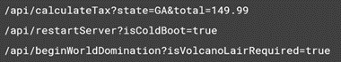

- If users rely on the API not changing, then we should use versioning. Types of design – URI path, Query String, with Headers, Accept header and versioning with Content Type. For simple APIs the query string is the recommended one, but for complex APIs the versioning with Content Type is recommended.

## Middleware

- It is going to inject itself in between the calls and this route.

- Middleware – we can use router.all() for using middleware.

  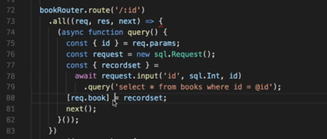

  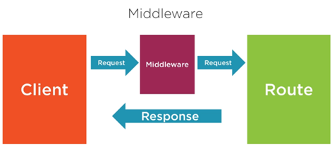

- Middleware is kind of like setting utility classes to help express to do the dirty work. Middleware is just a function that has access to the request object, the response object and the next function to go to the next middleware. Type of middleware – 3rd party, router level, application level, error-handling, built-in

- Middleware is more tied to routes, validations are more tied to models, so we should bake the validation logic into the model itself using mongoose.

## HATEOAS

- Using hypermedia to building self-documenting API, it is very easy for someone to navigate and understand what options are available to them anytime while they are using our API. HATEOAS means that list of links available to us that help us navigate the API.

## Architecture

- Node.js provides a wrapper around V8 JS Runtime engine to provide additional functionalities for building network applications. It is fast because all written in C language. We can build WebSocket server, fast file uploading client, Ad Server, Any real-time data apps. Node.js is not a multi-threaded application. Benefits of non-blocking code – files will be read in parallel

  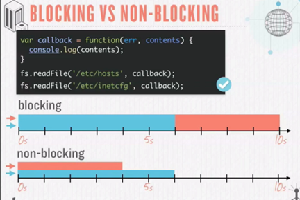

- We use javascript with Node.js because javascript makes easy to do event programming using the event loop and makes the code non-blocking.

- Node register the event whenever request comes in, whenever it is done registering the script, it starts the event loop when finished means it checking for events continuously, whenever a request comes it trigger its call-back. Known events are request, connection, close, timeout these events further more events, one event at a time will get processed in event queue, other will be queued in event queue.

- Node is generally deployed on Linux machines in production.

- Execution of javascript on the server is not done by Node, but it is done with a virtual machine, VM like V8 or Chakra. Node is just the coordinator, it is the one who instructs a VM like V8 to execute our javascript. So Node.js is a wrapper around a VM like V8. V8 will tell the results to Node and Node will tell this result to us. Node comes with built-in modules providing rich features through easy-to-use asynchronous API’s. this works great because V8 itself is single threaded, this is also true for browser.

  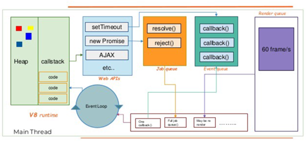

  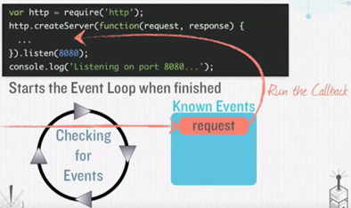

- We should run our node process under PM2 tool, it will automatically use all the available cores in our server and it will automatically create a new process every time an active process crashes and exits. It will also reload our application without any downtime. This tool is must in production.

- Node's architecture – V8 and libuv

  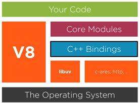

- Javascript Event loop – Javascript is a single threaded due to which we can execute only one chunk of code at a time i.e. a function. It executes a synchronous task in “Sync Task Queue” this is a callstack for our application. The callback functions which needs to be executed in asynchronously, they needs to be added in the “Async Task Queue” by “Sync Task Queue” and when “Sync Task Queue” is done with execution the Synchronous task, it will pick the async task from the “Async Task Queue. There is also a “Async Micro Task Queue”, it will contains asynchronous micro-task which will have higher priority than normal asynchronous tasks resides in “Async Task Queue”. We should not block the event loop, so wherever possible we should write the asynchronous code using async and await keywords.

  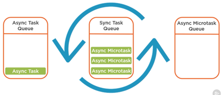

- Chrome’s V8 often called an engine, is a package deal containing an interpreter, compiler, runtime implementation compatible with the runtime interface demanded by the ECMA standard JavaScript conventions.

- Nodejs is not a framework(or a language) but a JavaScript runtime built on Chrome’s V8 JavaScript engine. It extends the power of handling file and network I/O with a preference for asynchronous patterns after including everything that is Javascript.

- Node.js expands the JavaScript language by providing a larger set of runtime environment primitives — those which are outside the scope of ECMA’s standards. These include things like file handling, network I/O, etc. Javascript does not come equipped with these because for security reasons, javascript originally did not include file I/O for use in the browser. And, it did not need to do networking tasks, because the browser does them.

- Node.js is Single-threaded( actually hybrid, more on this later) and Asynchronous. JavaScript executes all operations on a single thread, but using a few smart data structures, gives us the illusion of multi-threading. There is an event queue that uses a queue data structure that is responsible for sending new functions to the track for processing.

- You can take any number of examples like the `setTimeout` method, Axios methods, or any other method that run asynchronously. let’s take the setTimeout operation and look into its lifecycle. When a `setTimeout` is called, it is processed in the stack and then sent to the corresponding API which waits till the specified time to send this operation back in for processing.

- Where does it send the operation? The event queue. Hence, we have a cyclic system for running async operations in JavaScript. The language itself is single-threaded, but the browser APIs act as separate threads.

- The event loop facilitates this process; it constantly checks whether or not the call stack is empty. If it is empty, new functions are added from the event queue. If it is not, then the current function call is processed.

  

- So, How does Nodejs handle multiple requests concurrently despite being Single-threaded? - There is one process, multiple threads, but only one thread dedicated to parsing and executing javascript code. the other threads are started from C++ bindings called from the JS.

- Node isn’t the best choice for applications that mostly deal with CPU-intensive computing(but worker threads are a choice here). On the other hand, it excels at handling multiple I/O requests.

- Think of NodeJS as a waiter taking the customer's orders while the I/O chefs prepare them in the kitchen. Other systems have multiple chefs, who take a customer's order, prepare the meal, clear the table and only then attend to the next customer.

  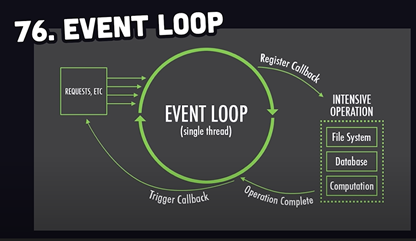

- Sample Node JS architecture -

  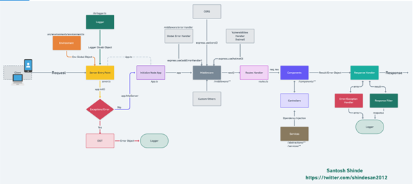

- Node js shines in I/O intensive uses that is in network applications. In order for event loop to function properly, our code can’t spend too much time doing anything of its own, this includes works that requires heavy use of CPU.

- In node js event loop at a time only one function will be executing, all the async request like network, file i/o or timer is listened by the event loop for a callback function.

- The event loop – the entity that handles external events and converts them into callback invocations. It is a loop that picks events from the event queue and pushes their callbacks to the call stack.

- How call stack actually works: event queue will only send the callbacks to call stack once call stack is empty otherwise it will wait until it gets empty.

  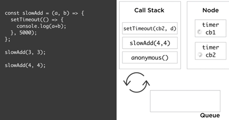

- Node JS server can simultaneously handle uploading of two files, one of main reason of Node JS creation is to handle the file upload. Other web apps try to load entire file into memory before writing it to the disk which can cause all sorts of issue at server side, also tricky to provide the progress of file uploads, but in Node JS we can do it very simply.

- Node offers async API’s that we can use and not worry about threads, to do things in parallel without needing to deal with threads this is the biggest benefits of using a runtime like node. We can also create addons using C++.

- Node has a reliable module dependency manager usually referred to as CommonJS. This is basically the “require” function in Node combined with the “module” object.

- Node.js is like the kitchen itself, it allows you to execute lines in our recipes by using built-in modules like our oven and sink.

- Worker threads helps us to write CPU intensive tasks by running events in parallel. It will create a new thread by making main thread available for new user request. This is similar to web workers. Using worker thread is like creating a new event loop. We can pass messages between main and worker thread. Worker threads should be used only with CPU intensive tasks. For IO bound code like disk access or network calls, it is more efficient to use the async API’s.

  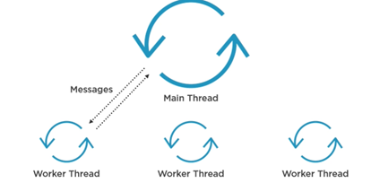

- There is no server required to run node js, it is itself a server. Node js is also gets used for building command line applications like webpack, gulp, eslint and yeoman. Node uses libuv library for asynchronous I/O and event loop.

- As per below diagram, much of the work done by Node JS and libuv not by the javascript –

  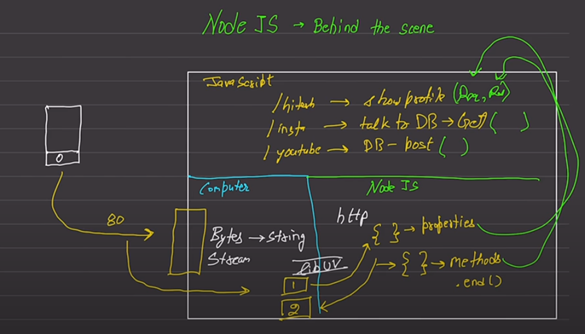

## NPM

- NPM is not really part of node, it is just come packaged with node since it is the default and most popular package manager.

- NPM is basically the world’s largest of free and reusable code.

- Pruning – to remove unused package from the project, it gives extraneous error if package is installed but not mentioned in package.json file. We can use npm prune, npm prune grunt it will match the installed the package with package.json file and remove the non-specified ones. We can use npm prune –production to remove dev dependencies package before going to production.

- Lifecycle scripts – pre-start, start and test. Custom scripts – debug, predebug-compile, debug-compile, pre-build, build, etc. If we are running lifecycle script then we don’t have to specify ‘run’ while running that script like “npm start”.

## Express

- Express is Sinatra inspired web development for Node.js, i.e. insanely fast, flexible, and simple.

- Node has inbuilt HTTP module to create http server and connection. But due to some limitation and code needs to write, we generally prefer express web framework it has routes and middleware.

## Async/Await

- use Async/Await – it is easier to read.

## Event Emitters

- Event emitters -

  ```typescript
  const EventEmitter = require('events');
  const myEmitter = new EventEmitter();

  setImmediate(() => {
    myEmitter.emit('TEST_EVENT');
  });

  myEmitter.on('TEST_EVENT', () => {
    console.log('TEST_EVENT was fired');
  });
  ```

## Authentication/Authorization

- Using passport for user authentication and authorization, this is a default option for express library, and a simple way to implement. It manages user object in the session. It also deals with dropping it in a cookie, and pulling it out of a cookie and applying it to the session. We also need to use cookie-parser and express-session package for this

- Authentication - There are many ways to protect our API like JSON Web Tokens (JWT) is popular one. It is a token approach due to this we don’t need to keep track of who is signed in with a session store or have cookies. The JWT will be sent on every request because REST is stateless and we not know of the previous request. The token has to be stored on the client at the is requesting resources.

- Factors we can use for two-factor authentication - something you know (password), something you have (badge, id card, token), something you are (biometric)

- Authentication types for APIs – Cookies, Basic Auth, Token Auth and OAuth.

- OAuth - It uses trusted third-party to identify users. So the application which uses OAuth, never gets the credentials. User authenticates with third party and use token to confirm identity, it is safer for the application (don’t have to dealt with the user credential and authentication) and the user.

  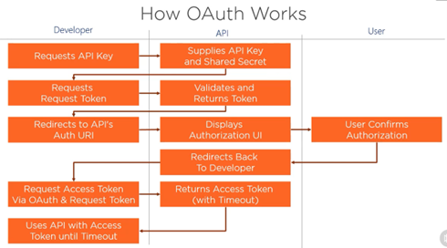

## Folder Structure

- We should group our folder based on feature not types, also contain config and utils folder

  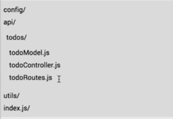

## Mongoose

- Mongoose is an ORM for MongoDB. We don’t have to deal with MongoDB directly, mongoose is going to do that for us.

- Mongoose, like express, has support for middleware. Middleware is perfect for validating, changing, notifying, input sanitization etc. we will use middleware to hash our passwords before a user is created. Middleware will attach to lifecycle events around our documents like before save, before validations, after save, etc.

## CORS

- Understanding CORS – if we are on localhost:4500, and we are trying to get access a route on localhost:3000, the browsers aren’t going to let me in due to security concern. To work around this we need to enable CORS on our server. By this the browser makes two requests, the first request is called pre-flight check by using verbs OPTIONS to check if it is allowed to make request to that server, server responds like yes or no like 200.

## Deployment

- Before deploying checklist -

  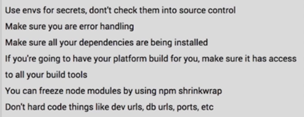

- Using multiple processes is the only way to scale a node js application. Node JS is designed for building distributed applications with many nodes. To increase the scalability, we have strategies like cloning, decomposing (micro services), splitting into multiple instances (horizontal partitioning or sharding).

- The cluster module can be used to enable load balancing over an environment multiple CPU core. It is based on form function, it basically allows us to fork our main application process as many times as we have CPU cores, and then it will take over and load balance all request to the main process across all forked processes. This module is a helper for implementing cloning strategies but only on one machine. We can use process manager like PM2.

  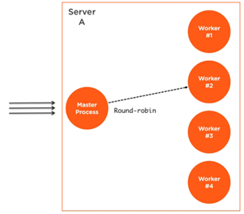

- Load balancing and HTTP server – if a machine has 8 cores, it will start the 8 processes. These are completely different node js processes, each worker process will have its own even loop and memory space. The loaded will be distribute among different worker process.

- Availability and zero-downtime restarts – with multiple instances the availability of the system will get increased in-case of any instance gets down. When we want to restart all of the processes like for a deployment of new code, in this instead of restarting them together we can simply restart them on at a time to allow other workers to continue to serve requests while on worker is being restarted. It is called zero-downtime restart

- Node works well on windows, but it is much safer option to host production Node applications on Linux platform, many other production tools are more stable on Linux.

- Shared state and sticky load balancing – due to load balancing we had problem of thread safety which is sharing data between threads or worker processes. So, with a cluster setup we can no longer cache things in memory because every worker process has its own memory space, so if we cache something in one worker’s memory, other worker’s will not have access to it. If we need cache thing with a cluster setup, we have to use a separate entity and read write to that entity’s API from all workers, this entity can be a database server or in-memory cache service like Redis.

- In cluster setup stateful communication also become a problem. Since the communication is not guaranteed to be with the same worker, creating a stateful channel on any one worker is not an option, like problem in authentication to one worker and next time sending its request to another worker which doesn’t know its authentication status. This problem can be solved by simply share the state across the many workers we have by storing these session’s information in a shared database or a Redis node, or better way is using sticky load balancing in this we send the same user request to same worker process but by this we don’t really get the full benefits of load balancing for authenticated users -

  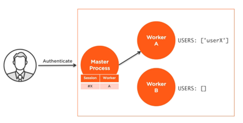

## Streams

- Working with big amounts of data in node js means working with streams. Streams are simple collection of data that might not be available all at once and don’t have to fit in memory. Types of streams – readable, writable, duplex, transform.

- Duplex and transform streams – with duplex streams we can implement both a readable and writeable stream with the same object. It is like if we are inheriting from both interfaces. In transform stream its output is computed from its input like converting small caps into upper case or file conversion into different format.

- When we read a file, node open that file and put that content into the memory become making it available in the code. In-case of a large file, it may throw an error, to avoid this, we should use steam to read file through stream.

## Gulp

- Gulp is in-memory streams, fast and code over configuration by more declarative, and has large plugin ecosystem. Instead of using Grunt or Gulp, we should use NPM directly which has simpler debugging, better docs, easy to learn, simple and no need for separate plugins.

## Overview

- History of Node JS - New major versions gets released every 6 months of Node js.

  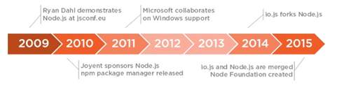

## HTTPS

- We can create polling request for an API on some specific intervals by using setInterval() method.

- HTTPS is called TLS (transport layer security), it encrypts payloads over the network using certificates.

## Distributed APIs

- The history of distributed APIs

  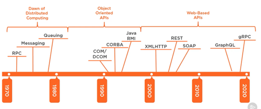

## Security

- CSRF support is indirectly inbuilt in angular which will check any XSRF-TOKEN from the server response headers and set it to the request header automatically so that it will get match on the server side. We can override this behavior to provide a different token by using XSRF strategy service

## Unit Tests

- Mocha is a testing framework and Chai is an assertion library. Sinon is a mocking library.

## Modules

- Require() Vs. Import statements –

  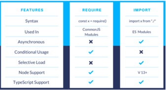
